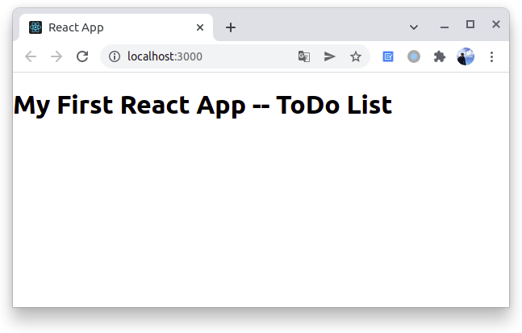

# 创建第一个 React 项目


本文参考《[React+Node.js开发实战](https://union-click.jd.com/jdc?e=&p=JF8BAMAJK1olXDYCV1ddDEMeB19MRANLAjZbERscSkAJHTdNTwcKBlMdBgABFksUCm8ME1IRQl9HCANtViljdB1QSCJwJ2BrMVc_dUJwWR1Se1cZbQcyVF9cCk4XB2oKHWslXQEyAjBdCUoWAm4NGl8WbQcyVFlYC0oQAGYJHlMTVDYFVFdtVQ9FWSddSxhHFTYyZF1tOHsXM2w4WTVGXFUFBF4JWEwXCz8NHQscVQUHAwtYDRwQVmwPH1xHWTYAVV9ZAXs)》，通过 create-react-app 工具开发一个待办事项（ToDo List）应用程序。相信通过这个例子，小伙伴们会对 React 开发的全过程有一个大致的了解。


## 需求分析

在开始之前，我们先来确认 ToDoList App 应用程序的主要功能。

1. 查看待办事项；
2. 添加待办事项；
3. 删除待办事项；
4. 修改待办事项状态。


## 创建项目

1、通过 create-react-app 工具创建项目。

```bash
create-react-app todo-list
cd todo-list
npm start
```

现在，我们创建并启动了一个基础项目工程。

2、修改 src/App.js 文件，内容如下：

```react
import React from 'react';

export default class App extends React.Component {
  constructor(props) {
    super(props);
  }

  render() {
    return (
      <div>
        <h1>My First React App -- ToDo List</h1>
      </div>
    );
  }
}
```

保存文件，Webpack 会自动刷新页面，此时浏览器页面如下：




## 实现界面

接下来，实现 ToDo List 的界面显示，同样是修改 src/App.js 文件。代码如下：

