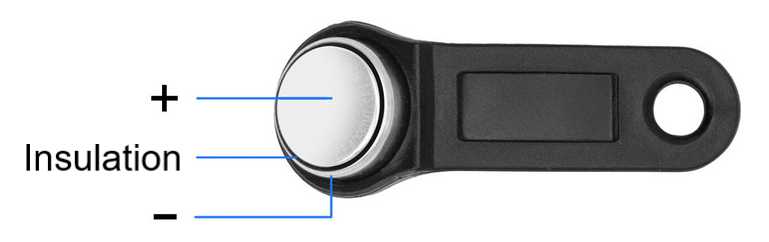
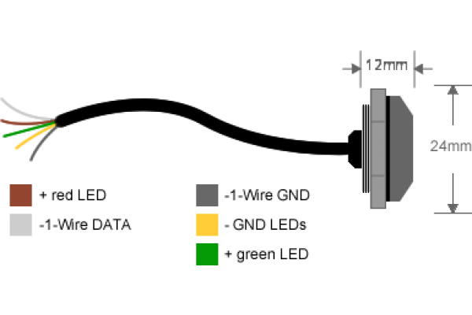
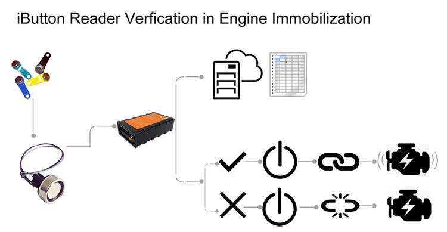

# iButton：纽扣式电子身份与读写应用

## iButton 介绍

## iButton 读卡器

## 数据格式

## 应用场景

## 参考

- [iBUTTON背后的故事](http://www.eetrend.com/article/2018-12/100127501.html)
- [Taming iButton Keys with Flipper Zero](https://blog.flipperzero.one/taming-ibutton/)
- [ONEWIREVIEWER和IBUTTON快速使用指南](https://www.maximintegrated.com/cn/design/technical-documents/tutorials/4/4373.html)
- [Electronic access control lock with iButton](https://www.youtube.com/watch?v=oT33XnBSFXg)
- [Product: iButton Reader & iButton tags in GPS tracking](http://www.totemtek.com/gps-tracking/iButton-reader-in-gps-tracking.html#.YN3weHUzYWQ)
- [Badge or iButton](https://www.prodongle.com/en/product/badge-ibutton)
- [WHAT IS AN IBUTTON DEVICE?](https://www.maximintegrated.com/en/design/technical-documents/app-notes/3/3808.html)
- [Understanding and Using Cyclic Redundancy Checks with Maxim 1-Wire and iButton Products (maximintegrated.com)](https://www.maximintegrated.com/en/design/technical-documents/app-notes/2/27.html)

