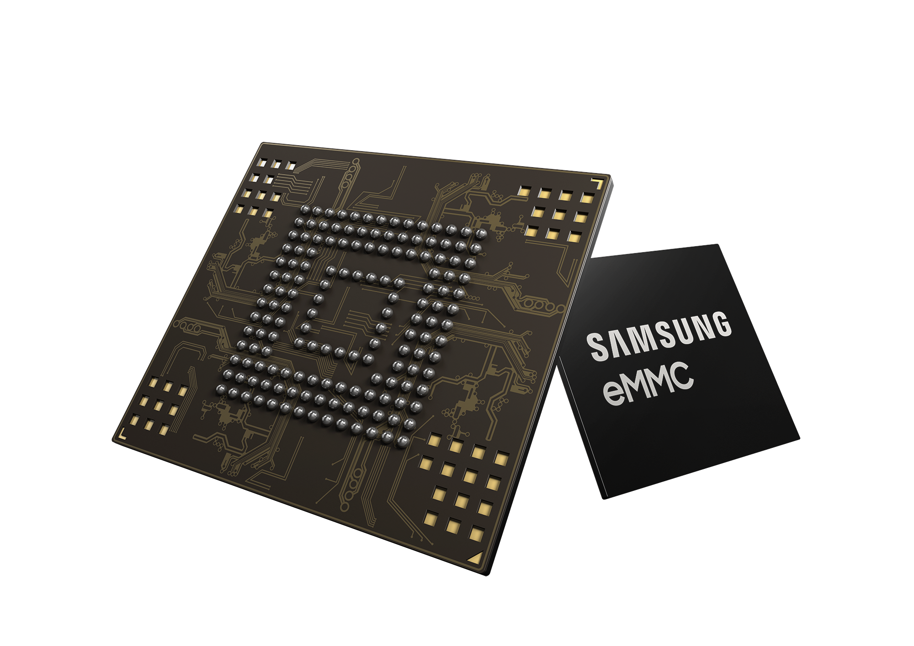
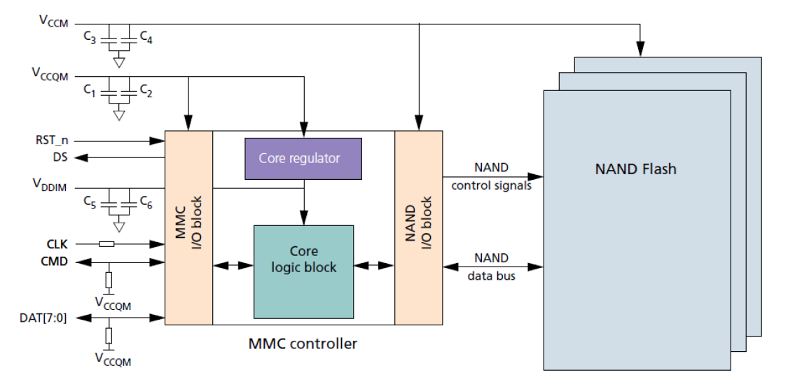

# eMMC 入门：嵌入式多媒体卡结构与接口

eMMC 是 embedded Multi-Media Card 的简称，即嵌入式多媒体卡。

其中，Multi-Media Card（MMC）是一种闪存卡（Flash Memory Card）标准，它定义了 MMC 的架构以及访问 Flash Memory 的接口和协议，具体由电子设备工程联合委员会 JEDEC 制订和发布。

而 eMMC 则是对 MMC 的一个拓展，以满足更高标准的性能、成本、体积、稳定、易用等的需求，具有体积小、功耗低、容量大等优点，非常适合用作智能手机、平板电脑、移动互联网设备等消费类电子设备的存储介质。

## eMMC 组成

eMMC 内部主要分为 Flash Memory、Flash Controller 和 Host Interface 三大部分，

整体架构如下图所示。

具体来看，eMMC 实际是依照 JEDEC 标准，将传统的 NAND Flash 与一颗主控制器封装在一起的存储器，是一种接口的标准。从下面 eMMC 内部结构图中可以看到，主控制器更像是做一个 NAND 和 MMC 接口协议的转换。

### Flash Memory

[Flash Memory](/electronic-components/flash-memory/) 是一种非易失性的存储器，通常在嵌入式系统中用于存放系统、应用和数据等，类似于 PC 系统中的硬盘。目前，绝大部分手机和平板等移动设备中所使用的 eMMC 内部的 Flash Memory 都属于 NAND Flash。

eMMC 在内部对 Flash Memory 划分了几个主要区域，如下图所示。

eMMC 内部分区：

- **Boot Area Partitions**

  此分区主要是为了支持从 eMMC 启动系统而设计的。
  该分区的数据，在 eMMC 上电后，可以通过很简单的协议就可以读取出来。同时，大部分的 SOC 都可以通过 GPIO 或者 FUSE 的配置，让 ROM 代码在上电后，将 eMMC BOOT 分区的内容加载到 SOC 内部的 SRAM 中执行。

- **RPMB Partition**

  RPMB 是 Replay Protected Memory Block 的简称，它通过 HMAC SHA-256 和 Write Counter 来保证保存在 RPMB 内部的数据不被非法篡改。
  在实际应用中，RPMB 分区通常用来保存安全相关的数据，例如指纹数据、安全支付相关的密钥等。

- **General Purpose Partitions**

  此区域则主要用于存储系统或者用户数据。 General Purpose Partition 在芯片出厂时，通常是不存在的，需要主动进行配置后，才会存在。

- **User Data Area**

  此区域则主要用于存储系统和用户数据。
  User Data Area 通常会进行再分区，例如 Android 系统中，通常在此区域分出 boot、system、userdata 等分区。

### Flash Controller

NAND Flash 直接接入 Host 时，Host 端通常需要有 NAND Flash Translation Layer，即 NFTL 或者 NAND Flash 文件系统来做坏块管理、ECC等的功能。

eMMC 则在其内部集成了 Flash Controller，用于完成擦写均衡、坏块管理、ECC 校验等功能。相比于直接将 NAND Flash 接入到 Host 端，eMMC 屏蔽了 NAND Flash 的物理特性，可以减少 Host 端软件的复杂度，让 Host 端专注于上层业务，省去对 NAND Flash 进行特殊的处理。同时，eMMC 通过使用 Cache、Memory Array 等技术，在读写性能上也比 NAND Flash 要好很多。

### Host Interface

eMMC 与 Host 之间的连接如下图所示：

各个信号的用途描述如下：

- **CLK**

  用于同步的时钟信号（从 Host 端输出），是进行数据传输的同步和设备运作的驱动。

- **Data Strobe**

  此信号是从 Device 端输出的时钟信号，频率和 CLK 信号相同，用于 Host 同步从 Device 端输出的数据。该信号只能在 HS400 模式下配置启用，启用后可以提高数据传输的稳定性，省去总线 tuning 过程。（该信号在 eMMC 5.0 中引入）

- **CMD**

  此信号主要用于从 Host 向 eMMC 发送 Command，或从 eMMC 向 Host 发送对应的 Response。

- **DAT0-7**

  这组信号用于 Host 和 eMMC 之间的数据传输。在 eMMC 上电或者软复位后，只有 DAT0 可以进行数据传输，完成初始化后，可配置 DAT0-3 或者 DAT0-7 进行数据传输，即数据总线可以配置为 4 bits 或者 8 bits 模式。

## 总线协议

Host 与 eMMC 之间的通信都是 Host 以一个 Command 开始发起的。针对不同的 Command，Device 会做出不同的响应。

在一个时钟周期内，CMD 和 DAT0-7 信号上都可以支持传输 1 个比特，即 SDR (Single Data Rate) 模式。此外，DAT0-7 信号还支持配置为 DDR (Double Data Rate) 模式，在一个时钟周期内，可以传输 2 个比特。

Host 可以在通讯过程中动态调整时钟信号的频率（注，频率范围需要满足 Spec 的定义）。通过调整时钟频率，可以实现省电或者数据流控（避免 Over-run 或者 Under-run）功能。 在一些场景中，Host 端还可以关闭时钟，例如 eMMC 处于 Busy 状态时，或者接收完数据，进入 Programming State 时。

## 参考

- [eMMC之分区管理、总线协议和工作模式【转】 - 请给我倒杯茶 - 博客园 (cnblogs.com)](https://www.cnblogs.com/zzb-Dream-90Time/p/10133464.html)
- [eMMC · Linux Kernel Internals (codingbelief.com)](https://linux.codingbelief.com/zh/storage/flash_memory/emmc/index.html) :star:
- [eMMC 分区管理 · Linux Kernel Internals (codingbelief.com)](https://linux.codingbelief.com/zh/storage/flash_memory/emmc/emmc_partitions.html)
- [eMMC 总线协议 · Linux Kernel Internals (codingbelief.com)](https://linux.codingbelief.com/zh/storage/flash_memory/emmc/emmc_bus_protocol.html)
- [eMMC简介_内核工匠-CSDN博客](https://blog.csdn.net/feelabclihu/article/details/105502163)
- [浅谈 SSD，eMMC，UFS - 知乎 (zhihu.com)](https://zhuanlan.zhihu.com/p/26551438)
- [Linux eMMC信息读取 | wowothink](https://wowothink.com/33268c93/) :star:
- [eMMC之分区管理、总线协议和工作模式【转】 - 请给我倒杯茶 - 博客园 (cnblogs.com)](https://www.cnblogs.com/zzb-Dream-90Time/p/10133464.html)
- [emmc - 蜗窝科技 (wowotech.net)](http://www.wowotech.net/tag/emmc)

