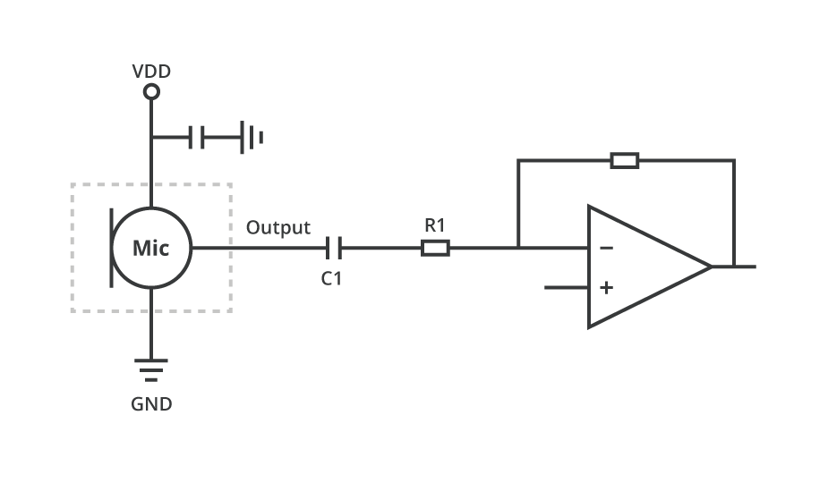
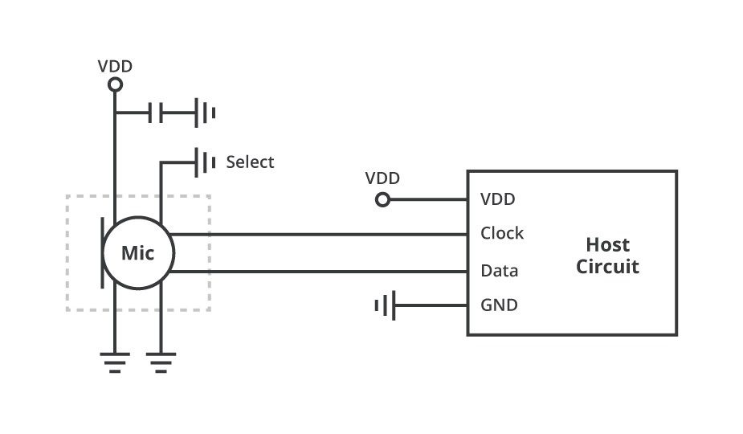
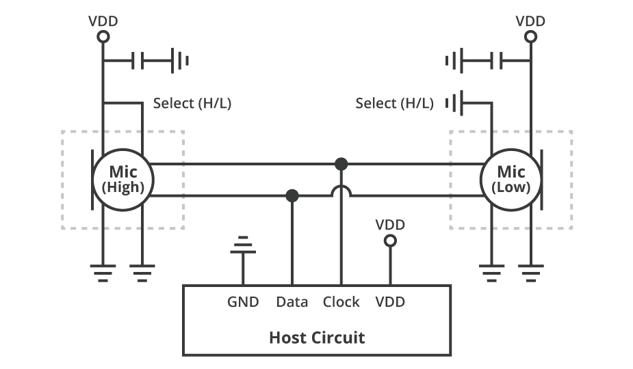

# 数字麦克风：MEMS 与 PDM/PCM 接口

数字麦克风（digital microphone）采用 MEMS 技术，将声波转换为电信号，并在封装内完成放大与模数转换，直接输出数字音频流。消费电子里，**PDM 数字麦克风**因结构简单、走线方便而被大量使用。

## 概述

PDM（Pulse Density Modulation）用高速率的 1-bit 流表示声音；PCM 则是更常见的多比特采样格式。很多芯片组接收 PDM 后，再在内部转换为 PCM 供算法使用。

PDM 接口通常允许两颗麦克风共享时钟与数据线：一颗在时钟上升沿输出，另一颗在下降沿输出，从而实现同步的双麦采集（例如简易波束形成或降噪的前置条件）。

## 模拟与数字 MEMS 麦克风

MEMS 麦克风常见结构是两颗芯片装在一个封装里：MEMS 振膜把声波变成电信号，ASIC 负责放大；若 ASIC 内含 ADC，则对外是数字麦，否则是模拟麦。

### 模拟 MEMS 麦克风接口

模拟输出需要关注偏置、增益和外部 ADC 的抗混叠设计。

### 数字 MEMS 麦克风接口

## 选型与使用注意

- 灵敏度、信噪比（SNR）、声过载点（AOP）决定远场/近讲表现
- 注意声孔方向（顶部进声/底部进声）与整机密封
- PDM 时钟频率、走线长度与干扰会影响数据完整性
- 双麦应用要保证机械对称与相位一致性

## 应用场景

手机通话与降噪、智能音箱唤醒、笔记本会议麦阵列、耳机通话、IoT 语音节点等。

## 小结

数字麦克风把“拾音 + 数字化”前移到传感器端，降低模拟链路难度。嵌入式上优先搞清接口是 PDM 还是 I2S/PCM，再匹配 SoC 的音频路由。
