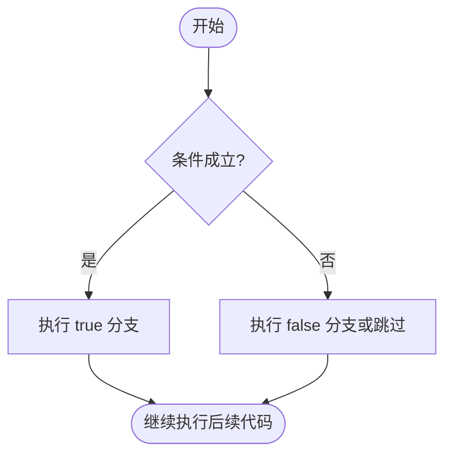
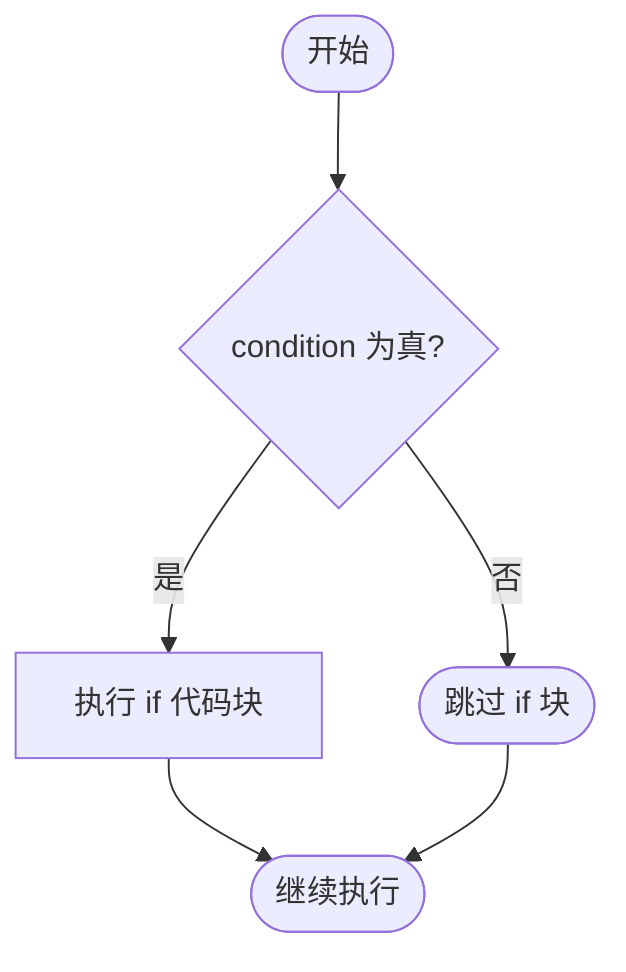
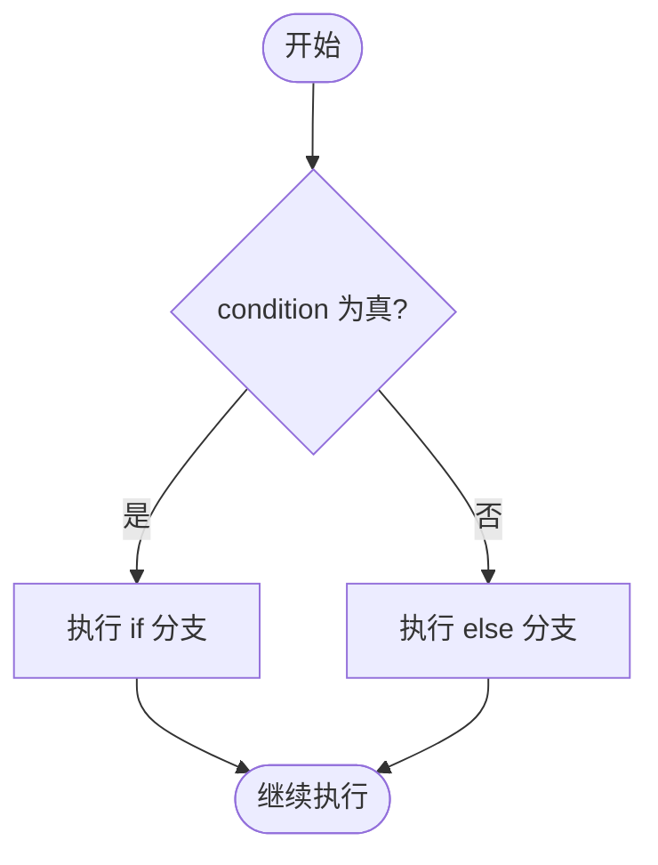
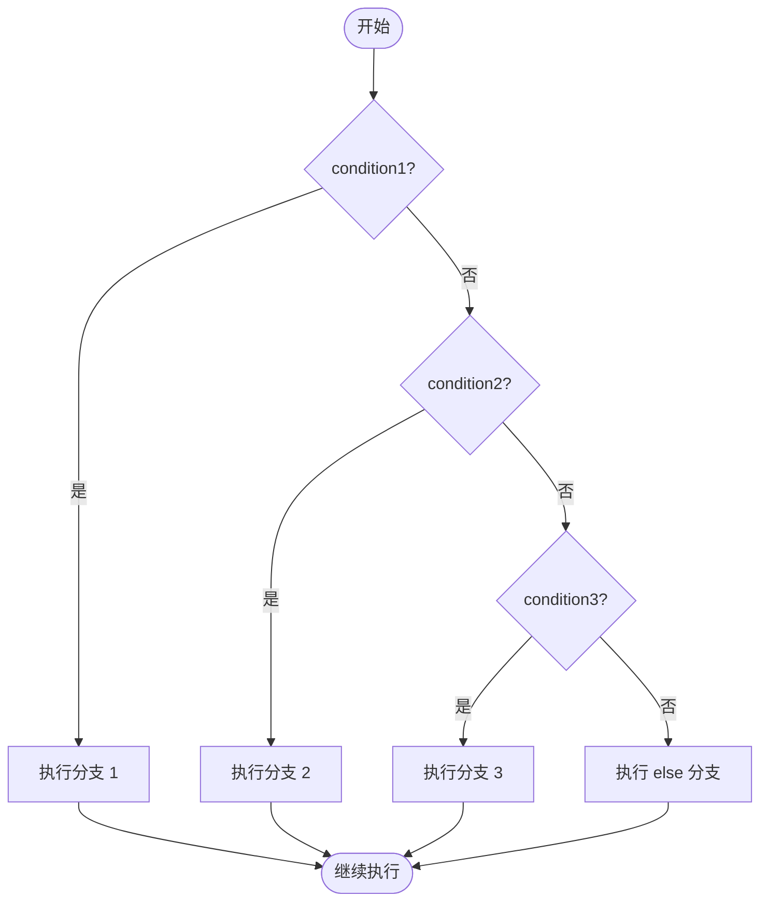

# Lua 条件语句

条件语句用于根据表达式的结果选择不同的执行路径。Lua 提供 `if`、`elseif`、`else` 和 `end` 来组织分支逻辑。

Lua 的真假规则非常简单：只有 `false` 和 `nil` 是假，其他值都是真，包括 `0`、空字符串 `""` 和空表 `{}`。

## 条件判断流程

典型的条件语句会先判断表达式，再根据结果执行不同代码块：



Lua 常见条件结构如下：

| 结构 | 适用场景 |
| :--- | :--- |
| `if` | 条件成立时执行一段代码 |
| `if...else` | 在两个分支中选择一个执行 |
| `if...elseif...else` | 在多个条件分支中选择一个执行 |
| 嵌套 `if` | 一个条件成立后，还需要继续判断更细的条件 |

## if 语句

`if` 是最基本的条件语句。条件为真时执行 `then` 和 `end` 之间的代码；条件为假时直接跳过。

### 语法

```lua
if condition then
   statement(s)
end
```

### 执行流程



### 示例：判断数字大小

```lua showLineNumbers title="main.lua"
local a = 10

if a < 20 then
   print("a is less than 20")
end

print("value of a is:", a)
```

输出如下：

```bash
a is less than 20
value of a is:	10
```

### 示例：使用布尔变量

```lua showLineNumbers title="main.lua"
local a = 10
local result = a < 20

if result then
   print("a is less than 20")
end
```

输出如下：

```bash
a is less than 20
```

### 示例：使用 not 取反

```lua showLineNumbers title="main.lua"
local a = 10
local result = a > 20

if not result then
   print("a is not greater than 20")
end
```

输出如下：

```bash
a is not greater than 20
```

## if...else 语句

当条件成立和不成立时都需要执行不同逻辑，可以使用 `else`。

### 语法

```lua
if condition then
   statement(s)
else
   statement(s)
end
```

### 执行流程



### 示例：二选一分支

```lua showLineNumbers title="main.lua"
local a = 100

if a < 20 then
   print("a is less than 20")
else
   print("a is not less than 20")
end

print("value of a is:", a)
```

输出如下：

```bash
a is not less than 20
value of a is:	100
```

## if...elseif...else 语句

需要判断多个互斥条件时，可以使用 `elseif`。Lua 关键字是一个单词 `elseif`，不是 `else if`。

程序会从上到下依次检查条件。一旦某个条件成立，就执行对应分支，并跳过后续所有 `elseif` 和 `else`。

### 语法

```lua
if condition1 then
   statement(s)
elseif condition2 then
   statement(s)
elseif condition3 then
   statement(s)
else
   statement(s)
end
```

### 执行流程



### 示例：多分支判断

```lua showLineNumbers title="main.lua"
local a = 100

if a == 10 then
   print("Value of a is 10")
elseif a == 20 then
   print("Value of a is 20")
elseif a == 30 then
   print("Value of a is 30")
else
   print("None of the values is matching")
end

print("Exact value of a is:", a)
```

输出如下：

```bash
None of the values is matching
Exact value of a is:	100
```

## 嵌套 if 语句

嵌套 `if` 指在一个分支内部继续写 `if`。它适合表达「先满足大条件，再判断小条件」的逻辑。

### 语法

```lua
if condition1 then
   if condition2 then
      statement(s)
   end
end
```

### 示例：判断三个数中的最大值

```lua showLineNumbers title="main.lua"
local x, y, z = 10, 20, 30

if x >= y then
   if x >= z then
      print(x, "is the largest")
   else
      print(z, "is the largest")
   end
else
   if y >= z then
      print(y, "is the largest")
   else
      print(z, "is the largest")
   end
end
```

输出如下：

```bash
30	is the largest
```

嵌套条件过多时，代码会变得难读。很多情况下可以改用 `elseif`、提前返回，或者把判断逻辑提取成函数。

## 条件表达式中的真假值

Lua 不会把数字 `0` 当作假：

```lua showLineNumbers title="main.lua"
if 0 then
   print("0 is true in Lua")
end

if "" then
   print("empty string is also true in Lua")
end
```

输出如下：

```bash
0 is true in Lua
empty string is also true in Lua
```

如果你要判断一个变量是否有值，通常可以直接写：

```lua
if value ~= nil then
   -- value 不是 nil
end
```

如果你要判断布尔条件是否明确为真，可以写：

```lua
if value == true then
   -- value 必须是布尔值 true
end
```

## 小结

Lua 条件语句的关键点如下：

- `if`、`elseif`、`else`、`end` 是分支结构的核心关键字。
- `elseif` 是 Lua 的正确写法，不是 `else if`。
- 只有 `false` 和 `nil` 为假，`0` 和 `""` 都是真。
- 多分支判断优先使用 `elseif`，深层嵌套要适当拆分。
