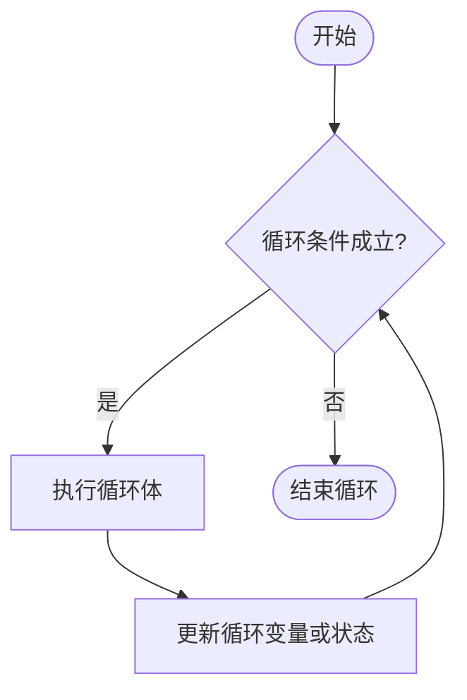
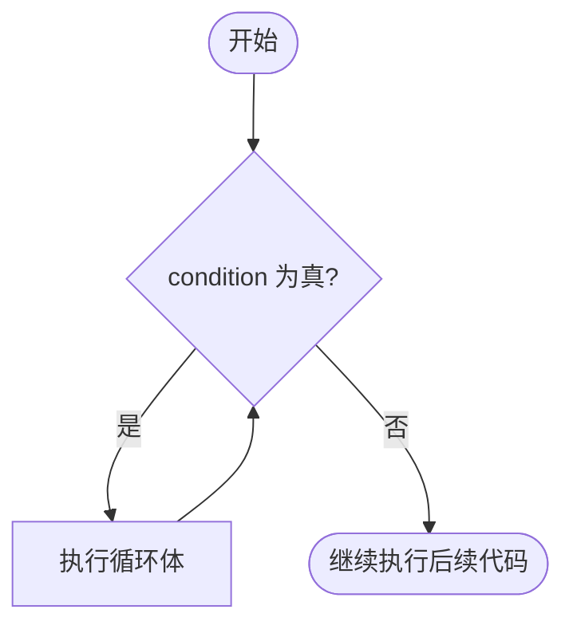
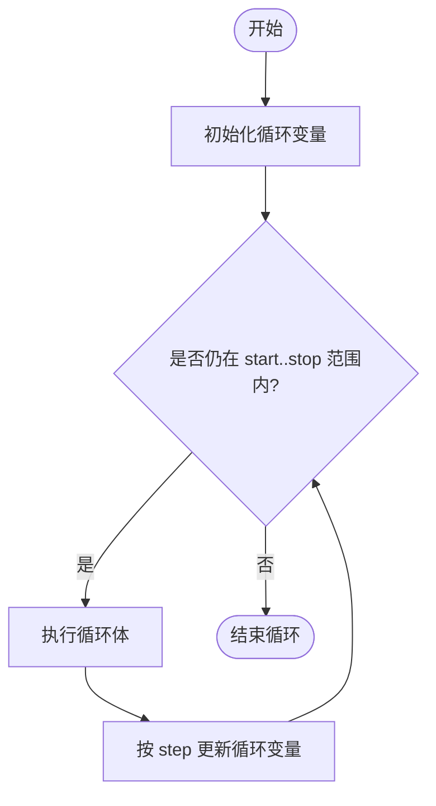
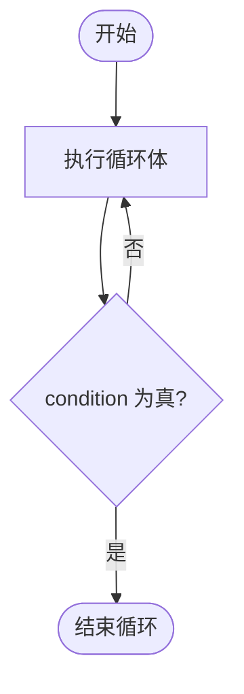

# Lua 循环语句

循环用于重复执行一段代码。Lua 常用的循环结构包括 `while`、数值 `for`、泛型 `for` 和 `repeat...until`。此外，`break` 可以提前结束当前循环。

在 Lua 中，只有 `false` 和 `nil` 被视为假；数字 `0`、空字符串 `""`、空表 `{}` 都是真。因此写循环条件时不要把 Lua 当作 C 语言来理解。

## 循环执行流程

大多数循环都会经历「判断条件 -> 执行循环体 -> 更新状态 -> 再次判断」这个过程：



Lua 的循环语句概览如下：

| 循环类型 | 适用场景 |
| :--- | :--- |
| `while` | 先判断条件，条件成立时重复执行，可能一次都不执行 |
| 数值 `for` | 按固定步长遍历数字范围 |
| 泛型 `for` | 遍历迭代器返回的数据，例如 `ipairs()`、`pairs()` |
| `repeat...until` | 先执行循环体，再判断结束条件，至少执行一次 |
| 嵌套循环 | 在一个循环体中再写另一个循环 |

## while 循环

`while` 会在每次进入循环体前判断条件。条件为真时执行循环体，条件为假时跳出循环。

### 语法

```lua
while condition do
   statement(s)
end
```

### 执行流程



### 示例：打印数字

```lua showLineNumbers title="main.lua"
local a = 10

while a < 20 do
   print("value of a:", a)
   a = a + 1
end
```

输出如下：

```bash
value of a:	10
value of a:	11
value of a:	12
value of a:	13
value of a:	14
value of a:	15
value of a:	16
value of a:	17
value of a:	18
value of a:	19
```

### 示例：遍历数组

Lua 数组习惯从下标 `1` 开始。遍历数组时，可以用长度运算符 `#` 获取连续数组部分的长度。

```lua showLineNumbers title="main.lua"
local numbers = {10, 20, 30, 40, 50}
local index = 1

while index <= #numbers do
   print("value of item:", numbers[index])
   index = index + 1
end
```

输出如下：

```bash
value of item:	10
value of item:	20
value of item:	30
value of item:	40
value of item:	50
```

## 数值 for 循环

数值 `for` 适合处理固定次数的循环。它的循环变量是局部变量，只在循环体内有效。

### 语法

```lua
for var = start, stop, step do
   statement(s)
end
```

其中：

- `start` 是初始值；
- `stop` 是结束值，循环会包含这个边界值；
- `step` 是步长，可省略，默认值为 `1`。

当 `step` 为正数时，循环变量大于 `stop` 后结束；当 `step` 为负数时，循环变量小于 `stop` 后结束。

### 执行流程



### 示例：打印数字

```lua showLineNumbers title="main.lua"
for i = 10, 19 do
   print(i)
end
```

输出如下：

```bash
10
11
12
13
14
15
16
17
18
19
```

### 示例：倒序循环

```lua showLineNumbers title="main.lua"
for i = 5, 1, -1 do
   print(i)
end
```

输出如下：

```bash
5
4
3
2
1
```

### 示例：遍历数组

```lua showLineNumbers title="main.lua"
local numbers = {10, 20, 30, 40, 50}

for i = 1, #numbers do
   print(numbers[i])
end
```

输出如下：

```bash
10
20
30
40
50
```

## repeat...until 循环

`repeat...until` 与 `while` 的主要区别是：它先执行循环体，再判断条件。因此，即使条件一开始就成立，循环体也至少会执行一次。

需要注意的是，`until condition` 表示「直到条件为真时结束」，这和 `while condition do` 的语义刚好相反。

### 语法

```lua
repeat
   statement(s)
until condition
```

### 执行流程



### 示例：打印数字

```lua showLineNumbers title="main.lua"
local i = 10

repeat
   print("value of i:", i)
   i = i + 1
until i > 20
```

输出如下：

```bash
value of i:	10
value of i:	11
value of i:	12
value of i:	13
value of i:	14
value of i:	15
value of i:	16
value of i:	17
value of i:	18
value of i:	19
value of i:	20
```

### 示例：遍历数组

```lua showLineNumbers title="main.lua"
local numbers = {10, 20, 30, 40, 50}
local i = 1

repeat
   print(numbers[i])
   i = i + 1
until i > #numbers
```

输出如下：

```bash
10
20
30
40
50
```

## 泛型 for 循环

泛型 `for` 用于配合迭代器遍历数据。最常见的两个迭代器是：

- `ipairs(t)`：按数组下标从 `1` 开始顺序遍历，遇到第一个 `nil` 停止。
- `pairs(t)`：遍历 table 中的所有键值对，遍历顺序不保证固定。

### 使用 ipairs 遍历数组

```lua showLineNumbers title="main.lua"
local numbers = {20, 10, 30, 40, 50}

for i, v in ipairs(numbers) do
   print(i, v)
end
```

输出如下：

```bash
1	20
2	10
3	30
4	40
5	50
```

如果不需要下标，可以用 `_` 占位：

```lua showLineNumbers title="main.lua"
local numbers = {20, 10, 30, 40, 50}

for _, v in ipairs(numbers) do
   print(v)
end
```

### 使用 pairs 遍历键值表

```lua showLineNumbers title="main.lua"
local days = {
   Mon = "Monday",
   Tue = "Tuesday",
   Wed = "Wednesday",
   Thu = "Thursday",
   Fri = "Friday",
   Sat = "Saturday",
   Sun = "Sunday",
}

for key, value in pairs(days) do
   print(key, value)
end
```

`pairs()` 的输出顺序由 Lua 实现和 table 内部状态决定，不要依赖它的顺序。如果需要稳定顺序，应先整理键列表，再按键列表遍历。

## break 语句

`break` 用于提前结束当前所在的最内层循环。跳出循环后，程序会继续执行循环后面的语句。

```lua showLineNumbers title="main.lua"
for i = 1, 10 do
   if i > 5 then
      break
   end

   print(i)
end
```

输出如下：

```bash
1
2
3
4
5
```

## 无限循环

当循环条件永远不会变成假时，就会产生无限循环。服务进程、事件循环中可能会有意使用无限循环，但通常需要提供退出条件。

```lua showLineNumbers title="main.lua"
local count = 0

while true do
   count = count + 1
   print("count:", count)

   if count >= 3 then
      break
   end
end
```

输出如下：

```bash
count:	1
count:	2
count:	3
```

## 嵌套循环

Lua 允许在任意循环中嵌套另一个循环。例如，下面的代码打印 1 到 3 的乘法表：

```lua showLineNumbers title="main.lua"
for row = 1, 3 do
   for col = 1, 3 do
      io.write(row * col, "\t")
   end
   print()
end
```

输出如下：

```bash
1	2	3
2	4	6
3	6	9
```

再看一个用嵌套循环查找质数的例子：

```lua showLineNumbers title="main.lua"
for n = 2, 25 do
   local is_prime = true

   for factor = 2, math.floor(math.sqrt(n)) do
      if n % factor == 0 then
         is_prime = false
         break
      end
   end

   if is_prime then
      print(n, "is prime")
   end
end
```

输出如下：

```bash
2	is prime
3	is prime
5	is prime
7	is prime
11	is prime
13	is prime
17	is prime
19	is prime
23	is prime
```

## 小结

选择循环结构时，可以按下面的经验判断：

- 已知循环次数或数字范围，优先使用数值 `for`。
- 遍历数组或 table，优先使用泛型 `for`。
- 循环次数不确定，但进入循环前必须先判断条件，使用 `while`。
- 循环体至少要执行一次，使用 `repeat...until`。
- 需要提前退出循环时，使用 `break`。
