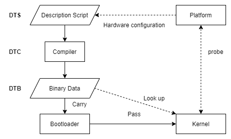

# Linux 设备树（DTS）简介

设备树（Device Tree）是一种描述硬件的数据结构，起源于 [Open Firmware](https://en.wikipedia.org/wiki/Open_Firmware)。它由 **命名节点**（node）与 **属性**（property）组成：节点可包含属性和子节点，属性是 name–value 对。

操作系统读取这份描述后，不必把板级细节大量硬编码进内核。官方文档见：[Open Firmware and Devicetree](https://www.kernel.org/doc/html/latest/devicetree/index.html)。

## 为什么引入 DTS

早期 ARM Linux 中，板级信息（`platform_device`、`resource`、`i2c_board_info`、`spi_board_info`、各类 `platform_data` 等）大量堆在 `arch/arm/plat-xxx`、`arch/arm/mach-xxx`。这些代码对多数内核子系统而言是冗余板级表，合并冲突也多。

引入 Device Tree 后，硬件拓扑与资源信息由 bootloader 传给内核（一份「硬件数据库」），板级硬编码大幅减少。调整后的大致约定是：

1. ARM 核心与 SoC 架构相关代码仍在 `arch/arm`  
2. 外设驱动放在 `drivers/`  
3. SoC 特定代码留在 `arch/arm/mach-xxx`（范围收窄）  
4. **板级细节**尽量交给 Device Tree  

可以把内核看成黑盒，启动时还需要这些输入：

1. 识别平台的信息  
2. 运行时配置参数  
3. 设备拓扑与特性  

嵌入式系统通常由 bootloader 加载内核，并把上述信息（常以 DTB）一并传递。

## 从 .dts 到 DTB

下表列出了从 DTS 生成 DTB 过程中涉及的几个重要角色：

| 角色 | 说明 |
| --- | --- |
| `.dts` | 人类可读的设备树源文件 |
| `.dtsi` | 可被 `#include` 的公共片段（类似头文件） |
| `dtc` | Device Tree Compiler，把源文件编成二进制 |
| `.dtb` / DTB | Device Tree Blob，适合机器处理 |

它们的关系如下图所示：



启动时，firmware / bootloader 把 DTB 放到内存，并把起始地址交给内核（或下一级程序）。PC 上常见 firmware → bootloader → OS；嵌入式多为 bootloader → OS。

设备树可描述的内容包括（原先多硬编码在内核里）：

- CPU 数量与类型  
- 内存基址与大小  
- 总线与桥  
- 外设连接关系  
- 中断控制器与中断用法  
- GPIO / Clock 控制器及使用情况  

内核根据这棵树展开 `platform_device`、`i2c_client`、`spi_device` 等，并把内存、IRQ 等资源绑定到对应设备。

:::note 不必描述一切
能动态探测的设备通常不必写进 DT（例如普通 USB device）。SoC 上的 USB host controller、无法探测的 PCI bridge 等仍需要描述。
:::

在 ARM Linux 中，一个 `.dts` 常对应一块板 / 一个 machine，路径多在 `arch/arm/boot/dts/`（或架构对应目录）。SoC 公共部分抽成 `.dtsi`，板级 `.dts` 再 `#include`。多个根节点 `/` 经 dtc 合并后，最终 DTB 只有一棵树、一个根。

节点命名常见形式为 `node-name@unit-address`。无 `reg` 时一般不要带 `@unit-address`。唯一引用一个节点要用完整路径，例如 `/soc/uart@1000`。

## DTS 基本结构

```c showLineNumbers
/ {
    node1 {
        a-string-property = "A string";
        a-string-list-property = "first string", "second string";
        a-byte-data-property = [0x01 0x23 0x34 0x56];
        child-node1 {
            first-child-property;
            second-child-property = <1>;
            a-string-property = "Hello, world";
        };
        child-node2 {
        };
    };
    node2 {
        an-empty-property;
        a-cell-property = <1 2 3 4>; /* 每个 cell 是 uint32 */
        child-node1 {
        };
    };
};
```

要点：

- 根节点是 `/`  
- 节点可嵌套  
- 属性可以是空、字符串、字符串列表、cells（`<>`）、字节数组（`[]`）  

## 一个最小板级例子

假设板子配置为：

- 双核 ARM Cortex-A9  
- 本地总线上：两路 UART、GPIO、SPI、中断控制器，以及一条 external bus  
- external bus 上：以太网、I2C（挂 DS1338 RTC）、NOR Flash  

对应（示意）`.dts`：

```c showLineNumbers
/ {
    compatible = "acme,coyotes-revenge";
    #address-cells = <1>;
    #size-cells = <1>;
    interrupt-parent = <&intc>;

    cpus {
        #address-cells = <1>;
        #size-cells = <0>;
        cpu@0 {
            compatible = "arm,cortex-a9";
            reg = <0>;
        };
        cpu@1 {
            compatible = "arm,cortex-a9";
            reg = <1>;
        };
    };

    serial@101f0000 {
        compatible = "arm,pl011";
        reg = <0x101f0000 0x1000>;
        interrupts = <1 0>;
    };

    serial@101f2000 {
        compatible = "arm,pl011";
        reg = <0x101f2000 0x1000>;
        interrupts = <2 0>;
    };

    gpio@101f3000 {
        compatible = "arm,pl061";
        reg = <0x101f3000 0x1000>;
        interrupts = <3 0>;
    };

    intc: interrupt-controller@10140000 {
        compatible = "arm,pl190";
        reg = <0x10140000 0x1000>;
        interrupt-controller;
        #interrupt-cells = <2>;
    };

    spi@10115000 {
        compatible = "arm,pl022";
        reg = <0x10115000 0x1000>;
        interrupts = <4 0>;
    };

    external-bus {
        #address-cells = <2>;
        #size-cells = <1>;
        ranges = <0 0 0x10100000 0x10000
                  1 0 0x10160000 0x10000
                  2 0 0x30000000 0x1000000>;

        ethernet@0,0 {
            compatible = "smc,smc91c111";
            reg = <0 0 0x1000>;
            interrupts = <5 2>;
        };

        i2c@1,0 {
            compatible = "acme,a1234-i2c-bus";
            #address-cells = <1>;
            #size-cells = <0>;
            reg = <1 0 0x1000>;
            rtc@58 {
                compatible = "maxim,ds1338";
                reg = <58>;
                interrupts = <7 3>;
            };
        };

        flash@2,0 {
            compatible = "samsung,k8f1315ebm", "cfi-flash";
            reg = <2 0 0x4000000>;
        };
    };
};
```

### compatible

`compatible` 是字符串列表：第一个通常最具体（厂商,型号），后面可写更通用的兼容名。驱动通过 `of_match_table` 与之匹配后才会进入 `probe`。

根节点的 `compatible` 还用于识别 machine / 平台。

### reg、#address-cells、#size-cells

子节点 `reg` 中 address / size 的 cell 个数，由**父节点**的 `#address-cells`、`#size-cells` 决定。

- 根下 `serial` 等：地址、长度各 1 cell → `reg = <0x101f0000 0x1000>`  
- `cpus`：`#size-cells = <0>` → `reg = <0>` / `<1>` 只有编号  
- `external-bus`：`#address-cells = <2>` → 片选 + 片选内偏移，再加 length  

同类型设备可以同名不同 `@unit-address`，例如 `cpu@0` 与 `cpu@1`。

### ranges（地址映射）

跨总线桥后，子地址空间往往要映射到 CPU 可见的内存。`ranges` 是转换表，每项包含：子地址、父地址、在子空间的大小。cell 宽度分别取子 / 父地址空间的 `#address-cells`。

上例中 `0 0 0x10100000 0x10000` 表示：external-bus 片选 0、偏移 0 起的 `0x10000` 字节，映射到 CPU 地址 `0x10100000`。

### 中断相关属性

| 属性 | 含义 |
| --- | --- |
| `interrupt-controller` | 空属性，标明本节点是中断控制器 |
| `#interrupt-cells` | 挂在该控制器下的设备，其 `interrupts` 有多少个 cell |
| `interrupt-parent` | 指向中断控制器的 phandle；未写则继承父节点 |
| `interrupts` | 中断号、触发方式等；具体编码看 binding 文档 |

例如 ARM GIC 常为 3 个 cell：类型（SPI/PPI）、中断号、flags（边沿 / 电平）。某设备若使用两个高电平 SPI：`interrupts = <0 168 4>, <0 169 4>;`。细节以内核 `Documentation/devicetree/bindings/` 为准。

## 对 BSP 与驱动的影响

**以前**：在板级代码里静态声明 `platform_device`，驱动靠 `.name` 匹配。

**现在**：板级信息写在 DTS；驱动用 `of_device_id` + `compatible` 匹配：

```c showLineNumbers
static const struct of_device_id usbcp_key_table[] = {
    { .compatible = "Realtek,rtk-gpio-ctl-irq-mux" },
    { /* sentinel */ },
};

static struct platform_driver usbcp_key_driver = {
    .driver = {
        .name = "usbcopy_key",
        .of_match_table = usbcp_key_table,
    },
    .probe  = usbcp_key_probe,
    .remove = usbcp_key_remove,
};
```

对应节点示例：

```c showLineNumbers
rtk_gpio_ctl_mlk {
    compatible = "Realtek,rtk-gpio-ctl-irq-mux";
    gpios = <&rtk_iso_gpio 8 GPIO_ACTIVE_HIGH>;
};
```

:::tip 注意
`gpios` 等属性的 cell 含义以**该 GPIO 控制器的 binding** 为准，不要照搬别的 SoC 的「第几个 cell 表示方向」之类的口头说法。驱动侧常用 `of_get_named_gpio()` / `devm_gpiod_get()` 等 API 解析。
:::

I2C 设备也不必再写 `i2c_board_info` 数组，把 client 写成 I2C 控制器节点的子节点即可；host 驱动在 probe 中注册后会按 DT 展开 client。

## 常用 of_ API（管中窥豹）

实现多在 `drivers/of/`，函数名以 `of_` 开头。

```c
void __iomem *of_iomap(struct device_node *node, int index);
```

按节点 `reg` 做 ioremap；多段内存时用 `index` 选择。很多驱动用 `of_iomap` / `devm_ioremap_resource` 替代手写地址。

```c
int of_get_named_gpio_flags(struct device_node *np,
                            const char *propname, int index,
                            enum of_gpio_flags *flags);
```

从属性（如 `"gpios"`）读取 GPIO 编号与标志。新代码更推荐 **gpiod** 接口（见下一篇 GPIO 子系统）。

## 编译 DTB：dtc 与 make dtbs

`dtc` 源码在 `scripts/dtc`。启用 Device Tree 后，编内核时会编出主机工具 `dtc`。各架构 `arch/*/boot/dts/Makefile`（或等价路径）列出要生成的 `.dtb`。

单独编译设备树：

```bash
make dtbs
```

会按当前配置生成对应 `.dtb`。

## 小结

- Device Tree 把板级硬件描述从内核硬编码中抽离出来  
- `.dts` / `.dtsi` → `dtc` → `.dtb`，由 bootloader 传给内核  
- 掌握 `compatible`、`reg`、cells、`ranges`、中断属性，就能读懂大部分板级 DTS  
- 驱动侧通过 `of_match_table` 与 DT 绑定，用 `of_*` / 子系统 API 取资源  

