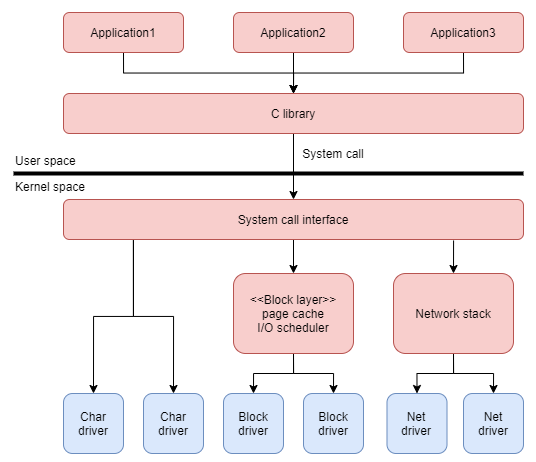
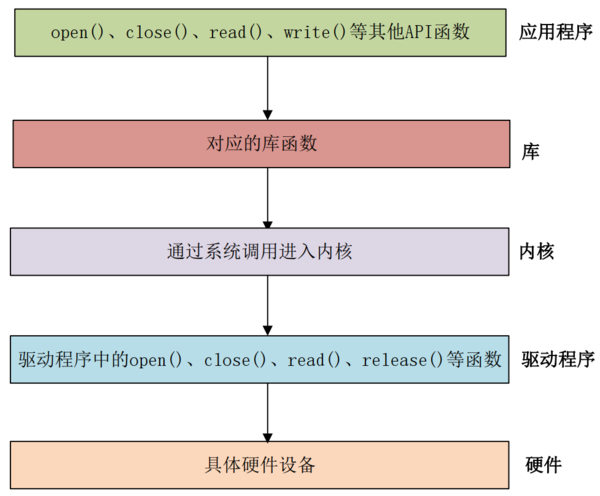
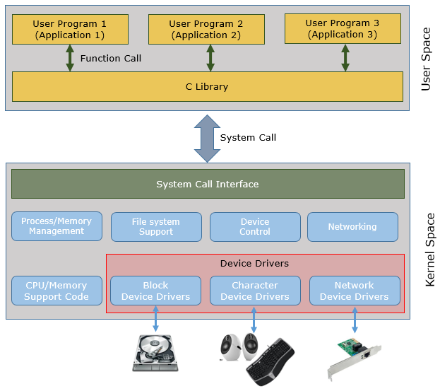

# Linux 设备驱动

设备驱动是应用程序与硬件之间的软件层。在 Linux 中，这一层通常在内核中实现，并常以内核模块的形式加载。

## 机制与策略

设备驱动应提供**机制**，而不是强加**策略**：

| 概念 | 含义 |
| --- | --- |
| 机制 | 驱动能完成哪些操作（读、写、配置、中断等） |
| 策略 | 用户空间如何使用这些能力（何时开关、如何调度） |

把策略留给应用或上层框架，驱动才能更通用、更好维护。

## 三类设备

计算机硬件大致包括 CPU、存储器与外设。现代 SoC 常在片上集成 UART、I2C、SPI、USB、以太网等控制器。驱动主要面向**存储器与外设**（含片上外设），而不是 CPU 内核本身。

Linux 按访问特点把设备分成三类：

### 字符设备

按字节流顺序访问，典型如串口、键盘、鼠标、触摸屏、控制台、LED 等。

用户空间通过 `/dev` 下的设备文件，用 `open` / `read` / `write` / `close` 等接口访问。

### 块设备

以块为单位、可随机访问，典型如硬盘、eMMC、SSD 等。

同样在 `/dev` 下有设备节点，但内核内部的 I/O 路径与字符设备差异很大（请求队列、缓存、文件系统等）。

访问方式常见两种：

1. 直接操作块设备节点（如 `dd` 读写 `/dev/sdb1`）  
2. 在其上建立文件系统（EXT4、Btrfs、FAT 等），再按路径访问文件  

针对 Flash 等介质，还有 **MTD（Memory Technology Device）** 子系统，以及 YAFFS2、JFFS2、UBIFS 等面向擦写特性的文件系统。虚拟文件系统（VFS）再对上层统一抽象。

### 网络设备

面向网络报文收发，**一般没有** `/dev` 下的设备节点。应用主要通过 **socket** 接口使用网卡（如 `eth0`）。

## 驱动在系统中的位置

除网络设备外，字符设备与块设备都映射到文件系统中的特殊文件。应用既可以：

- 直接用系统调用（`open`、`read`、`write`……）  
- 或用 C 库封装（`fopen`、`fread`、`fwrite`……；底层仍落到系统调用）  

## 小结

- 驱动连接内核与硬件，应提供机制、少强加策略  
- 三大类：字符设备、块设备、网络设备，用户态访问方式不同  
- 字符 / 块设备通过 `/dev` 节点暴露；网络设备走 socket  

