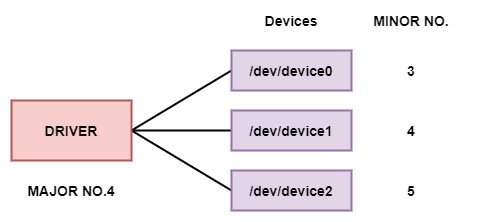

# Linux 设备节点

**设备节点**（device node / device file / device special file）是类 Unix 系统中的一类特殊文件。在 Linux 上，它们通常出现在 `/dev` 目录，用来让用户空间用「像文件一样」的方式访问已由内核分配的硬件资源。

## 设备节点做什么

- 把用户空间的标准文件操作（`open` / `read` / `write` / `ioctl`……）接到具体驱动  
- 资源用 **主设备号 + 次设备号** 标识：主设备号多对应驱动，次设备号多区分该驱动下的具体设备实例  

字符设备与块设备都会创建设备节点；**网络接口一般没有** `/dev` 节点，而是用名字（如 `eth0`）配合 socket 访问。可用 `cat /proc/devices` 查看当前字符 / 块设备的主设备号分配情况。

## 用 `ls` 看设备节点

```bash
ls -l /dev/ttyUSB*
```

示例输出：

```bash
crw-rw---- 1 root dialout 188, 0 ... /dev/ttyUSB0
crw-rw---- 1 root dialout 188, 1 ... /dev/ttyUSB1
```

- 首字符 `c`：字符设备；`b`：块设备  
- `188, 0`：主设备号 188，次设备号 0  

块设备示例：

```bash
ls -l /dev/sda*
# brw-rw---- 1 root disk 8, 0 ... /dev/sda
# brw-rw---- 1 root disk 8, 1 ... /dev/sda1
```



## 主设备号与次设备号

| 概念 | 作用 |
| --- | --- |
| 主设备号（major） | 通常标识驱动；应用打开节点时，内核据此找到对应驱动 |
| 次设备号（minor） | 区分同一驱动下的多个设备实例，传给驱动内部逻辑 |
| 设备节点 | 用户可见的名字（如 `/dev/ttyUSB0`），创建时绑定主/次设备号 |

现代内核允许更灵活的分配（含动态主设备号、共享主设备号等），但「主号找驱动、次号找实例」仍是最常用的理解模型。

现代系统多用 **udev**（或类似机制）根据内核事件自动创建 `/dev` 节点，一般不必手写 `mknod`；调试或极简环境里仍可能手动创建。

## 内核中的设备号表示

内核用 `dev_t` 保存设备编号（定义见 `<linux/types.h>`）。常见实现中，`dev_t` 为 32 位：高 12 位主设备号，低 20 位次设备号。

```c showLineNumbers
#define MINORBITS       20
#define MINORMASK       ((1U << MINORBITS) - 1)

#define MAJOR(dev)      ((unsigned int) ((dev) >> MINORBITS))
#define MINOR(dev)      ((unsigned int) ((dev) & MINORMASK))
#define MKDEV(ma, mi)   (((ma) << MINORBITS) | (mi))
```

宏定义见 `<linux/kdev_t.h>`。

## 申请与释放设备号（字符设备）

### 静态申请

若已知要用的编号范围：

```c
#include <linux/fs.h>

int register_chrdev_region(dev_t first, unsigned int count, const char *name);
```

| 参数 | 含义 |
| --- | --- |
| `first` | 起始设备号 |
| `count` | 连续编号个数 |
| `name` | 出现在 `/proc/devices` 等处的名称 |
| 返回值 | 成功为 0，失败为负错误码 |

### 动态申请（推荐新驱动默认做法）

```c
int alloc_chrdev_region(dev_t *dev, unsigned int firstminor,
                        unsigned int count, const char *name);
```

成功时 `*dev` 为分配到的起始编号；主设备号可用 `MAJOR(*dev)` 取出。

### 释放

```c
void unregister_chrdev_region(dev_t first, unsigned int count);
```

通常在模块退出路径中调用。

:::tip 选型建议
新驱动优先 `alloc_chrdev_region()` 动态分配，避免与他人静态主号冲突。动态主号意味着不能预先写死 `/dev` 节点，应配合 `cdev` + `device_create` / udev，或在加载后从 `/proc/devices` 读取再创建节点。
:::

### 静态与动态结合的常见写法

```c showLineNumbers
if (scull_major) {
    dev = MKDEV(scull_major, scull_minor);
    result = register_chrdev_region(dev, scull_nr, "scull");
} else {
    result = alloc_chrdev_region(&dev, scull_minor, scull_nr, "scull");
    scull_major = MAJOR(dev);
}

if (result < 0) {
    pr_warn("scull: can't get major %d\n", scull_major);
    return result;
}
```

默认让 `scull_major = 0` 走动态分配，同时保留编译期 / 模块参数指定主号的余地（经典 *LDD* scull 示例思路）。

## 设备号分配参考

部分主设备号有传统约定，清单见内核文档 [admin-guide/devices.txt](https://www.kernel.org/doc/html/latest/admin-guide/devices.html)（路径随内核版本可能调整）。广泛分发的驱动不要随意「挑一个看起来空闲的主号」。

## 小结

- 设备节点是用户空间访问字符 / 块设备的入口  
- 主/次设备号把「文件名」关联到「驱动 + 实例」  
- 新驱动优先动态申请设备号，并与 udev / `device_create` 配合  

