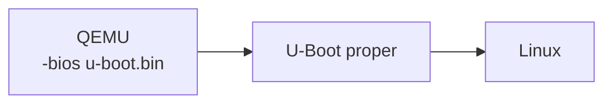
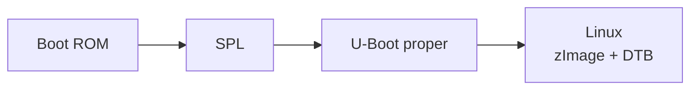
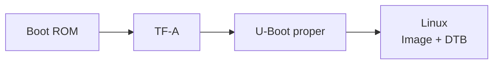
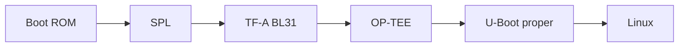
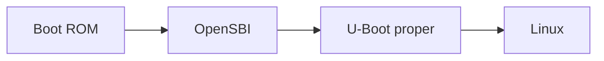
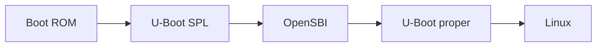
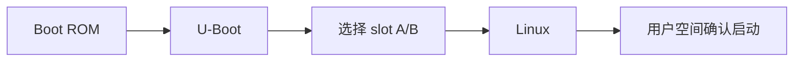
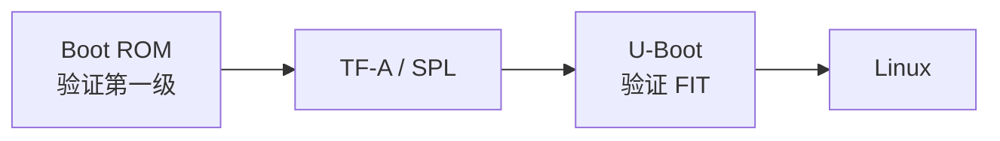
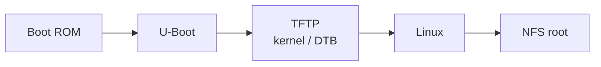

# U-Boot 常见启动链示例

不同平台的启动链差异很大。本页给出常见模式，帮助你阅读串口日志和板级文档。图中箭头表示控制权交接方向；具体阶段名称以 SoC / 板级文档为准。

## QEMU ARM64 入门链路

这是本教程主要实验链路。它简化了真实硬件中的 Boot ROM、SPL、TF-A 等阶段。

## 典型 ARMv7 开发板

SPL 负责 DRAM 初始化和加载 U-Boot proper。

## 典型 ARMv8 开发板

有些平台还会加入 SPL 或 OP-TEE：

## 典型 RISC-V 开发板

或：

## 产品化 A/B 启动

如果新 slot 启动失败，U-Boot 根据 bootcount 或状态变量回滚到旧 slot。

## 带安全验证的启动链

这个链路中，每一级都应验证下一级。只验证 kernel，而不保护 U-Boot 本身，不能形成完整信任链。

## 开发阶段网络启动

这种链路适合开发调试，不适合直接作为无保护的产品安全启动方案。

## 本页提醒

这些链路只是模式，不是所有板子的事实。真实系统必须以 SoC 文档、板级文档和实际串口日志为准。
