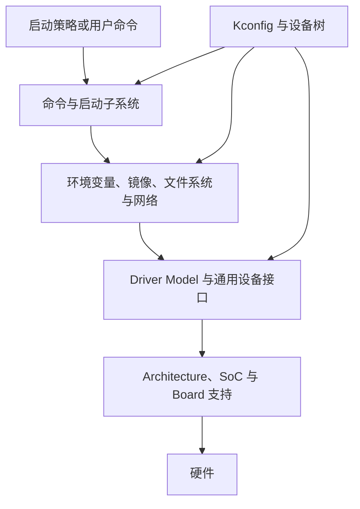
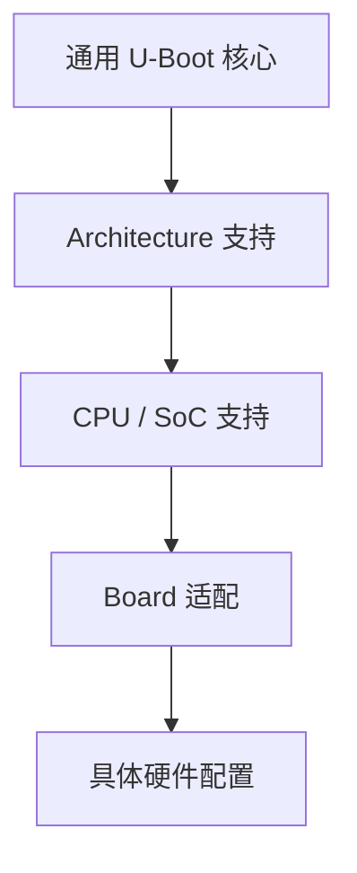
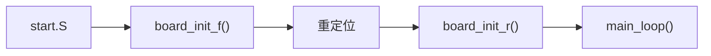

# U-Boot 的架构与组成

上一章介绍了 U-Boot 在启动链中的位置。本章把视角移到 U-Boot 内部，建立一张“地图”：配置系统、初始化核心、Driver Model、命令、环境变量和启动框架如何协作。读完后，你在后续看到一条命令或一段日志时，应能判断它大致依赖哪些模块。

:::tip 本章怎么读
这是第一部分的收尾地图，不是源码精读。细节会在第四部分《初始化、重定位与主循环》《设备树与 Driver Model》《添加一个自定义命令》等章节展开。第一次阅读时，抓住分层与三类配置即可。
:::

> 本教程以 Mainline U-Boot v2026.07 为基准。本章讨论 U-Boot proper 的通用架构；不同平台会按 Kconfig 裁剪功能。

## 学习目标

阅读本章后，你将能够：

- 说出 U-Boot 的主要组成部分及其职责
- 理解 Kconfig、设备树和环境变量分别解决什么问题
- 了解从入口到命令行的高层执行流程
- 解释 Driver Model 中 uclass、driver 和 device 的关系
- 区分 U-Boot 控制设备树与传给 Linux 的设备树
- 根据功能大致判断应去哪个源码目录查看

## 前置知识

建议先读完本部分前三章，尤其是[从上电到 Linux 的启动过程](/uboot/boot-process/)。

## 1. 本章所说的“架构”是什么

这里的“架构”不只指 ARM、RISC-V 或 x86，而是指 U-Boot 组织代码和运行功能的整体方式：

1. **平台分层**：如何复用通用代码，同时适配不同 Architecture、SoC 和 Board
2. **功能模块**：命令、驱动、环境变量、文件系统、网络和启动框架如何分工
3. **运行流程**：如何完成初始化，进入主循环，并最终启动操作系统

## 2. 设计目标如何影响 U-Boot 架构

U-Boot 官方设计原则强调保持小巧、快速、简单、可移植和可配置。

| 设计目标 | 在架构中的体现 |
| --- | --- |
| 小巧 | 功能通过 Kconfig 裁剪；未启用的命令和驱动不进入镜像 |
| 快速 | 只初始化启动真正需要的设备；设备通常按需 probe |
| 简单 | 采用相对直接的执行流程，便于串口和 JTAG 调试 |
| 可移植 | 通用逻辑与 Architecture、SoC、Board 代码分层 |
| 可配置 | 同一源码树可生成面向不同硬件的镜像 |

U-Boot 不是缩小版 Linux。它通常采用单线程、事件驱动或轮询式执行，不需要完整的进程与虚拟内存模型。所有模块都围绕一个核心目标：

> 用尽可能少的资源建立启动环境，然后可靠地把控制权交给下一阶段。

## 3. U-Boot 的整体组成

从运行时角度，可以把 U-Boot proper 看成下面几个相互协作的层次：



| 组成部分 | 主要职责 |
| --- | --- |
| 配置与构建系统 | 选择目标硬件和需要编入镜像的功能 |
| Architecture、SoC 与 Board 支持 | 处理 CPU、芯片和开发板差异 |
| 初始化核心 | 建立栈、全局数据、DRAM、重定位和运行环境 |
| Driver Model | 用统一方式描述、查找和操作设备 |
| 命令与 Shell | 解析输入，调用相应功能 |
| 环境变量 | 保存启动参数、策略和运行配置 |
| 存储、分区与文件系统 | 定位设备、分区并读取启动文件 |
| 网络协议栈 | 支持 DHCP、TFTP、NFS、PXE 等 |
| 镜像与启动子系统 | 解析镜像、准备参数并启动操作系统 |
| 设备树支持 | 配置 U-Boot，并向操作系统描述硬件 |

这些并不是彼此独立的程序。构建系统会把目标平台需要的代码链接成一个或多个镜像，运行时再通过统一接口协作。

## 4. 三类配置分别回答什么问题

初学者经常把 `defconfig`、设备树和环境变量都称为“U-Boot 配置”，但它们处于不同层次。

| 配置机制 | 核心问题 | 典型内容 | 生效时机 |
| --- | --- | --- | --- |
| Kconfig / `defconfig` | 哪些代码要进入镜像？ | 架构、命令、驱动、文件系统和启动功能 | 编译时 |
| 设备树 | 这块硬件有哪些设备，如何连接？ | 寄存器、中断、时钟、GPIO、总线和设备状态 | 构建时或运行时 |
| 环境变量 | 本次或以后怎样启动？ | `bootcmd`、`bootargs`、启动顺序、网络与加载地址 | 运行时 |

可以记住：

```bash
Kconfig：决定“有没有这个能力”
设备树：说明“硬件实例在哪里、参数是什么”
环境变量：决定“这一次怎样使用这些能力”
```

例如，设备树中存在 MMC 节点，并不代表 U-Boot 一定能访问它。还必须：对应驱动已通过 Kconfig 编入；时钟 / 复位 / 引脚等依赖描述正确；Driver Model 能匹配到驱动；使用时 probe 成功。环境变量里写 `tftp` 也不能凭空增加网络功能。

## 5. 平台支持如何分层

Mainline U-Boot 强调把代码放在尽可能通用的层次：



- **通用代码**：命令解析、环境变量、Driver Model、文件系统、网络、镜像解析、Standard Boot 等，尽量跨平台复用
- **Architecture**：复位入口、Cache / MMU、异常级、内核入口参数约定等（主要在 `arch/`）
- **SoC**：时钟、复位、pinctrl、内存控制器、芯片级启动模式等（ARM 上常见于 `arch/arm/mach-*`，具体以平台为准）
- **Board**：板型识别、板载电源、EEPROM 中的序列号 / MAC、板级设备树修正、产品恢复条件等

能够写成通用驱动的功能应放入 `drivers/`，能够写成 SoC 公共逻辑的功能应放入 SoC 层，不要全部堆进 `board/`。

## 6. U-Boot 的高层执行流程

U-Boot proper 的具体入口因架构而异，但大多数平台可用下面的流程建立基本认识：



| 阶段 | 主要作用 |
| --- | --- |
| `start.S` | 架构相关入口，建立最初执行条件 |
| `board_init_f()` | 准备 DRAM、串口和重定位所需信息（BSS 通常尚不可用） |
| 重定位 | 把 U-Boot proper 移到规划的 RAM 区域 |
| `board_init_r()` | 重定位后的公共初始化（DRAM 与 BSS 已可用） |
| `main_loop()` | 处理 `preboot`、自动启动和交互命令 |

如果 DRAM 已由 SPL 或更早阶段初始化，U-Boot proper 中的 `dram_init()` 可以只负责报告或确认内存信息。

> 记住一句话即可：`board_init_f()` 建立重定位前条件，`board_init_r()` 完成重定位后初始化，`main_loop()` 进入启动策略和命令处理。细节见后续《初始化、重定位与主循环》。

## 7. Global Data：连接早期与正常运行阶段

在 DRAM、BSS 和普通全局变量尚不可用时，U-Boot 仍需保存少量关键状态。为此使用 `struct global_data`，并通过名为 `gd` 的指针访问，其中可保存 RAM 信息、重定位偏移、串口、环境状态、控制设备树地址、Driver Model 根设备等。

许多架构把 `gd` 放在专用寄存器中，以便在早期阶段用较少代码访问。它不是可以随意塞数据的全局仓库——在片上 SRAM 紧张的平台上必须保持体积较小。

## 8. Driver Model：统一管理设备

不同厂商的 UART、MMC、I2C 或网卡寄存器完全不同。U-Boot 使用 **Driver Model（DM）** 建立统一抽象：

| 概念 | 含义 | 示例 |
| --- | --- | --- |
| uclass | 具有同类操作方式的一组设备 | `UCLASS_MMC`、`UCLASS_SERIAL` |
| driver | 操作某一类具体硬件的代码 | 某款 SoC 的 MMC 控制器驱动 |
| device | driver 与一个硬件实例绑定后形成的对象 | 板上的第一个 MMC 控制器 |

```bash
uclass：定义同类设备的统一能力
driver：实现某种硬件的具体操作
device：代表板子上的一个实际实例
```

设备从描述到可用，通常经历：**发现节点 → bind → of_to_plat → probe → 可用**。`bind` 只表示“已知设备与驱动的关系”，并不表示硬件已初始化成功。

U-Boot 通常只在设备第一次被使用时 probe（**Lazy Probe**），以缩短启动时间、减少占用，并降低与 Linux 的状态交接复杂度。例如正常从 eMMC 启动时，若未使用 USB，相关 Host Controller 可以始终不被 probe。

在命令行中可用 `dm tree` 观察设备树（后续《设备树与 Driver Model》会结合输出分析）。

## 9. 设备树与两份 FDT

设备树是现代 U-Boot 描述硬件的主要方式之一。Driver Model 读取节点的 `compatible`，匹配已编入镜像的 driver。

```dts
serial@9000000 {
    compatible = "arm,pl011";
    reg = <0x0 0x09000000 0x0 0x1000>;
    clock-frequency = <24000000>;
    status = "okay";
};
```

设备树不包含驱动程序本身。Kconfig 负责选择 driver，设备树负责描述 device，Driver Model 负责把二者连起来。因此“把 Linux 设备树复制给 U-Boot”不一定就能让设备工作。

在典型系统中，还要区分两份逻辑角色不同的设备树：

| 类型 | 使用者 | 主要用途 |
| --- | --- | --- |
| U-Boot Control FDT | U-Boot 自身 | 配置 Driver Model 和 U-Boot 的硬件访问 |
| OS FDT | Linux 内核 | 向 Linux 描述硬件、启动参数和保留内存 |

Control FDT 地址通常可通过只读环境变量 `fdtcontroladdr` 查看。启动 Linux 时，U-Boot 还可能从存储加载另一份 DTB 并传给 `booti`。两份 DTB 可能同源、可能复用同一块内存对象，也可能完全不同——关键是分清职责。

## 10. 命令、环境变量与启动子系统

命令子系统接收控制台输入，在命令表中查找实现并调用。命令一般用 `U_BOOT_CMD()` 等宏注册；是否出现在镜像中由 Kconfig 决定。命令实现应通过公共接口访问硬件，例如 `mmc` 走 MMC / Block 接口，`ext4load` 走文件系统层，`booti` 走镜像与 OS 启动代码。

环境变量提供可修改的键值配置，需区分：

| 层次 | 含义 |
| --- | --- |
| 默认环境 | 构建时随 U-Boot 提供的初始变量 |
| 当前环境 | 本次运行时内存中的变量 |
| 持久化环境 | 保存在 Flash、MMC、EEPROM 等后端中的变量 |

`setenv` 通常只改当前环境；`env save` 才会写持久化存储。风险提示与用法见[U-Boot 简介](/uboot/what-is-uboot/)和后续[环境变量与启动脚本](/uboot/environment-and-scripts/)。

从文件到内核，还要经过存储 / 分区 / 文件系统分层，以及镜像解析、参数准备和入口跳转。常见启动命令包括：

| 命令 | 常见用途 |
| --- | --- |
| `booti` | 启动 AArch64 `Image` |
| `bootz` | 启动 ARM32 `zImage` |
| `bootm` | 启动 Legacy Image 或 FIT |
| `bootefi` | 启动 EFI 应用或使用 EFI Boot Manager |

Standard Boot 用 `bootdev`、`bootmeth`、`bootflow` 组织设备扫描与启动方案；它协调下层模块，而不是取代驱动与文件系统。

因此可以把启动看成两层：

1. **策略层**：从哪个设备、用哪种方法找到系统
2. **执行层**：加载并验证镜像，准备参数，进入内核

## 11. 一条命令如何串起模块

假设执行：

```bash
# [U-Boot]
=> ext4load mmc 0:2 ${loadaddr} /boot/Image
```

背后大致会：展开环境变量 → 找到 `ext4load` 命令 → 文件系统选中 MMC `0` 分区 `2` → Driver Model 查找并必要时 probe MMC → 块设备读数据 → EXT4 找到文件 → 复制到 `${loadaddr}`。

再执行 `booti ${loadaddr} - ${fdt_addr_r}`，则会连到 Image 解析、OS FDT、设备树修正和架构相关的内核交接代码。

一条看似简单的命令，可能同时用到配置、命令、环境变量、文件系统、Driver Model、设备驱动、内存和启动子系统——这就是分层架构的价值。第三部分会亲手做这些步骤；第四部分再沿调用链读源码。

## 12. 源码目录速查

第一次打开源码时，先建立目录与功能的对应关系即可：

| 目录 | 主要内容 |
| --- | --- |
| `arch/` | Architecture、CPU 和部分 SoC 相关代码 |
| `board/` | 开发板特有代码 |
| `boot/` | 镜像处理和操作系统启动支持 |
| `cmd/` | U-Boot 命令实现 |
| `common/` | 与 Architecture 无关的公共逻辑 |
| `configs/` | 各目标的默认 `defconfig` |
| `drivers/` | 串口、MMC、网络、USB、时钟等驱动 |
| `env/` | 环境变量及存储后端 |
| `fs/` | 文件系统 |
| `net/` | 网络协议栈 |
| `tools/` | 在 Host 运行的镜像制作与打包工具 |

注意：`tools/` 跑在开发主机上；`configs/*.defconfig` 是默认配置，不是最终完整 `.config`；同一功能常横跨多个目录。更完整的源码结构与阅读方法见第四部分《U-Boot 源码结构》。

## 13. U-Boot proper 与 xPL

SPL / TPL / VPL 与 U-Boot proper 可复用许多源码，但是分别构建的阶段，配置与资源约束不同：

| 对比项 | xPL | U-Boot proper |
| --- | --- | --- |
| 主要目标 | 建立早期条件并加载下一阶段 | 提供完整启动策略并启动 OS |
| 典型内存 | 片上 SRAM 或受限早期内存 | 通常是 DRAM |
| 功能范围 | 严格裁剪 | 相对完整 |
| 命令行 | 通常没有普通交互命令 | 可以提供完整命令行 |

不能因为 U-Boot proper 能访问 MMC，就假定 SPL 也一定包含同样的驱动和文件系统。

## 14. 常见认识误区

#### 误区一：U-Boot 的架构就是处理器架构

不完全是。处理器 Architecture 只是平台支持的一层。

#### 误区二：设备树中存在节点，设备就一定可用

不是。还需要 driver 已编入镜像，并且 bind / probe 成功。

#### 误区三：所有设备都会在 U-Boot 启动时初始化

不是。许多设备只在真正使用时 probe。

#### 误区四：U-Boot Control FDT 就是传给 Linux 的 DTB

不一定。逻辑职责不同，可能共享来源，也可能分别加载。

#### 误区五：环境变量可以启用未编译的功能

不能。环境变量只能使用镜像中已有的命令、驱动和协议。

## 本章小结

U-Boot 通过 Kconfig 选择能力、设备树描述硬件、环境变量表达启动策略，并用初始化核心、Driver Model、命令、存储、网络和镜像子系统协同启动操作系统。先抓住这张地图，再在后续章节按模块深入。

## 思考与练习

1. Kconfig、设备树和环境变量分别在什么时候生效？
2. uclass、driver 和 device 之间是什么关系？
3. 为什么设备完成 bind 后仍可能无法使用？
4. U-Boot Control FDT 与 OS FDT 的主要区别是什么？
5. 执行 `ext4load mmc 0:2 ...` 时会经过哪些软件层次？
6. 为什么在 `cmd/` 中找到命令源码，不代表最终镜像中一定有它？

## 参考资料

- [U-Boot Design Principles](https://docs.u-boot.org/en/v2026.07/develop/designprinciples.html)
- [U-Boot Directory Hierarchy](https://docs.u-boot.org/en/v2026.07/develop/directories.html)
- [U-Boot Board Initialisation Flow](https://docs.u-boot.org/en/v2026.07/develop/init.html)
- [U-Boot Global Data](https://docs.u-boot.org/en/v2026.07/develop/global_data.html)
- [U-Boot Driver Model Design](https://docs.u-boot.org/en/v2026.07/develop/driver-model/design.html)
- [U-Boot Devicetree Control](https://docs.u-boot.org/en/v2026.07/develop/devicetree/control.html)
- [U-Boot Standard Boot](https://docs.u-boot.org/en/v2026.07/develop/bootstd/index.html)
