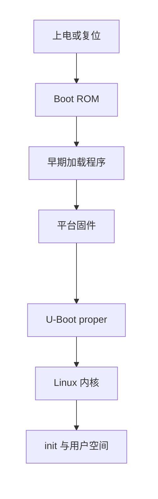
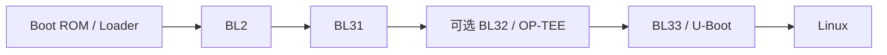

# U-Boot 启动过程：从上电到 Linux

前面介绍了 Bootloader 的作用与 U-Boot 的基本定位。本章沿着一次完整启动逐阶段展开，重点分析每个阶段运行在哪里、接收什么、完成什么，以及如何把系统交给下一阶段。

> 本教程以 Mainline U-Boot v2026.07 为基准。本章给出的是通用模型，不代表所有 SoC、开发板和产品都采用完全相同的启动链。

## 学习目标

阅读本章后，你将能够：

- 说明从上电到用户空间运行所经历的主要阶段
- 分析每个启动阶段的输入、任务和输出
- 区分 Boot ROM、早期加载程序、平台固件、U-Boot 和 Linux 的职责
- 区分镜像的存储位置、加载地址和执行地址
- 理解 U-Boot 向 AArch64 Linux 移交控制权时需要准备什么
- 根据串口日志初步定位启动故障

## 前置知识

建议先阅读[嵌入式系统与 Bootloader](/uboot/embedded-system-and-bootloader/)与[U-Boot 简介](/uboot/what-is-uboot/)。Bootloader 的定义与职责边界见第一章，本章不再重复展开。

## 1. 启动不是一个动作，而是一连串交接

日常所说的“启动 Linux”容易让人误以为设备只执行了一次加载和跳转。实际上，嵌入式系统通常会经历多个软件阶段：



图中的阶段并非全部必选。例如：

- 简单平台可能没有单独的平台固件
- U-Boot SPL 可以同时承担早期初始化和镜像加载
- 某些平台直接使用厂商 Loader，不使用 U-Boot SPL
- TF-A、OP-TEE 或 OpenSBI 只会出现在适用的架构和平台中
- 特殊系统可以跳过 U-Boot proper，直接从早期阶段启动 Linux

因此，不要把图中的名称当成固定公式。分析任意启动链时，更有效的方法是对每个阶段提出四个问题：

1. 代码从哪里读取？
2. 代码在哪里运行？
3. 这个阶段建立了哪些运行条件？
4. 它向下一阶段传递了什么？

这四个问题贯穿本章，也会成为后续阅读启动日志和排查故障的基本方法。

## 2. 怎样才算“启动完成”

“设备启动了”可能指不同的时间点：

| 现象 | 实际含义 |
| --- | --- |
| 出现 U-Boot 横幅 | U-Boot proper 已经开始运行 |
| 出现 U-Boot 提示符 `=>` | U-Boot 已完成基本初始化并进入交互环境 |
| 出现 `Starting kernel ...` | U-Boot 即将或已经把控制权交给内核 |
| 出现 `Linux version ...` | Linux 内核的早期代码已经开始运行 |
| 根文件系统挂载成功 | 内核已经找到并挂载 rootfs |
| 启动 `init` | 系统开始进入用户空间 |
| 出现登录提示符或业务界面 | 用户空间已完成产品定义的关键启动流程 |

所以，“内核开始执行”和“系统可用”是两个不同的里程碑。

本教程把完整启动过程的终点定义为：

> Linux 已挂载根文件系统，启动 `init`，并进入可以运行系统服务和应用程序的用户空间。

## 3. 阶段一：上电与处理器复位

设备上电或收到复位信号后，电源、时钟和复位控制电路会使处理器进入芯片规定的初始状态。处理器随后从架构和 SoC 设计指定的复位入口开始取指。

在这个时刻，不能假定整套硬件已经可用：

- 外部 DRAM 通常还不能使用
- 大多数外设尚未初始化
- 时钟可能处于安全的初始频率
- 多核系统通常只让一个主处理器核心先执行
- Cache、MMU 和中断控制器处于架构规定或平台规定的状态
- 串口可能还没有配置，因此看不到任何输出

冷启动、热复位、看门狗复位和从低功耗状态恢复的路径也可能不同。

本阶段的关键结果只有一个：

> 处理器进入一个确定的初始状态，并开始执行启动链的第一段代码。

## 4. 阶段二：Boot ROM

许多 SoC 在芯片内部集成了一段不可由普通用户修改的只读程序，通常称为 Boot ROM、ROM Code 或 Primary Bootloader。它由芯片厂商实现，是处理器复位后最先执行的软件。

### 4.1 Boot ROM 如何选择启动来源

Boot ROM 通常会综合读取启动模式引脚、eFuse / OTP、介质中的启动标记、按键或恢复条件等信息，然后按 SoC 规则尝试从 eMMC、SD、SPI NOR、NAND、USB、UART 或网络等介质加载下一阶段。

具体支持哪些介质、从哪个偏移读取、镜像头采用什么格式，都由 SoC 决定，不能从一块开发板类推到另一块开发板。

### 4.2 Boot ROM 通常完成什么

1. 完成加载下一阶段所必需的最小硬件初始化
2. 根据启动配置选择启动介质
3. 识别芯片规定的启动镜像格式
4. 将下一阶段镜像读取到片上 SRAM 或其他可用内存
5. 在启用安全启动时验证镜像
6. 准备入口参数并跳转到下一阶段

如果正常启动介质不可用，一些 Boot ROM 会进入 USB 或 UART 下载模式，等待主机发送恢复镜像。

### 4.3 为什么经常看不到 Boot ROM 日志

Boot ROM 的容量和运行条件受限，串口引脚或时钟未必已经配置。很多芯片不会输出可读日志，或者只通过状态寄存器、USB 枚举和特定错误码报告结果。

因此，串口完全没有输出时，不能直接断言“U-Boot 坏了”。问题也可能发生在供电、复位、启动模式、Boot ROM 无法识别介质、下一阶段镜像偏移 / 格式、签名验证，或早期串口初始化之前。

## 5. 阶段三：早期加载程序

Boot ROM 能加载的镜像大小和内存通常有限，而功能完整的 U-Boot proper 往往需要 DRAM。早期加载程序的任务，就是在资源受限的环境中建立运行后续固件所需的条件。

这个阶段可能被称为 U-Boot SPL、TPL / VPL、FSBL、厂商 Loader、TF-A BL2 或其他名称。名称并不能完全说明职责，应回到“运行在哪里、初始化什么、加载谁”。

### 5.1 为什么它通常运行在片上 SRAM

片上 SRAM 容量较小，但复位后通常可直接访问。早期加载程序必须控制体积，常见任务包括：建立栈与基本 C 运行环境、初始化调试串口、配置必要时钟与引脚、初始化电源与 DRAM（含 DDR training）、初始化用于读后续镜像的存储控制器，以及加载 / 验证下一阶段。

不是所有平台都由 U-Boot SPL 初始化 DRAM。有些依赖厂商 DDR 固件或 TF-A / 其他 Loader；QEMU 等模拟平台还可能在 U-Boot 运行前就提供可用 RAM。

### 5.2 U-Boot 的 xPL 阶段

U-Boot 使用 **xPL** 统称可选的早期程序加载阶段：

| 阶段 | 名称 | 典型作用 |
| --- | --- | --- |
| TPL | Tertiary Program Loader | 尽可能小的早期初始化，通常继续加载 VPL 或 SPL |
| VPL | Verifying Program Loader | 可选的验证和选择阶段 |
| SPL | Secondary Program Loader | 通常初始化 SDRAM，并加载 U-Boot proper 或其他固件 |

一块开发板通常只使用其中一部分。许多平台只使用 SPL；少数因片上 SRAM 更小或启动链更复杂，还需要 TPL。

:::note
名称中的 Secondary / Tertiary 是 U-Boot 项目约定，不应据此推断它们在所有芯片手册中的绝对级数。后续《SPL、TPL、VPL 与 U-Boot proper》会详细介绍。
:::

### 5.3 早期加载成功意味着什么

当早期加载程序能够把后续程序放入 DRAM 并跳转时，通常可以初步说明：处理器已离开 Boot ROM；至少一部分时钟和引脚配置正确；DRAM 已达到当前阶段所需状态；用于加载后续镜像的介质路径基本可用。

这不代表 DRAM 已经过完整压力测试，也不代表所有外设都能正常工作。

## 6. 阶段四：平台固件

在现代 ARM64 和 RISC-V 系统中，U-Boot 前后可能还有承担特权级、安全世界或运行时服务的平台固件。它们并不简单等同于“另一个 U-Boot”。

### 6.1 ARM64 中的 TF-A 与 OP-TEE

**Trusted Firmware-A（TF-A）** 是 Arm A-profile 平台常用的安全固件实现。完整模型可能包含：

| 名称 | 典型角色 |
| --- | --- |
| BL1 | 初始可信启动阶段；在某些平台中由 Boot ROM 承担或替代 |
| BL2 | 加载和准备后续固件镜像 |
| BL31 | 驻留在 EL3 的运行时固件，提供 PSCI 等服务 |
| BL32 | 可选的 Secure World Payload，例如 OP-TEE |
| BL33 | Non-secure World 固件，常见实现之一是 U-Boot |

一种常见的时序关系可以表示为：



:::note
上图表示常见逻辑顺序。BL31 往往会在内存中驻留；进入 BL32 后再回到 BL31，再进入 BL33，是安全世界与 Normal World 的协作关系，不同 SoC 会裁剪或重排这些阶段。
:::

例如，Boot ROM 或厂商 Loader 可能代替 BL1 / BL2；U-Boot SPL 也可能先加载 BL31、BL32 和 U-Boot proper，再由 BL31 把控制权交给作为 BL33 的 U-Boot。

### 6.2 RISC-V 中的 OpenSBI

RISC-V Linux 通常运行在 Supervisor Mode，部分底层机器服务需要由 Machine Mode 固件提供。**OpenSBI** 是常见的 Supervisor Binary Interface 实现。

一种常见的简化启动链是：

```bash
Boot ROM → U-Boot SPL 或其他 Loader → OpenSBI → U-Boot proper → Linux
```

早期 Loader 可以同时把 OpenSBI 和 U-Boot proper 加载到内存。OpenSBI 初始化 M-mode 运行时环境后，再进入运行于 S-mode 的 U-Boot。Linux 启动后仍可通过 SBI 调用请求服务。实际顺序仍以平台构建配置为准。

### 6.3 平台固件与 U-Boot 的分工

| 平台固件 | U-Boot proper |
| --- | --- |
| 建立安全状态和特权级运行环境 | 选择具体启动方案 |
| 提供 PSCI、SBI 等底层运行时服务 | 扫描存储、分区、文件系统或网络 |
| 管理 Secure World 或 Machine Mode 能力 | 加载 Kernel、DTB 和 initramfs |
| 可能在 Linux 运行期间继续驻留 | 跳转到 Linux 后通常不再执行普通启动逻辑 |

平台固件解决的是处理器架构和安全运行环境问题；U-Boot 主要解决的是“从哪里找到并如何启动目标系统”。

## 7. 阶段五：U-Boot proper

**U-Boot proper** 是功能相对完整的 U-Boot 阶段。它通常在 DRAM 中运行，可以包含命令行、环境变量、Driver Model、网络协议、文件系统和多种启动方法。

U-Boot proper 启动后，大致会完成：建立运行环境（必要时重定位）、初始化控制台与启动所需设备、读取环境、确定启动策略、查找并加载内核 / 设备树 / initramfs、检查镜像、设置设备树与内核命令行，并把处理器状态调整到内核要求后跳转。

正常产品通常通过 `bootcmd`、启动脚本或 Standard Boot 自动完成。开发和排障时，你也可以停在 `=>` 提示符下逐条执行相同操作。

> U-Boot 自身的初始化、重定位和主循环会在《初始化、重定位与主循环》一章中展开。本章只关注它在完整启动链中的作用。

## 8. 不要混淆三种“位置”

理解启动过程时，最容易混淆的是文件存放位置、加载地址和执行地址。

假设 U-Boot 从 eMMC 分区中读取 Linux 内核：

```bash
# [U-Boot]
=> ext4load mmc 0:2 0x40200000 /boot/Image
```

这条命令涉及两个完全不同的位置：

- `mmc 0:2` 和 `/boot/Image` 描述文件在存储设备中的位置
- `0x40200000` 描述文件被复制到 DRAM 后的内存地址

随后执行：

```bash
# [U-Boot]
=> booti 0x40200000 - 0x40000000
```

U-Boot 会解析位于内存中的 AArch64 `Image`，准备相关参数，并进入内核入口。这里还给出了设备树在内存中的地址 `0x40000000`。

分析启动链时，应分别记录：

| 位置 | 需要回答的问题 | 示例 |
| --- | --- | --- |
| 存储位置 | 镜像长期保存在哪里？ | eMMC 原始偏移、FAT 文件、TFTP 服务器 |
| 加载地址 | 镜像被复制到哪一段 RAM？ | `0x40200000` |
| 执行入口 | CPU 最后跳到哪里开始执行？ | 镜像头或平台配置指定的入口 |

三者有时数值相同，有时完全不同。对于支持 XIP 的 NOR Flash，代码甚至可以直接在映射后的存储区域执行；而从 eMMC 或网络读取的镜像通常必须先复制到 RAM。

> 上面的地址只是用于解释概念，不能直接用于任意开发板。实际地址必须根据平台内存布局、U-Boot 环境变量和镜像格式确定。

## 9. 启动介质、启动文件和 rootfs 也可以分离

设备“从 eMMC 启动”并不一定表示所有启动组件都位于同一个 eMMC 分区。

一个产品可能采用这样的布局：

| 内容 | 所在位置 |
| --- | --- |
| SPL、TF-A 和 U-Boot proper | SPI NOR Flash |
| Linux Kernel 与 DTB | eMMC 的 boot 分区 |
| rootfs | NVMe SSD |
| Recovery 镜像 | eMMC 的独立分区 |
| 开发阶段的替代内核 | TFTP 服务器 |

因此需要区分三个问题：

1. 处理器最初从哪个介质取得启动固件？
2. U-Boot 从哪里取得 Kernel、DTB 和 initramfs？
3. Linux 最终从哪里挂载 rootfs？

这三处可以相同，也可以完全不同。`bootargs` 中的 `root=` 参数通常描述第三个问题，而不是 U-Boot 自身来自哪里。

## 10. U-Boot 为 Linux 准备什么

在 U-Boot 跳转之前，Linux 还只是位于存储设备或内存中的一份镜像。启动链需要为它准备可执行环境，典型包括：

- 可供内核使用的 DRAM
- 已加载到合适地址的 Kernel
- 描述硬件和启动配置的 DTB
- 可选的 initramfs
- 内核命令行参数
- 符合架构要求的 Cache、MMU、中断和 CPU 状态
- 必要的保留内存和固件接口信息

设备树不仅描述 CPU、内存和外设，也可以通过 `/chosen` 节点向内核传递 `bootargs`、initramfs 起止地址、标准输出设备等。U-Boot 可能在加载 DTB 后修改内存、MAC 地址、启动参数或保留内存等属性，再把最终结果传给 Linux。

### 10.1 AArch64 的交接示例

Linux 官方文档要求 AArch64 Bootloader 至少完成：初始化内核将使用的 RAM、准备设备树、必要时解压内核、调用内核镜像。

进入 AArch64 内核时，通用寄存器的关键约定是：

```bash
x0 = DTB 在系统 RAM 中的物理地址
x1 = 0
x2 = 0
x3 = 0
```

同时还要满足文档规定的异常级、MMU、Cache、中断、定时器和一致性等条件。U-Boot 的 `booti` 命令会根据 AArch64 `Image` 格式和平台实现完成相应处理。本教程后续手动启动 Linux 时，会实际使用 `booti`。

这组寄存器约定属于 AArch64，不能直接套用到 ARM32、RISC-V 或其他架构。

### 10.2 跳转以后谁拥有控制权

U-Boot 输出下面一行时：

```bash
Starting kernel ...
```

它已经完成最后的准备，并即将跳到内核入口。正常启动路径下，Linux 不会再回到 U-Boot 命令行（特殊调试或 kexec 等场景除外）。

从此以后：

- Linux 接管普通内存和大多数硬件
- Linux 使用自己的设备驱动重新配置设备
- U-Boot 的普通命令和驱动不再参与系统运行
- TF-A、OP-TEE 或 OpenSBI 等驻留固件仍可能提供运行时服务

所以，`Starting kernel ...` 之后没有输出，不一定是 U-Boot 已经崩溃，也可能是内核入口、设备树、串口参数或 CPU 交接状态存在问题。

## 11. 阶段六：Linux 内核

Linux 获得控制权后，会从高度受限的早期环境逐步建立完整的内核运行环境：执行架构相关入口、解析设备树、建立页表并启用 MMU、初始化内存 / 中断 / 定时器 / 调度器、初始化子系统与驱动、解析内核命令行，再使用 initramfs 或挂载最终 rootfs，并启动第一个用户空间进程 `init`。

你在串口中看到的 Linux 日志大致反映了这个过程。日志中的时间通常是相对于内核自身开始计时的时间，不是从开发板上电开始计算。因此，仅根据 `[    0.000000]` 不能得出前面固件阶段没有耗时。

## 12. 阶段七：init 与用户空间

Linux 内核不会直接启动你的所有业务程序。它会尝试运行第一个用户空间进程，通常是 `systemd`、BusyBox `init`、SysV init 或产品自定义 init。这个进程的 PID 通常为 1。

如果内核已经挂载 rootfs，却无法找到或执行 `init`，可能出现：

```bash
Kernel panic - not syncing: No working init found.
```

这时 U-Boot 和内核的大部分启动工作已经完成，问题更可能位于 rootfs 内容、`init=` 参数、程序架构或动态链接器、权限或挂载方式。这说明启动故障必须按阶段定位，而不能把所有问题都归因于 U-Boot。

## 13. 常见启动链示例

| 平台类型 | 简化启动链 |
| --- | --- |
| 常见 ARM32 | Boot ROM → U-Boot SPL → U-Boot proper → Linux |
| 常见 ARM64 | Boot ROM / Loader → TF-A BL31 → U-Boot BL33 → Linux（可选 OP-TEE 作 BL32） |
| SPL 驱动的 ARM64 | Boot ROM → U-Boot SPL → TF-A BL31 → U-Boot proper → Linux |
| 常见 RISC-V | Boot ROM → Loader / SPL → OpenSBI → U-Boot proper → Linux |
| 本教程 QEMU ARM64 | QEMU → U-Boot proper → Linux |

真实平台还可能加入 DDR 固件、厂商安全固件或多个验证阶段。面对陌生开发板时，优先查阅 SoC TRM、BSP 文档、固件打包脚本，以及 U-Boot 对应板的文档与 `defconfig`。附录中还会汇总更多启动链示例。

## 14. 本教程中的 QEMU 启动链

本教程使用 QEMU ARM64 `virt` 作为主要实验平台。最小运行方式类似：

```bash
# [Host]
qemu-system-aarch64 \
    -machine virt \
    -nographic \
    -cpu cortex-a57 \
    -bios u-boot.bin
```

在这个实验中：

- QEMU 创建虚拟 ARM64 `virt` 机器
- `u-boot.bin` 通常被放在模拟 Flash 的基址（常为 `0x0`）并开始运行
- QEMU 生成 DTB，并把它放在 DRAM 的约定位置（对 `virt` 而言，DRAM 基址常见为 `0x40000000`，不是物理地址 `0x0`）
- QEMU 提供虚拟 RAM、PL011 串口、定时器和 PSCI 等平台条件

这条路径有意简化了真实开发板中的 Boot ROM、DDR 初始化、镜像打包和烧录步骤，使你能够先学习 U-Boot proper 的使用。

> 在 QEMU 中成功运行 `u-boot.bin`，不表示同一个文件可以直接写入真实开发板。

## 15. 从启动日志识别当前阶段

下面是一段经过简化的示意日志：

```bash
U-Boot SPL 2026.07 (...)
Trying to boot from MMC1

NOTICE:  BL31: ...

U-Boot 2026.07 (...)

DRAM:  1 GiB
MMC:   ...
Loading Kernel Image
Loading Device Tree
Starting kernel ...

[    0.000000] Linux version ...
[    0.000000] Machine model: ...
[    1.234567] VFS: Mounted root ...
[    1.345678] Run /sbin/init as init process
```

可以把它切分为：

| 日志 | 所属阶段 | 可以初步判断 |
| --- | --- | --- |
| `U-Boot SPL ...` | U-Boot SPL | Boot ROM 已经成功加载 SPL |
| `Trying to boot from MMC1` | U-Boot SPL | SPL 正在从指定介质查找后续镜像 |
| `BL31: ...` | TF-A | EL3 固件已经开始运行 |
| `U-Boot 2026.07 ...` | U-Boot proper | 完整 U-Boot 已经获得控制权 |
| `Loading Kernel Image` | U-Boot proper | 正在加载或处理内核 |
| `Starting kernel ...` | U-Boot → Linux | 正在发生控制权交接 |
| `Linux version ...` | Linux | 内核早期代码已经运行 |
| `VFS: Mounted root ...` | Linux | rootfs 已成功挂载 |
| `Run /sbin/init ...` | Linux → 用户空间 | 内核正在启动第一个用户空间进程 |

真实日志由版本、平台和配置决定，不一定逐字相同。Boot ROM 和部分安全固件也可能没有任何可见输出。

## 16. 根据最后一条日志定位故障

排查启动问题时，先找到最后一个确认成功的阶段，再检查它准备的输出和下一阶段需要的输入。

| 现象 | 优先检查 |
| --- | --- |
| 串口完全没有输出 | 供电、复位、串口连接、启动模式、Boot ROM 和早期镜像 |
| 只有 Boot ROM 或下载模式迹象 | 启动介质、镜像格式、写入偏移和签名 |
| 出现 SPL 横幅后停止 | DDR、后续镜像位置、存储驱动、镜像验证和加载地址 |
| 出现 TF-A / OpenSBI 日志后停止 | 下一阶段入口、异常级、设备树和固件打包 |
| 已进入 U-Boot 提示符 | 自动启动配置、设备扫描、环境变量和启动文件 |
| U-Boot 找不到 Kernel 或 DTB | 设备号、分区、文件系统、路径和网络配置 |
| 停在 `Starting kernel ...` | Kernel 格式与地址、DTB、CPU 状态和内核控制台参数 |
| 内核提示无法挂载 rootfs | `bootargs`、根设备、文件系统驱动和 rootfs 内容 |
| 内核提示找不到 `init` | rootfs 内容、`init=`、程序架构、动态链接器和权限 |
| 已进入用户空间但服务失败 | init 配置、依赖服务、应用程序和用户空间日志 |

这个表只能帮助缩小范围。例如，错误的串口 `console=` 参数可能让内核正常运行却没有输出，看起来像停在了 `Starting kernel ...`。

## 17. 常见认识误区

#### 误区一：启动介质就是根文件系统所在介质

不一定。固件、Kernel、DTB 和 rootfs 可以分别位于 SPI Flash、eMMC、NVMe 或网络。

#### 误区二：进入 U-Boot 说明全部硬件正常

不是。只能说明 U-Boot 当前使用的处理器、内存和部分外设基本可用。

#### 误区三：出现 `Starting kernel ...` 表示 Linux 已经成功启动

不是。这只表示 U-Boot 正在交接控制权。

#### 误区四：Linux 会继续使用 U-Boot 的普通设备驱动

通常不会。Linux 接管后使用自己的驱动。驻留固件则可能继续提供特定运行时服务。

#### 误区五：QEMU 的启动链与真实开发板相同

不是。QEMU 可以预先建立真实硬件上由 Boot ROM、DDR 初始化代码和平台固件提供的部分条件。

## 本章小结

从上电到 Linux 用户空间，是一连串逐步建立条件并移交控制权的过程。分析启动链时，应关注每一阶段的存储位置、运行位置、输入和输出，并区分 Boot ROM、早期加载程序、平台固件、U-Boot、Linux 内核与 `init` 的职责。

## 思考与练习

1. 为什么串口没有输出时，不能直接判断 U-Boot proper 已经损坏？
2. Boot ROM 从 eMMC 加载 SPL 时，SPL 的存储位置和运行位置分别是什么？
3. 在 ARM64 启动链中，TF-A BL31、OP-TEE 和 U-Boot 的职责有什么区别？
4. `ext4load mmc 0:2 0x40200000 /boot/Image` 中包含哪两类地址或位置？
5. 为什么出现 `Starting kernel ...` 后无日志，也可能只是 `console=` 参数错误？
6. 如果看到 `VFS: Cannot open root device`，应优先检查启动链中的哪个阶段？
7. 找一份真实开发板的启动日志，按阶段标注。
8. 画出一条“U-Boot 位于 SPI NOR、Kernel 位于 eMMC、rootfs 位于 NFS”的启动数据路径。

## 参考资料

- [U-Boot：Booting from TPL/SPL](https://docs.u-boot.org/en/v2026.07/usage/spl_boot.html)
- [U-Boot：Generic xPL framework](https://docs.u-boot.org/en/v2026.07/develop/spl.html)
- [U-Boot：QEMU ARM](https://docs.u-boot.org/en/v2026.07/board/emulation/qemu-arm.html)
- [U-Boot：booti command](https://docs.u-boot.org/en/v2026.07/usage/cmd/booti.html)
- [Linux Kernel：Booting AArch64 Linux](https://docs.kernel.org/arch/arm64/booting.html)
- [Trusted Firmware-A：Firmware Design](https://trustedfirmware-a.readthedocs.io/en/latest/design/firmware-design.html)
- [OpenSBI：Platform Firmwares](https://github.com/riscv-software-src/opensbi/blob/master/docs/firmware/fw.md)
