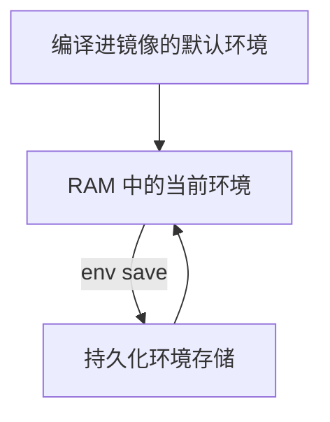

# U-Boot 命令行与常用命令

本章将系统学习 U-Boot 命令行：查找命令、阅读帮助、编辑环境变量、检查返回值，并用 Hush Shell 编写最小脚本。掌握这些基础后，你才能可靠地操作内存、存储设备和 Linux 启动流程。

> 本教程以 Mainline U-Boot v2026.07、`qemu_arm64_defconfig` 和 QEMU ARM64 `virt` 为基准。除特别标注外，本章命令都在 `=>` 后执行，代码块中的 `[U-Boot]` 不是命令的一部分。

## 学习目标

阅读本章后，你将能够：

- 看懂命令帮助中的参数表示，并用 `help`、补全和行编辑提高效率
- 使用常见的只读查询命令了解当前系统
- 查看、创建、引用和删除环境变量，并区分默认 / 当前 / 持久化环境
- 用 `$?`、`;`、`&&`、`||` 和 `run` 控制命令执行流程
- 使用 Hush Shell 编写简单的判断与循环
- 识别写入、擦除或跳转类命令的风险

## 前置知识

请先完成[运行 U-Boot](/uboot/first-run/)的验收，确保能稳定进入 `=>`。Host Shell、U-Boot Console 与 QEMU Monitor 的区分见上一章，本章不再展开。

## 1. 进入实验环境

在 Host Shell 中运行上一章创建的脚本：

```bash
# [Host]
"$HOME/uboot-lab/scripts/run-uboot.sh"
```

在自动启动倒计时结束前按空格键，确认提示符为 `=>` 后再开始实验。若误入 `(qemu)`，按 `Ctrl+A`，松开后再按 `c` 切回 U-Boot Console。

## 2. U-Boot 命令行是什么

U-Boot 命令行是 Bootloader 提供的交互界面。你可以通过它：

- 查看 CPU、内存和设备信息
- 检查或修改环境变量
- 初始化存储和网络设备
- 把文件加载到内存
- 检查或修改内存
- 执行启动脚本
- 启动 Linux、EFI Application 或其他 Payload
- 排查启动故障

它看起来像 Linux Shell，但不是 Bash，也不是 Linux 用户空间。

| 对比项 | U-Boot 命令行 | Linux Shell |
| --- | --- | --- |
| 运行阶段 | Linux 启动前 | Linux Kernel 和用户空间启动后 |
| 常见提示符 | `=>` | `$` 或 `#` |
| 主要任务 | 初始化硬件、加载并启动 Payload | 文件管理、进程管理和应用运行 |
| 命令来源 | 编译进 U-Boot 的命令与 Shell Built-in | Shell Built-in 和文件系统中的程序 |
| 文件系统 | 只提供配置中启用的有限支持 | 由 Kernel 和用户空间完整管理 |
| 多任务与进程 | 通常没有进程模型 | 支持进程、线程和 Job Control |

U-Boot proper 默认可以提供命令行，而 SPL、TPL 等早期阶段通常不包含完整命令行。如果启动日志停在 SPL 阶段，不能想当然地等待 `=>` 出现。

## 3. 命令从哪里来

U-Boot 不是把所有命令都编译进每一个镜像。具体有哪些命令，由以下因素共同决定：

- U-Boot 版本
- CPU Architecture
- Board 配置
- Kconfig 选项
- Driver 与 Subsystem 是否启用
- 镜像大小限制

因此，两块开发板上的 U-Boot 即使版本相同，`help` 输出也可能不同。判断一个命令是否可用，应以当前镜像的帮助系统和构建配置为准。

本教程的基准配置启用了 `CONFIG_BOOTSTD_FULL`。它会带入完整 Standard Boot 功能和 U-Boot Script Boot Method，而后者需要 Hush Parser。因此，在**本章基准构建**中可以使用 `if`、`for`、`&&` 和 `||` 等 Shell 结构。换用其他 `defconfig` 时，请以本机 `.config` 的检查结果为准，不要默认所有镜像都具备相同能力。

你也可以在 Host Shell 中检查实际构建配置：

```bash
# [Host]
grep -E \
    '^CONFIG_(HUSH_PARSER|CMDLINE_EDITING|AUTO_COMPLETE|SYS_LONGHELP)=' \
    "$HOME/uboot-lab/build/qemu-arm64/.config"
```

基准构建应包含：

```bash
CONFIG_HUSH_PARSER=y
CONFIG_CMDLINE_EDITING=y
CONFIG_AUTO_COMPLETE=y
CONFIG_SYS_LONGHELP=y
```

如果某个功能在其他开发板上不可用，应先检查配置，而不是直接判断 U-Boot 版本有问题。

## 4. 看懂命令语法

一条 U-Boot 命令通常由命令名、Subcommand、Option 和 Argument 组成：

```bash
command [subcommand] [options] <required-argument> [optional-argument]
```

例如：

```bash
env print bootdelay
```

可以拆分为：

| 部分 | 内容 | 作用 |
| --- | --- | --- |
| Command | `env` | 环境变量管理命令 |
| Subcommand | `print` | 输出变量 |
| Argument | `bootdelay` | 要输出的变量名 |

帮助文档常使用下面的记号：

| 记号 | 含义 |
| --- | --- |
| `<name>` | 必填参数；输入实际值时不要保留尖括号 |
| `[name]` | 可选参数；不要输入方括号 |
| `a \| b` | 从多个选项中选择一个 |
| `name ...` | 参数可以重复 |
| `-a`、`-f` | Option，具体含义由当前命令定义 |

例如帮助中出现：

```bash
env print [-a | name ...]
```

表示可以输出全部变量，也可以给出一个或多个变量名。下面都是实际命令：

```bash
# [U-Boot]
=> env print -a
=> env print bootdelay
=> env print bootdelay bootcmd
```

命令名和变量名通常区分大小写。教程统一使用小写命令，并在参数之间保留至少一个空格。

## 5. 首先学会使用帮助

面对陌生命令时，不要先在网上复制参数，而应先查看当前 U-Boot 镜像提供的帮助。

### 5.1 列出所有命令

```bash
# [U-Boot]
=> help
```

`help` 会输出当前镜像中可用的命令和简短说明。列表很长，而且会随配置变化。

`?` 是 `help` 的简写：

```bash
# [U-Boot]
=> ?
```

### 5.2 查看某个命令

```bash
# [U-Boot]
=> help env
=> help bdinfo
=> help echo
```

典型帮助包含命令说明、Usage 和参数列表：

```bash
env - environment handling commands

Usage:
env print [-a | name ...]
env set [-f] name [value]
...
```

如果只看到简短 Usage，而没有详细说明，可能是构建时关闭了 `CONFIG_SYS_LONGHELP`。

### 5.3 识别常见错误

输入不存在的命令：

```bash
# [U-Boot]
=> not_a_command
Unknown command 'not_a_command' - try 'help'
```

输入已存在的命令但参数不正确时，U-Boot 通常会输出 Usage：

```bash
# [U-Boot]
=> env
env - environment handling commands

Usage:
env ...
```

两种情况的排查方向不同：

- `Unknown command`：检查拼写、执行环境和 Kconfig
- 显示 Usage：检查参数数量、顺序和格式

## 6. 提高输入效率

### 6.1 行编辑

基准配置启用了 `CONFIG_CMDLINE_EDITING`，可以使用：

- 左右方向键移动 Cursor
- `Backspace` 删除前一个字符
- 上下方向键浏览历史输入
- `Ctrl+C` 取消当前输入，或尝试中断支持取消的命令

并非所有驱动或长时间操作都能立即响应 `Ctrl+C`。涉及擦除、烧录和 Fuse 的命令更不能把中断当作可靠的撤销机制。

在 `-nographic` 模式下，`Ctrl+C` 会发送给 U-Boot Guest，不是退出 QEMU。退出 QEMU 仍然使用 `Ctrl+A`，松开后再按 `x`。

### 6.2 Tab 补全

基准配置启用了 `CONFIG_AUTO_COMPLETE`。输入命令前缀后按 `Tab`：

```bash
# [U-Boot]
=> pri<Tab>
```

如果前缀唯一，U-Boot 会补全命令；如果存在多个候选，再按一次 `Tab` 可以显示候选列表。补全结果取决于当前镜像包含哪些命令。

### 6.3 历史记录

上下方向键可以浏览当前会话输入过的命令。部分镜像还会启用：

```bash
# [U-Boot]
=> history
```

`history` 命令本身需要 `CONFIG_CMD_HISTORY`，不要因为方向键可用就认定该命令一定存在。历史记录通常只保存在当前运行会话中，复位后会重新开始。

## 7. 常用只读查询命令

上一章已经执行过 `version`、`echo` 和 `bdinfo`。本章结合 `help` 再看一遍，并补充 `dm tree` 等查询命令，用来建立系统概况。

| 命令 | 作用 | 是否通常安全 |
| --- | --- | --- |
| `version` | 查看 U-Boot、编译器和构建信息 | 是 |
| `help [command]` | 查看可用命令和 Usage | 是 |
| `bdinfo` | 查看架构、内存、设备树等板级信息 | 是 |
| `env print [name]` | 查看环境变量 | 是 |
| `dm tree` | 查看 Driver Model Device Hierarchy | 是 |
| `coninfo` | 查看 Console Device 信息 | 是 |
| `printenv` | `env print` 的兼容 Alias | 是 |
| `echo` | 输出文本或变量值 | 是 |

其中某些命令仍取决于构建配置。使用前可以先执行：

```bash
# [U-Boot]
=> help version
=> help bdinfo
=> help dm
```

### 7.1 查看版本

```bash
# [U-Boot]
=> version
```

输出应包含类似：

```bash
U-Boot 2026.07
```

### 7.2 查看板级信息

```bash
# [U-Boot]
=> bdinfo
```

常见内容包括 DRAM Bank、Relocation Address、Device Tree Address、Ethernet Address、Console Baud Rate 等。不同平台字段不同；本章只需确认能找到 DRAM Size。地址含义见[内存、地址与数据操作](/uboot/memory-and-address/)。

### 7.3 查看 Driver Model

```bash
# [U-Boot]
=> dm tree
```

它会按层级显示 U-Boot 已绑定的 Device、对应 Driver 和 Probe 状态。输出中的 `[ + ]` 通常表示 Device 已经 Probe。

`dm tree` 显示的是 U-Boot Driver Model 中的 Device，不是 Linux 启动后的 `/sys`，也不是传给 Linux 的 OS FDT。Control FDT 与 OS FDT 的区分见[U-Boot 的架构与组成](/uboot/architecture/)；Driver Model 细节会在后续源码章节展开。

## 8. 环境变量的三个层次

环境变量是 U-Boot 配置和启动脚本的重要载体。理解它时要区分三个层次：



| 层次 | 来源 | 修改后的影响 |
| --- | --- | --- |
| 默认环境 | U-Boot Source 与 Board 配置 | 重新编译镜像后改变 |
| 当前环境 | U-Boot 运行时的 RAM | 当前会话立即生效 |
| 持久化环境 | Flash、MMC、EEPROM 等 Backend | 下次启动可以再次加载 |

`env set` 只修改 RAM 中的当前环境。只有执行 `env save` 且持久化 Backend 可用时，修改才可能写入存储设备。概念回顾也可对照[U-Boot 简介](/uboot/what-is-uboot/)与[架构与组成](/uboot/architecture/)。

:::warning
本教程当前的 QEMU 启动命令没有连接独立的可写环境镜像。本章只练习当前环境，**不要**执行 `env save`、`saveenv` 或 `env erase`。持久化环境（如 `envstore.img`）见后续[环境变量与启动脚本](/uboot/environment-and-scripts/)。
:::

## 9. 查看与修改环境变量

现代写法统一使用 `env` 及其 Subcommand。旧资料中常见的命令仍作为 Alias 保留：

| 推荐写法 | 常见 Alias | 作用 |
| --- | --- | --- |
| `env print` | `printenv` | 输出环境变量 |
| `env set` | `setenv` | 设置或删除环境变量 |
| `env run` | `run` | 执行变量中的命令 |
| `env save` | `saveenv` | 保存到持久化环境 |

新教程和新脚本优先使用 `env print`、`env set` 等结构化写法，同时要能看懂旧 BSP 中的 Alias。

### 9.1 查看变量

查看单个变量：

```bash
# [U-Boot]
=> env print bootdelay
```

常见输出类似 `bootdelay=2`；具体数值取决于默认配置。若提示 `## Error: "bootdelay" not defined`，表示该变量未显式定义，并不代表命令失败。

同时查看多个变量：

```bash
# [U-Boot]
=> env print bootdelay bootcmd
```

不带变量名时会输出整个当前环境：

```bash
# [U-Boot]
=> env print -a
```

输出可能很长。排查启动问题时，优先打印相关变量，不要每次都输出全部内容。

### 9.2 创建变量

```bash
# [U-Boot]
=> env set lab_message "Hello from U-Boot"
=> env print lab_message
lab_message=Hello from U-Boot
```

设置变量时只写变量名，不要加 `$`：

```bash
env set lab_message "Hello from U-Boot"
```

引用变量值时再使用 `$`。推荐带花括号的形式：

```bash
# [U-Boot]
=> echo ${lab_message}
Hello from U-Boot
```

`${name}` 比 `$name` 的边界更清楚，尤其适合启动脚本。

### 9.3 修改变量

再次设置同名变量会覆盖当前值：

```bash
# [U-Boot]
=> env set lab_message "U-Boot command line"
=> echo ${lab_message}
U-Boot command line
```

### 9.4 删除变量

推荐使用明确的删除命令：

```bash
# [U-Boot]
=> env delete lab_message
```

兼容写法是只给 `env set` 提供变量名、不提供值：

```bash
# [U-Boot]
=> env set lab_message
```

删除后检查：

```bash
# [U-Boot]
=> env print lab_message
## Error: "lab_message" not defined
```

### 9.5 恢复默认值

先临时修改 `bootdelay`：

```bash
# [U-Boot]
=> env set bootdelay 5
=> env print bootdelay
bootdelay=5
```

恢复这个变量的默认值：

```bash
# [U-Boot]
=> env default bootdelay
=> env print bootdelay
```

恢复后通常会重新出现默认值（常见为 `2`，以你的镜像为准）。`env default` 只修改当前 RAM 环境，不等于写回持久化存储。当前 QEMU 实验没有持久化后端时，也可以直接 `reset` 丢弃本次会话里的临时修改。

下面的命令会把整个当前环境恢复为默认值：

```bash
env default -a
```

它会丢弃当前环境中的大量自定义内容。即使尚未保存，也不应在不了解影响时执行。

:::warning
不要为了“图省事”执行 `env default -a` 或 `env erase`。前者重置整个当前环境，后者擦除持久化环境（若 Backend 可用）。本章清理实验变量请用后面的 `lab_` 前缀删除步骤，或直接复位无持久化的 QEMU 会话。
:::

## 10. 变量展开与引号

引号决定了变量是在“定义脚本时”展开，还是在“运行脚本时”展开。

先创建一个变量：

```bash
# [U-Boot]
=> env set lab_target qemu-arm64
```

使用双引号定义：

```bash
# [U-Boot]
=> env set lab_fixed "echo ${lab_target}"
```

`${lab_target}` 会立即展开，`lab_fixed` 实际保存：

```bash
echo qemu-arm64
```

使用单引号定义：

```bash
# [U-Boot]
=> env set lab_dynamic 'echo ${lab_target}'
```

单引号抑制当前这次展开，`lab_dynamic` 保存变量引用本身：

```bash
echo ${lab_target}
```

修改目标值后运行两个脚本：

```bash
# [U-Boot]
=> env set lab_target changed
=> run lab_fixed
qemu-arm64
=> run lab_dynamic
changed
```

可以把差异概括为：

| 写法 | 展开时机 | 典型用途 |
| --- | --- | --- |
| `"echo ${lab_target}"` | 执行 `env set` 时 | 固定当前值 |
| `'echo ${lab_target}'` | 后续执行脚本时 | 使用最新变量值 |

编写 `bootcmd`、加载地址和文件名脚本时，这个差异非常重要。本章验收要求你能解释 `lab_fixed` 与 `lab_dynamic` 的不同。

## 11. 命令返回值

每条 U-Boot 命令执行后都会产生 Return Value。通常：

- `0` 表示成功
- `1` 表示失败

特殊变量 `$?` 保存上一条命令的返回值。

使用 `true` 和 `false` 可以直接观察：

```bash
# [U-Boot]
=> true
=> echo $?
0
=> false
=> echo $?
1
```

也可以检查真实命令：

```bash
# [U-Boot]
=> env print bootdelay
=> echo $?
0
=> env print variable_that_does_not_exist
## Error: "variable_that_does_not_exist" not defined
=> echo $?
1
```

若 `bootdelay` 未定义，第一条 `env print` 的 `$?` 也可能为 `1`；可改用刚创建的 `lab_message` 等变量做成功示例。检查返回值比匹配日志文字更可靠。自动启动脚本应根据成功或失败决定下一步，而不是无条件继续。

## 12. 一行执行多个命令

### 12.1 分号：无条件继续

分号 `;` 可以把多个命令写在同一行：

```bash
# [U-Boot]
=> echo one; echo two; echo three
one
two
three
```

需要特别注意：前一条命令失败后，分号后面的命令仍会执行。

```bash
# [U-Boot]
=> false; echo "Still running"
Still running
=> echo $?
0
```

最终 `$?` 是 `echo` 的成功状态，前面的失败已经被掩盖。这是启动脚本中非常常见的错误来源。

### 12.2 `&&`：成功才继续

```bash
# [U-Boot]
=> true && echo "Previous command succeeded"
Previous command succeeded
=> false && echo "This is not printed"
```

`&&` 适合表达“前一步成功后，才能执行下一步”。

### 12.3 `||`：失败才执行

```bash
# [U-Boot]
=> false || echo "Fallback path"
Fallback path
=> true || echo "This is not printed"
```

`||` 适合打印错误、选择备用启动路径或进入 Recovery。

| 连接符 | 后一条命令何时执行 |
| --- | --- |
| `;` | 无论前一条成功还是失败 |
| `&&` | 前一条成功时 |
| `||` | 前一条失败时 |

## 13. 使用 `run` 执行环境变量脚本

U-Boot 经常把一组命令保存到环境变量，再通过 `run` 执行：

```bash
# [U-Boot]
=> env set lab_hello 'echo Hello; version'
=> env run lab_hello
Hello
U-Boot 2026.07 ...
```

下面两种写法等价：

```bash
env run lab_hello
run lab_hello
```

### 13.1 顺序执行多个脚本变量

创建三个脚本：

```bash
# [U-Boot]
=> env set lab_step1 'echo Step 1; true'
=> env set lab_step2 'echo Step 2; false'
=> env set lab_step3 'echo Step 3'
```

一次传给 `run`：

```bash
# [U-Boot]
=> run lab_step1 lab_step2 lab_step3
Step 1
Step 2
=> echo $?
1
```

`lab_step2` 失败后，`run` 不再执行后面的 `lab_step3`。

这里要区分两个规则：

- 同一脚本变量中用 `;` 连接的命令，失败后仍然继续
- 一次 `run` 多个脚本变量时，某个变量执行失败会停止后续变量

因此，把启动过程拆成多个有明确返回值的步骤，通常比把所有命令塞进一个由分号连接的长变量更可靠。

## 14. Hush Shell 的判断与循环

U-Boot 提供 Simple Parser 和 Hush Parser 两种命令行解析器。Hush 类似精简的 Bourne Shell，支持 `if`、`for`、`while` 和 `until` 等控制结构。

它不是完整 Bash。不要直接复制依赖 Array、Process Substitution、Job Control 或外部 Linux Command 的 Bash Script。

### 14.1 条件判断

```bash
# [U-Boot]
=> env set lab_mode safe
=> if test "${lab_mode}" = "safe"; then echo "Safe mode"; else echo "Normal mode"; fi
Safe mode
```

`test` 返回成功时执行 `then` 分支，否则执行 `else` 分支。

常用 String Test：

| 表达式 | 含义 |
| --- | --- |
| `test -n "${name}"` | String 非空 |
| `test -z "${name}"` | String 为空 |
| `test "${a}" = "${b}"` | String 相等 |
| `test "${a}" != "${b}"` | String 不相等 |

变量可能为空时应使用引号，避免展开后丢失 Argument。

### 14.2 循环

```bash
# [U-Boot]
=> for lab_item in kernel dtb initramfs; do echo "File: ${lab_item}"; done
File: kernel
File: dtb
File: initramfs
```

Hush 还支持局部 Shell Variable：

```bash
# [U-Boot]
=> lab_local=temporary
=> echo ${lab_local}
temporary
```

局部 Shell Variable 与 Environment Variable 不同。`run` 只能按名称执行 Environment Variable 中的脚本，因此用于启动流程的配置和命令通常仍通过 `env set` 创建。

## 15. 数字不一定都是十进制

U-Boot 经常处理内存地址、寄存器和存储 Offset，因此多数命令默认使用十六进制，而且通常可以省略 `0x`。本节只建立意识，不要求一次记全规则；内存读写见[内存、地址与数据操作](/uboot/memory-and-address/)。

例如帮助或资料中可能出现：

```bash
md 40200000 10
```

在典型 U-Boot Memory Command 中表示 Address 为 `0x40200000`，Count 为 `0x10`（十进制 16）。本章不执行这条命令。

使用 `setexpr` 可以观察：

```bash
# [U-Boot]
=> setexpr lab_sum 10 + 1
=> echo ${lab_sum}
11
```

这里的计算是：

```bash
0x10 + 0x1 = 0x11
```

结果 `0x11` 等于十进制 17，不是十进制 11。

### 15.1 `test` 是一个重要例外

`test` 的数值比较使用 Base 0 解析：

- 没有 Prefix 时按十进制处理
- 有 `0x` Prefix 时按十六进制处理

```bash
# [U-Boot]
=> test 0x10 -eq 16; echo $?
0
```

很多 U-Boot 命令生成的“数字变量”却是没有 `0x` Prefix 的十六进制 String，例如：

```bash
filesize=1f40
```

直接执行下面的比较可能得到错误结果：

```bash
test "${filesize}" -lt 4096
```

因为 `test` 会尝试把 `1f40` 当作十进制，并在遇到 `f` 时停止解析。对于明确采用十六进制格式的变量，应显式补上 Prefix：

```bash
test "0x${filesize}" -lt 0x1000
```

判断数字的 Base 和 Unit 时，不要只看变量名；应查看产生该变量的命令文档。

## 16. 常用命令分类

不需要一次背完所有命令。先按用途建立地图：

| 类别 | 常见命令 | 后续章节 |
| --- | --- | --- |
| 帮助与信息 | `help`、`version`、`bdinfo`、`dm` | 本章、[阅读 U-Boot 启动日志](/uboot/reading-boot-log/) |
| 环境与脚本 | `env`、`echo`、`run`、`test`、`setexpr` | [环境变量与启动脚本](/uboot/environment-and-scripts/) |
| 内存操作 | `md`、`mw`、`cp`、`cmp`、`crc32` | [内存、地址与数据操作](/uboot/memory-and-address/) |
| 存储设备 | `mmc`、`usb`、`nvme`、`scsi`、`part` | [存储设备与分区](/uboot/storage-and-partitions/) |
| 文件加载 | `load`、`fatload`、`ext4load`、`tftpboot` | [文件系统与文件加载](/uboot/filesystem-and-loading/) |
| Device Tree | `fdt` | [Linux 启动所需的文件](/uboot/linux-boot-files/)、Driver Model |
| 自动启动 | `bootflow`、`bootdev`、`bootmeth` | [Standard Boot 启动框架](/uboot/standard-boot/) |
| 启动 Payload | `booti`、`bootz`、`bootm`、`bootefi` | [手动启动 Linux](/uboot/manual-boot/) |
| 系统控制 | `reset`、`poweroff` | 启动与调试 |

同一目标往往有多种命令。例如 `load` 可以提供统一文件加载接口，而 `fatload`、`ext4load` 是文件系统相关命令。后续章节会解释应该选择哪一种。

## 17. 命令的安全等级

“命令存在”不等于“可以随便执行”。建议把 U-Boot 命令分成四类：

| 等级 | 行为 | 示例 |
| --- | --- | --- |
| 只读查询 | 只输出状态 | `help`、`version`、`bdinfo`、`env print`、`dm tree` |
| 修改当前状态 | 修改 RAM 或 Runtime State | `env set`、`env default`、`mw`、Device Init |
| 持久化写入 | 修改 Flash、MMC、EEPROM 或 Fuse | `env save`、`mmc write`、`sf erase`、`nand erase`、`fuse prog` |
| 转移控制权 | 复位或跳转执行其他程序 | `reset`、`booti`、`bootm`、`bootefi`、`go` |

其中 `mw` 虽然只写 RAM，也可能覆盖 U-Boot、Device Tree、Kernel 或 Stack，导致立即崩溃，所以不属于安全查询。

执行写入类命令前，至少确认：

1. 当前提示符确实属于目标设备
2. Device Number 与 Partition Number 正确
3. Address、Offset、Block Count 和 Unit 正确
4. 相关数据已经备份
5. 当前命令来自目标版本的帮助或可靠文档
6. 断电或中断后的 Recovery 方法已经明确

不要直接复制其他开发板的 Offset、Load Address 或 Flash Layout。

## 18. 清理本章实验变量

本章创建的变量都使用 `lab_` Prefix，便于统一识别和清理：

```bash
# [U-Boot]
=> env delete lab_target lab_fixed lab_dynamic
=> env delete lab_hello lab_step1 lab_step2 lab_step3 lab_mode lab_sum
```

局部变量 `lab_local` 不属于 Environment，不能通过 `env delete` 删除；复位 U-Boot 后它会消失。

检查是否仍有相关变量：

```bash
# [U-Boot]
=> env grep -n lab_
```

`env grep` 取决于 Kconfig。如果当前镜像没有该 Subcommand，可以逐个使用 `env print` 检查，或者直接复位当前没有持久化的 QEMU 实验环境。

不要为了清理几个实验变量而执行：

```bash
env default -a
env erase
```

二者分别会重置整个当前环境、擦除持久化环境，风险见上文警告。

## 19. 常见问题

### 19.1 Linux 命令提示 Unknown Command

例如：

```bash
# [U-Boot]
=> sudo ls
Unknown command 'sudo' - try 'help'
```

先确认当前提示符。U-Boot 可能提供自己的 `ls`，但语法和支持的 Interface 取决于构建配置；它不是 Host 上的 GNU `ls`。

### 19.2 文档中有命令，当前镜像却没有

常见原因：

- 当前 Board 没有启用对应 Kconfig
- 命令依赖的 Driver 或 Subsystem 没有启用
- 厂商 BSP 使用了不同版本
- 为减小镜像体积而裁剪了功能

先执行 `help`，再检查 `.config`。不要通过随意打开大量 Kconfig 选项来“补齐所有命令”。

### 19.3 变量输出为空

```bash
# [U-Boot]
=> echo ${missing_variable}

```

空输出可能表示变量不存在或值为空。使用：

```bash
# [U-Boot]
=> env print missing_variable
```

可以区分它是否存在。

### 19.4 脚本定义后变量值不对

重点检查单引号与双引号：

- 双引号中的变量通常在定义脚本时展开
- 单引号可以保留变量引用，在运行脚本时再展开

执行 `env print <script-name>`，先查看实际保存的脚本文本。

### 19.5 前一步失败，后一步仍然执行

检查脚本是否使用了 `;`。需要 Success Dependency 时改用 `&&`，需要 Failure Fallback 时使用 `||`，复杂流程使用 `if`。

### 19.6 数值比较结果不符合预期

检查：

- 当前命令默认使用十六进制还是十进制
- 环境变量是否带 `0x`
- 数值的 Unit 是 Byte、Block、Second 还是 Hz
- 变量是否为空

尤其注意 `test` 与多数 Address Command 的 Number Parsing 规则不同。

### 19.7 按 `Ctrl+C` 没有立即停止

并非每条命令都能在任意阶段处理中断。不要用这种方式测试 Flash Erase、Firmware Update 等操作。QEMU 实验需要强制退出时，可以使用 `Ctrl+A`，松开后再按 `x`。

## 20. 本章实验验收

请在不使用持久化写入命令的前提下，完成下面的操作：

```bash
# [U-Boot]
=> help env
=> version
=> bdinfo
=> env set lab_name learner
=> echo "Hello, ${lab_name}"
Hello, learner
=> env set lab_check 'if test -n "${lab_name}"; then echo ready; else echo missing; fi'
=> run lab_check
ready
=> echo $?
0
=> env delete lab_name lab_check
```

完成标准：

- 能通过 `help` 找到命令的实际 Usage
- 能区分 Command、Subcommand、Option 和 Argument
- 能创建、引用和删除 Environment Variable
- 能解释单引号与双引号的展开差异（例如 `lab_fixed` 与 `lab_dynamic`）
- 能读取 `$?` 并判断上一条命令是否成功
- 能说明 `;`、`&&` 与 `||` 的差别
- 能识别当前命令是否可能修改持久化数据

下一章将练习[阅读 U-Boot 启动日志](/uboot/reading-boot-log/)，把命令行观察与阶段判断结合起来。

## 本章小结

本章建立了 U-Boot 命令行的基本使用方法：以当前镜像的 `help` 为准，使用环境变量组织配置和脚本，通过 `$?`、`&&`、`||` 与 Hush 控制执行流程，并在操作前区分只读、运行时修改、持久化写入和控制权转移。

## 思考与练习

1. 为什么两块开发板使用相同 U-Boot 版本，却可能拥有不同命令？
2. `env print` 与 `printenv` 有什么关系？
3. `env set name` 在不提供 Value 时会做什么？
4. 默认环境、当前环境和持久化环境分别位于哪里？
5. 为什么定义脚本时经常使用单引号保留 `${variable}`？
6. `false; echo done` 为什么仍会输出 `done`？
7. `run step1 step2 step3` 在 `step2` 失败时会发生什么？
8. 为什么 `test "${filesize}" -lt 4096` 可能得到错误结果？
9. `mw` 没有写入 Flash，为什么仍然属于高风险命令？
10. 尝试用 `if` 编写一个脚本：`lab_mode` 为 `debug` 时输出 `Debug mode`，否则输出 `Normal mode`。

## 参考资料

- [U-Boot：Command-line Parsing](https://docs.u-boot.org/en/v2026.07/usage/cmdline.html)
- [U-Boot：Environment Variables](https://docs.u-boot.org/en/v2026.07/usage/environment.html)
- [U-Boot：env command](https://docs.u-boot.org/en/v2026.07/usage/cmd/env.html)
- [U-Boot：test command](https://docs.u-boot.org/en/v2026.07/usage/cmd/test.html)
- [U-Boot：history command](https://docs.u-boot.org/en/v2026.07/usage/cmd/history.html)
- [U-Boot：qemu_arm64_defconfig](https://github.com/u-boot/u-boot/blob/v2026.07/configs/qemu_arm64_defconfig)
