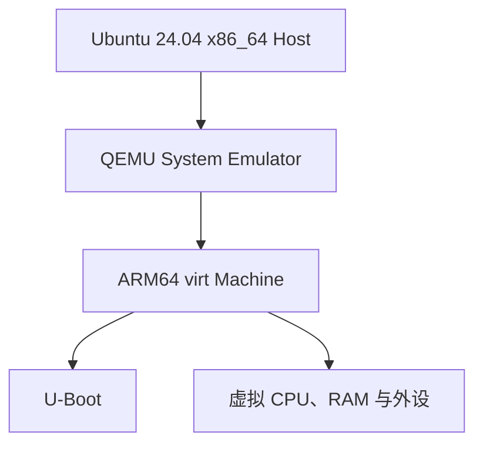

# 用 QEMU 搭建 U-Boot 实验环境

从本章开始，你将实际运行 U-Boot。教程首先使用 QEMU ARM64 `virt` 平台，以避开开发板型号、烧录工具和启动介质差异。本章将安装所需工具并生成实验使用的 `u-boot.bin`。

> 本教程以 Mainline U-Boot v2026.07、Ubuntu 24.04 x86_64 和 QEMU ARM64 `virt` 为基准。除非特别说明，本章所有命令都在开发主机的 Linux Shell 中执行。

## 学习目标

阅读本章后，你将能够：

- 理解为什么教程选择 QEMU ARM64 `virt`
- 区分 QEMU 的 System Emulation 与 User Mode Emulation
- 安装 QEMU、AArch64 交叉编译器和 U-Boot 构建依赖
- 建立统一实验目录，并获取固定版本的 Mainline U-Boot
- 使用 `qemu_arm64_defconfig` 生成并验收实验镜像

## 前置知识

建议先读完[认识 U-Boot](/uboot/embedded-system-and-bootloader/)，至少了解[本教程中的 QEMU 启动链](/uboot/boot-process/)。本章所有命令默认在开发主机的 Linux Shell 中执行。

## 1. 为什么先使用 QEMU

学习 U-Boot 最直接的方式似乎是准备一块开发板，但真实硬件会同时引入很多平台问题：

- SoC Boot ROM 的启动规则
- DDR 初始化固件
- TF-A、OP-TEE 或厂商 Loader
- SD 卡、eMMC 和 SPI Flash 的写入偏移
- 厂商打包与烧录工具
- 串口线、启动拨码和供电
- 错误烧录导致设备无法启动的风险

这些问题都很重要，但不适合在第一次接触 U-Boot 时同时解决。

QEMU 可以在普通计算机上模拟一台 ARM64 机器。你不需要开发板，也不需要向真实存储介质写入镜像，就可以练习：

- 进入 U-Boot 命令行
- 查看 CPU、内存和设备信息
- 使用环境变量和启动脚本
- 挂载虚拟磁盘
- 通过 VirtIO 访问存储与网络
- 手动加载并启动 Linux
- 使用 GDB 调试 U-Boot

如果实验失败，只需退出 QEMU 并重新运行，不会损坏真实设备。

## 2. QEMU 模拟了什么

QEMU 是一个开源的机器模拟器和虚拟化工具。本教程使用的是 **System Emulation**：QEMU 模拟完整的 ARM64 计算机，U-Boot 运行在这台虚拟计算机中。



使用 `-bios u-boot.bin` 时，大致是：

- U-Boot 被放在模拟 Flash 的基址（常为 `0x0`）并开始执行
- QEMU 生成设备树，并把它放在 DRAM 的约定位置（对 `virt` 而言，DRAM 基址常见为 `0x40000000`，不是物理地址 `0x0`）
- 虚拟机提供 CPU、RAM、PL011 串口、Timer、PSCI，以及可选的 VirtIO 磁盘 / 网络

`virt` 是通用模拟平台，不对应某一款真实 SoC，也不会完整复现 Boot ROM、DDR training、板级电源时序或厂商安全启动链。它适合学习 U-Boot 的通用机制，但不能代替真实硬件移植。启动链与真板差异的更多说明见[本教程中的 QEMU 启动链](/uboot/boot-process/)。

## 3. QEMU 与交叉编译器的角色

本教程的开发主机是 x86_64，而目标机器是 AArch64。两种工具分别解决不同问题：

| 工具 | 运行位置 | 作用 |
| --- | --- | --- |
| `aarch64-linux-gnu-gcc` | x86_64 Host | 把 U-Boot 源码编译成 AArch64 指令 |
| `qemu-system-aarch64` | x86_64 Host | 模拟一台可以执行 AArch64 指令的计算机 |
| `u-boot.bin` | QEMU Guest | 在虚拟 ARM64 机器中运行 |

可以把它们的关系概括为：

```bash
U-Boot source
    │
    │ aarch64-linux-gnu-gcc
    ▼
AArch64 u-boot.bin
    │
    │ qemu-system-aarch64
    ▼
U-Boot command line
```

交叉编译器负责“生成目标架构程序”，QEMU 负责“提供运行目标程序的虚拟硬件”。两者不能互相替代。

## 4. 实验环境要求

推荐的基础环境如下：

| 项目 | 建议配置 |
| --- | --- |
| Host 操作系统 | Ubuntu 24.04 LTS |
| Host Architecture | x86_64 |
| 内存 | 至少 4 GiB |
| 可用磁盘空间 | 至少 5 GiB |
| 网络 | 能访问 Ubuntu 软件源和 U-Boot Git 仓库 |
| U-Boot | Mainline v2026.07 |
| Target Architecture | AArch64 |
| QEMU Machine | `virt` |
| U-Boot 配置 | `qemu_arm64_defconfig` |
| 交叉编译器前缀 | `aarch64-linux-gnu-` |

先确认当前系统：

```bash
# [Host]
uname -m
lsb_release -ds
```

期望看到类似输出：

```bash
x86_64
Ubuntu 24.04.x LTS
```

如果没有 `lsb_release`，可以查看：

```bash
# [Host]
cat /etc/os-release
```

其他 Linux 发行版也可以完成实验，但包名和版本可能不同。本教程不会逐一列出 Fedora、Arch Linux、macOS 和 Windows 的安装方法。

## 5. 安装 QEMU

Ubuntu 把不同目标架构的 QEMU 拆分成多个软件包。ARM 和 AArch64 System Emulator 位于 `qemu-system-arm` 包中。

执行：

```bash
# [Host]
sudo apt update
sudo apt install qemu-system-arm qemu-utils
```

其中：

- `qemu-system-arm` 提供 `qemu-system-arm` 和 `qemu-system-aarch64`
- `qemu-utils` 提供 `qemu-img`（本章几乎不用；后续创建和检查虚拟磁盘时会用到）

安装完成后检查：

```bash
# [Host]
qemu-system-aarch64 --version
qemu-img --version
```

Ubuntu 24.04 最初提供 QEMU 8.2 系列，并可能通过系统更新获得修订版本。输出中的补丁版本不必与本教程完全相同，只要 `qemu-system-aarch64` 可以正常执行即可。

### 5.1 本教程为什么不要求 KVM

当 x86_64 Host 模拟 AArch64 Guest 时，QEMU 使用软件翻译执行 ARM64 指令。这个实验不依赖 KVM，也不需要：

```bash
-enable-kvm
```

KVM 主要用于 Host 与 Guest Architecture 兼容时的硬件加速。U-Boot 体积较小，在本教程的实验中使用纯模拟已经足够。

### 5.2 System Emulation 与 User Mode Emulation

不要安装错误的软件包：

| 类型 | 典型命令 | 用途 |
| --- | --- | --- |
| System Emulation | `qemu-system-aarch64` | 模拟完整 ARM64 机器，可以运行 U-Boot |
| User Mode Emulation | `qemu-aarch64` | 在 Linux 用户空间运行单个 AArch64 程序 |

U-Boot 需要访问虚拟 CPU、RAM、串口和设备树，因此必须使用 System Emulation。

## 6. 安装交叉编译器

Ubuntu 为 AArch64 提供 `gcc-aarch64-linux-gnu` 软件包：

```bash
# [Host]
sudo apt install gcc-aarch64-linux-gnu
```

安装完成后检查：

```bash
# [Host]
aarch64-linux-gnu-gcc --version
```

还可以查询编译器生成代码的目标机器：

```bash
# [Host]
aarch64-linux-gnu-gcc -dumpmachine
```

期望输出：

```bash
aarch64-linux-gnu
```

命令名称末尾的 `gcc` 是具体程序；构建 U-Boot 时使用的：

```bash
CROSS_COMPILE=aarch64-linux-gnu-
```

是工具链前缀。U-Boot 构建系统会在这个前缀后追加 `gcc`、`ld`、`objcopy`、`nm` 等名称。

例如：

```bash
aarch64-linux-gnu- + gcc     → aarch64-linux-gnu-gcc
aarch64-linux-gnu- + objcopy → aarch64-linux-gnu-objcopy
```

前缀最后的连字符不能省略。

## 7. 安装 U-Boot 构建依赖

为了完成 QEMU ARM64 的基础构建，并为后续配置实验准备工具，安装：

```bash
# [Host]
sudo apt install \
    git build-essential bc bison file flex \
    device-tree-compiler \
    libgnutls28-dev libncurses-dev libpython3-dev libssl-dev \
    pkg-config python3 python3-pkg-resources python3-pyelftools \
    python3-pycryptodome python3-setuptools swig uuid-dev
```

这些软件包的作用如下：

| 软件包 | 主要用途 |
| --- | --- |
| `git` | 获取和管理 U-Boot 源码 |
| `build-essential` | 提供 Host GCC、Make 等基础构建工具 |
| `bc` | 构建脚本中的数值计算 |
| `bison`、`flex` | 生成配置和解析相关代码 |
| `file` | 检查 ELF 文件的目标 Architecture |
| `device-tree-compiler` | 编译与检查设备树 |
| `libgnutls28-dev`、`libssl-dev` | 构建加密、签名和相关 Host Tools |
| `libncurses-dev` | 支持 `menuconfig` 界面 |
| `libpython3-dev`、`swig` | 构建设备树等 Python Binding |
| `python3-pyelftools` | 供 Binman 等构建工具解析 ELF |
| `python3-pycryptodome` | 为部分镜像和加密工具提供 Python 支持 |
| `pkg-config`、`uuid-dev` | 查找构建库及支持相关 Host Tools |

U-Boot 支持的目标很多，官方文档列出的完整依赖也更多。本章安装的是 QEMU ARM64 实验和后续基础章节需要的集合；当你构建其他开发板、文档或完整测试套件时，可能还要增加软件包。

> 不要使用 `sudo make` 编译 U-Boot。普通用户应拥有源码和构建目录，只有安装系统软件包时需要 `sudo`。

## 8. 一次性检查工具

执行下面的命令，确认主要工具都能被 Shell 找到：

```bash
# [Host]
command -v git
command -v make
command -v aarch64-linux-gnu-gcc
command -v qemu-system-aarch64
command -v qemu-img
command -v dtc
```

然后查看版本：

```bash
# [Host]
git --version
make --version | head -n 1
aarch64-linux-gnu-gcc --version | head -n 1
qemu-system-aarch64 --version | head -n 1
dtc --version
python3 --version
```

只要每条命令都能正常输出，具体小版本不必逐字一致。

还可以确认 QEMU 支持 `virt` Machine：

```bash
# [Host]
qemu-system-aarch64 -machine help | grep 'virt'
```

输出中应能找到名称为 `virt` 的 Machine。

## 9. 建立统一的实验目录

为了避免源码、构建产物和磁盘镜像混在一起，本教程采用下面的目录：

```bash
~/uboot-lab/
├── build/      # U-Boot 等项目的构建输出
├── images/     # 实验使用的固件、内核和磁盘镜像
├── scripts/    # 后续使用的 QEMU 启动脚本
└── src/        # U-Boot、Linux 等源码
```

创建目录：

```bash
# [Host]
mkdir -p "$HOME/uboot-lab"/{build,images,scripts,src}
```

检查结果：

```bash
# [Host]
find "$HOME/uboot-lab" -maxdepth 1 -type d | sort
```

本教程后续默认使用：

```bash
实验根目录：~/uboot-lab
U-Boot 源码：~/uboot-lab/src/u-boot
U-Boot 构建：~/uboot-lab/build/qemu-arm64
实验镜像：  ~/uboot-lab/images
启动脚本：  ~/uboot-lab/scripts
```

将源码和构建输出分开有几个好处：

- 清理构建结果时不会误删源码
- 同一份源码可以建立多个目标配置
- 更容易比较不同版本或不同开发板
- 后续打包实验资源时路径更加清晰

## 10. 获取固定版本的 U-Boot

进入源码目录，克隆 Mainline U-Boot v2026.07：

```bash
# [Host]
cd "$HOME/uboot-lab/src"
git clone \
    --depth 1 \
    --branch v2026.07 \
    https://git.u-boot-project.org/u-boot/u-boot.git
```

这里使用：

- `--branch v2026.07`：检出教程指定的正式版本
- `--depth 1`：只下载该版本附近的最少历史，减少下载量

检查当前版本：

```bash
# [Host]
cd "$HOME/uboot-lab/src/u-boot"
git describe --tags --exact-match
```

期望输出：

```bash
v2026.07
```

还可以查看当前 commit：

```bash
# [Host]
git rev-parse --short HEAD
```

> 不要直接使用不断变化的 `master` 分支完成教材实验。固定版本可以避免命令、配置和日志在学习过程中发生变化。

### 10.1 为什么不直接安装 `u-boot-qemu`

Ubuntu 提供 `u-boot-qemu` 软件包，但它遵循 Ubuntu 的打包和更新周期，版本不一定与本教程的 v2026.07 相同。

为了保证配置、命令和后续源码位置一致，本教程使用固定 Tag 自行生成 `u-boot.bin`。这也能顺便验证交叉编译器和构建依赖是否完整。

## 11. 生成 QEMU ARM64 实验镜像

本节只完成一次最小构建，用来准备下一篇要运行的文件。完整的 Kconfig、`.config`、构建产物分析和配置体系会在第四部分详细解释；本章不必一次学完编译系统。

先生成 QEMU ARM64 配置：

```bash
# [Host]
cd "$HOME/uboot-lab/src/u-boot"

make \
    O="$HOME/uboot-lab/build/qemu-arm64" \
    qemu_arm64_defconfig
```

再执行交叉编译：

```bash
# [Host]
make \
    O="$HOME/uboot-lab/build/qemu-arm64" \
    CROSS_COMPILE=aarch64-linux-gnu- \
    -j"$(nproc)"
```

参数含义如下：

| 参数 | 含义 |
| --- | --- |
| `O=...` | 把 `.config`、Object 和镜像放到独立构建目录 |
| `CROSS_COMPILE=...` | 指定 AArch64 工具链前缀 |
| `-j"$(nproc)"` | 根据 Host CPU 数量并行编译 |
| `qemu_arm64_defconfig` | 选择 QEMU ARM64 的默认配置 |

构建成功后，实验所需文件位于：

```bash
~/uboot-lab/build/qemu-arm64/u-boot.bin
```

检查文件：

```bash
# [Host]
test -s "$HOME/uboot-lab/build/qemu-arm64/u-boot.bin"
ls -lh "$HOME/uboot-lab/build/qemu-arm64/u-boot.bin"
```

`test -s` 没有输出时，可以继续执行下面的检查。也可以让 Shell 明确显示结果：

```bash
# [Host]
test -s "$HOME/uboot-lab/build/qemu-arm64/u-boot.bin" \
    && echo "PASS: u-boot.bin is ready"
```

还可以检查 ELF 文件的目标 Architecture：

```bash
# [Host]
file "$HOME/uboot-lab/build/qemu-arm64/u-boot"
```

输出中应包含类似信息：

```bash
ELF 64-bit LSB executable, ARM aarch64
```

`u-boot` 与 `u-boot.bin` 的区别是：

| 文件 | 用途 |
| --- | --- |
| `u-boot` | 带 ELF Header 和 Symbol，适合分析与调试 |
| `u-boot.bin` | Raw Binary，下一篇通过 QEMU `-bios` 加载 |

## 12. 保存一份固定的实验镜像

为了避免后续重新构建覆盖文件，可以把本次结果复制到 `images/`：

```bash
# [Host]
install -m 0644 \
    "$HOME/uboot-lab/build/qemu-arm64/u-boot.bin" \
    "$HOME/uboot-lab/images/u-boot-v2026.07-qemu-arm64.bin"
```

计算 SHA-256：

```bash
# [Host]
sha256sum "$HOME/uboot-lab/images/u-boot-v2026.07-qemu-arm64.bin"
```

SHA-256 值会受到编译器版本、构建时间和 U-Boot 配置等因素影响，因此你的结果不必与其他环境相同。它主要用于确认自己保存和传输的文件没有发生变化。

后续实验统一使用：

```bash
~/uboot-lab/images/u-boot-v2026.07-qemu-arm64.bin
```

## 13. 环境验收

在进入下一章之前，依次确认：

```bash
# [Host]
(
    set -e

    test "$(uname -m)" = "x86_64"
    test "$(aarch64-linux-gnu-gcc -dumpmachine)" = "aarch64-linux-gnu"
    command -v qemu-system-aarch64
    qemu-system-aarch64 -machine help | grep 'virt'
    test -s "$HOME/uboot-lab/images/u-boot-v2026.07-qemu-arm64.bin"

    echo "PASS: QEMU ARM64 environment is ready"
)
```

任意检查失败时，子 Shell 会停止，不会输出最后的 `PASS`。`command -v` 和 `grep` 应分别显示 QEMU 程序路径与 `virt` Machine。

完整的验收清单如下：

| 检查项 | 通过标准 |
| --- | --- |
| Host Architecture | 验收脚本要求 `x86_64`（推荐 Ubuntu 24.04；其他发行版需自行对应包名） |
| QEMU | `qemu-system-aarch64` 可以执行 |
| Machine | QEMU 支持 `virt` |
| 工具链 | Target 为 `aarch64-linux-gnu` |
| U-Boot 源码 | 当前 Tag 为 `v2026.07` |
| 构建配置 | 使用 `qemu_arm64_defconfig` |
| 实验镜像 | `images/u-boot-v2026.07-qemu-arm64.bin` 存在且非空 |

全部通过后，环境搭建完成。

## 14. 常见问题

### 14.1 找不到 `qemu-system-aarch64`

错误示例：

```bash
qemu-system-aarch64: command not found
```

检查并重新安装：

```bash
# [Host]
sudo apt update
sudo apt install qemu-system-arm
command -v qemu-system-aarch64
```

不要因为命令中含有 `aarch64` 就去寻找名为 `qemu-system-aarch64` 的 Ubuntu 软件包；对应的软件包名称是 `qemu-system-arm`。

### 14.2 找不到交叉编译器

错误示例：

```bash
/bin/sh: 1: aarch64-linux-gnu-gcc: not found
```

执行：

```bash
# [Host]
sudo apt install gcc-aarch64-linux-gnu
aarch64-linux-gnu-gcc -dumpmachine
```

同时检查 `CROSS_COMPILE` 是否包含末尾的 `-`。

### 14.3 找不到 `qemu_arm64_defconfig`

错误示例：

```bash
make: *** No rule to make target 'qemu_arm64_defconfig'.  Stop.
```

先确认当前目录：

```bash
# [Host]
pwd
test -f Makefile
test -f configs/qemu_arm64_defconfig
```

这些命令应在 U-Boot 源码根目录执行，而不是 `build/` 或 `images/` 目录。

### 14.4 提示缺少 Python `elftools`

错误示例：

```bash
ModuleNotFoundError: No module named 'elftools'
```

安装 Ubuntu 软件包：

```bash
# [Host]
sudo apt install python3-pyelftools
```

如果当前 Shell 激活了 Conda 或其他 Python Virtual Environment，构建脚本可能没有使用系统 Python。可以打开一个干净终端，或先退出当前虚拟环境再重新构建。

### 14.5 提示缺少 GnuTLS 或 OpenSSL Header

错误可能包含：

```bash
gnutls/gnutls.h: No such file or directory
openssl/ssl.h: No such file or directory
```

安装：

```bash
# [Host]
sudo apt install libgnutls28-dev libssl-dev
```

### 14.6 `git clone` 速度慢或中断

先确认网络和 DNS 可以访问官方仓库。克隆命令已经使用 `--depth 1` 减少下载量。

如果下载留下了不完整目录，先检查其中是否已有重要修改。对于刚刚失败、确认不包含个人内容的首次克隆，可以移走该目录后重新执行。不要在不确认目标的情况下递归删除整个 `~/uboot-lab`。

也可以使用 U-Boot 官方 GitHub Mirror：

```bash
# [Host]
git clone \
    --depth 1 \
    --branch v2026.07 \
    https://github.com/u-boot/u-boot.git
```

### 14.7 使用了错误版本

检查：

```bash
# [Host]
cd "$HOME/uboot-lab/src/u-boot"
git describe --tags --always
git status --short
```

本教程期望第一个命令显示 `v2026.07`。如果使用其他版本，命令、配置、日志和源码位置都可能存在差异。

## 15. 本章没有安装什么

当前只准备了运行 U-Boot proper 所需的基础环境，暂时没有：

- 构建 Linux Kernel
- 制作 BusyBox rootfs
- 创建带分区的 VirtIO 磁盘
- 配置 TFTP 或 NFS
- 构建 TF-A 和 OP-TEE
- 模拟 Secure World 启动链
- 连接真实开发板

这些内容会在相应章节逐步加入。第一次运行 U-Boot 时保持环境简单，有助于判断每个参数和设备的作用。

## 本章小结

本章在 Ubuntu 24.04 x86_64 上安装了 QEMU ARM64、AArch64 交叉编译器和 U-Boot 构建依赖，并建立独立的源码、构建、镜像和脚本目录。通过固定 v2026.07、使用 `qemu_arm64_defconfig` 和源码外构建，我们得到了后续实验使用的 `u-boot.bin`。

## 思考与练习

1. QEMU System Emulation 与 User Mode Emulation 有什么区别？
2. 交叉编译器和 QEMU 分别解决什么问题？
3. 为什么 x86_64 Host 模拟 AArch64 U-Boot 时不要求 KVM？
4. `CROSS_COMPILE=aarch64-linux-gnu-` 末尾为什么要保留连字符？
5. 为什么源码目录和构建目录要分开？
6. `u-boot` 与 `u-boot.bin` 分别适合什么用途？
7. 为什么教程不直接使用 Ubuntu 的 `u-boot-qemu` 软件包？
8. 尝试使用 `qemu-system-aarch64 -machine help`，看看除了 `virt` 还有哪些 ARM Machine。

## 参考资料

- [U-Boot：QEMU ARM](https://docs.u-boot.org/en/v2026.07/board/emulation/qemu-arm.html)
- [U-Boot：Obtaining the Source](https://docs.u-boot.org/en/v2026.07/build/source.html)
- [U-Boot：Building with GCC](https://docs.u-boot.org/en/v2026.07/build/gcc.html)
- [QEMU Downloads](https://www.qemu.org/download/)
- [QEMU Documentation](https://www.qemu.org/docs/master/)
- [Ubuntu：qemu-system-arm](https://packages.ubuntu.com/noble/qemu-system-arm)
- [Ubuntu：u-boot-qemu](https://packages.ubuntu.com/noble/u-boot-qemu)
