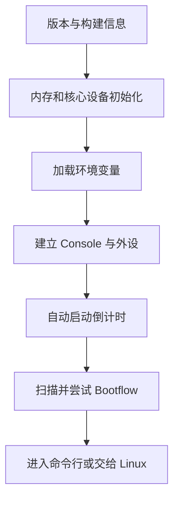

# 阅读 U-Boot 启动日志

本章把启动日志当作一条时间线：从版本横幅、内存与设备初始化，一直读到自动启动和 `=>` 提示符。你将学会识别关键里程碑，并用“最后成功阶段”快速缩小故障范围。

> 本教程以 Mainline U-Boot v2026.07、`qemu_arm64_defconfig` 和 QEMU ARM64 `virt` 为基准。日志会随版本、配置和 QEMU 参数变化，文中的省略号和设备数量仅用于讲解，不是逐字匹配的标准答案。

## 学习目标

阅读本章后，你将能够：

- 按启动阶段拆分 U-Boot 日志，并解释版本、DRAM、Environment 与 Console 信息
- 理解自动启动倒计时和 Standard Boot 扫描输出
- 区分 U-Boot 日志与 Linux Kernel 日志，判断 Warning 是否致命
- 记录最后一个成功里程碑，并用只读命令验证假设
- 保存、筛选和对比两次 QEMU 启动日志

## 前置知识

请先完成[运行 U-Boot](/uboot/first-run/)与[命令行与常用命令](/uboot/commands/)。完整启动链（Boot ROM、SPL、TF-A 等）见[从上电到 Linux 的启动过程](/uboot/boot-process/)；本章是第二部分收尾，重点解读 **QEMU 上 U-Boot proper** 的串口日志。

## 1. 启动日志是一条事件时间线

U-Boot 在初始化和启动操作系统的过程中，会把关键状态写到 Console。对于本教程的 QEMU 实验，可以把日志大致分为以下阶段：



日志最重要的价值不是告诉你“出现了多少行”，而是回答三个问题：

1. 系统已经成功执行到哪个阶段？
2. 哪一行开始偏离正常日志？
3. 这次偏离是否阻止了后续阶段继续执行？

如果只搜索 `error` 并从最后一个匹配结果开始排查，很容易被无关信息误导。

## 2. 先保存一份完整日志

排查启动问题时，不要只依赖终端滚动缓冲区或手机拍照。文本日志便于搜索、标注、比较，也适合作为后续实验的正常基线。

### 2.1 记录一次自动启动

先在 Host Shell 中创建日志目录：

```bash
# [Host]
mkdir -p "$HOME/uboot-lab/logs"
```

使用 Ubuntu 的 `script` 命令启动上一章创建的脚本：

```bash
# [Host]
script \
    --quiet \
    --flush \
    --command "$HOME/uboot-lab/scripts/run-uboot.sh" \
    "$HOME/uboot-lab/logs/qemu-uboot-autoboot.log"
```

这次不要按键中断倒计时。等待 U-Boot 完成自动启动扫描并回到 `=>`，再使用 `Ctrl+A`、松开后按 `x` 退出 QEMU。

`script` 会把终端会话写入文件，同时保留交互式终端。`--flush` 会及时刷新输出，即使 QEMU 意外结束，也更容易保留此前的日志。

### 2.2 再记录一次中断启动

重新执行：

```bash
# [Host]
script \
    --quiet \
    --flush \
    --command "$HOME/uboot-lab/scripts/run-uboot.sh" \
    "$HOME/uboot-lab/logs/qemu-uboot-interrupted.log"
```

这次在 `Hit any key to stop autoboot` 出现时按空格键。看到 `=>` 后退出 QEMU。现在你拥有两种启动路径的基线：

| 日志 | 启动路径 |
| --- | --- |
| `qemu-uboot-autoboot.log` | 倒计时结束，执行默认 `bootcmd` |
| `qemu-uboot-interrupted.log` | 用户中断倒计时，直接进入命令行 |

倒计时通常使用回车符反复更新同一行，所以日志中可能带有 `^M` 等控制字符。这是终端记录的正常现象，不是 U-Boot 输出损坏。

### 2.3 快速筛选关键行

先完整阅读一次日志，再用 `rg` 定位关键里程碑：

```bash
# [Host]
rg -a -ni \
    'U-Boot|DRAM|Core:|Flash:|Environment|In:|Out:|Err:|Net:|autoboot|bootflow|Starting kernel|Booting Linux|warning|error' \
    "$HOME/uboot-lab/logs/qemu-uboot-autoboot.log"
```

其中：

- `-a` 把带有控制字符的日志按文本处理
- `-n` 显示行号
- `-i` 忽略大小写

筛选结果只适合导航，不能替代上下文。找到可疑行后，仍要回到完整日志查看它前后的内容。若系统没有 `rg`，可用 `grep -a -ni ...` 达到类似效果。

## 3. 一份用于讲解的启动日志

基准实验可能显示与下面相似的内容：

```bash
U-Boot 2026.07 (...)

DRAM:  512 MiB
Core:  ... devices, ... uclasses, devicetree: board
Flash: 64 MiB
Loading Environment from Flash...
*** Warning - bad CRC, using default environment

In:    serial@9000000
Out:   serial@9000000
Err:   serial@9000000
Net:   ...
Hit any key to stop autoboot:  0
Scanning for bootflows in all bootdevs
...
=>
```

这是一份经过简化的教学示例。实际输出中的构建时间、Device 数量、Environment 提示、Network Device 和 Bootflow 列表都可能不同。

接下来按照出现顺序阅读。

## 4. 版本横幅：确认正在运行什么

日志第一行通常类似：

```bash
U-Boot 2026.07 (...)
```

它可能包含：

- U-Boot Release Version
- Git Commit 或提交数量
- Build Date
- Build Host
- Compiler Version

先确认版本，是因为不同版本的命令、默认配置和日志文字可能变化。如果文件名写着 `v2026.07`，但横幅显示另一个版本，说明 QEMU 实际加载的镜像不是你以为的那个。

开发版本中还可能出现类似：

```bash
U-Boot 2026.07-00012-g123456789abc-dirty
```

常见字段含义如下：

| 字段 | 含义 |
| --- | --- |
| `00012` | 当前版本标签之后还有 12 个提交 |
| `g123456789abc` | 构建所用 Git Commit 的缩写 |
| `dirty` | 构建时源码工作区存在未提交修改 |

`dirty` 本身不是启动错误，但复现实验时必须记录，因为两个名称相近的镜像可能实际包含不同代码。

进入命令行后，可以再次确认：

```bash
# [U-Boot]
=> version
```

## 5. DRAM、Core 与 Flash：硬件初始化概况

### 5.1 `DRAM`

```bash
DRAM:  512 MiB
```

它表示 U-Boot 识别到的 Guest RAM，不是 Host 的物理内存总量。在 QEMU ARM `virt` 中，RAM 容量由 `-m 512M` 创建，并通过 QEMU 生成的 Device Tree 描述给 U-Boot。

如果这里不是 512 MiB，可以在命令行交叉检查：

```bash
# [U-Boot]
=> bdinfo
```

重点查看 `DRAM bank` 的 `start` 和 `size`。地址和容量换算见[内存、地址与数据操作](/uboot/memory-and-address/)。

### 5.2 `Core`

```bash
Core:  ... devices, ... uclasses, devicetree: board
```

这里的 Device 和 Uclass 来自 U-Boot Driver Model：

- Device 是已经绑定到 Driver Model 的软件设备实例
- Uclass 按功能组织设备，例如 Serial、Block、Network
- 数量会随 U-Boot 配置、版本和 QEMU 外设变化

它们不是开发板上物理芯片的数量，不应作为跨版本测试的固定值。

`devicetree: board` 表示 U-Boot 当前 Control Device Tree 的来源类别。它不表示 Linux 已经启动，也不是传给 Linux 的 Device Tree 文件名。可以使用以下命令继续检查：

```bash
# [U-Boot]
=> bdinfo
=> dm tree
```

`dm tree` 显示的是 U-Boot Driver Model 中的 Device。Control FDT 与传给 Linux 的 OS FDT 不要混淆，见[U-Boot 的架构与组成](/uboot/architecture/)。

### 5.3 `Flash`

```bash
Flash: 64 MiB
```

它表示 U-Boot 识别到的模拟 Flash 容量，不是 `u-boot.bin` 文件大小。QEMU 把 U-Boot 作为固件放入模拟 Flash；Flash Address Range 中没有被镜像文件占用的空间，仍属于模拟设备的一部分。

## 6. Environment：先判断是否影响继续启动

日志可能出现：

```bash
Loading Environment from Flash...
*** Warning - bad CRC, using default environment
```

这两行应该连起来理解：

1. U-Boot 尝试从 Flash Backend 读取持久化环境
2. 读取到的数据未通过 CRC 校验
3. U-Boot 改用编译进镜像的默认环境继续运行

在当前 QEMU 实验中，我们没有连接单独的 `envstore.img`。第一次启动时看到这条 Warning 并不意外，也不等于 `u-boot.bin` 已损坏。只要后续继续出现 `In`、`Out`、倒计时和 `=>`，它就不是这次启动的致命错误。

环境变量要始终区分三个层次：

| 层次 | 含义 |
| --- | --- |
| 默认环境 | 构建时放入 U-Boot 的初始值 |
| 当前环境 | 本次运行期间位于 RAM 中的工作副本 |
| 持久化环境 | Flash、MMC 等 Backend 中可跨复位保存的数据 |

如果真实设备过去能够加载持久化环境，某次升级后突然出现 `bad CRC`，则应继续检查 Environment Offset、Size、Redundancy 和 Storage Layout 是否变化。

:::warning
不要在未确认存储范围前执行 `env save` / `saveenv`，否则可能覆盖仍有价值的数据。当前最小 QEMU 命令也没有可写环境镜像；持久化方案见[环境变量与启动脚本](/uboot/environment-and-scripts/)。
:::

## 7. `In`、`Out`、`Err`：Console 路由

```bash
In:    serial@9000000
Out:   serial@9000000
Err:   serial@9000000
```

三行分别表示 U-Boot 的标准输入、标准输出和标准错误连接到哪个 Console Device。

| 字段 | 主要方向 | 典型用途 |
| --- | --- | --- |
| `In` | 终端到 U-Boot | 接收按键和命令 |
| `Out` | U-Boot 到终端 | 普通输出 |
| `Err` | U-Boot 到终端 | 错误输出 |

`serial@9000000` 是 QEMU Device Tree 中 PL011 Serial Node 的名称。它不是 Linux 启动后的 `/dev/ttyAMA0`；此时 Linux 还没有运行。

如果能看到输出但不能输入，应优先检查 `In`、Terminal 设置和串口连接。进入命令行后可以使用：

```bash
# [U-Boot]
=> coninfo
```

真实开发板还要检查 Baud Rate、Data Bits、Parity、Stop Bits 和 Flow Control。基准实验的 Baud Rate 通常为 115200。

## 8. `Net`：设备是否被发现

日志可能列出一个或多个 Ethernet Device，也可能表示没有可用网卡：

```bash
Net:   ...
```

本教程当前的最小 QEMU 启动脚本没有添加虚拟网卡，因此没有 Ethernet Device 是合理结果。它不影响进入命令行，也不影响以后从虚拟磁盘启动 Linux。

看到 Network Device 只表示 U-Boot 已经识别它，不代表 DHCP、TFTP 或 Internet 已经可用。网络启动还需要 QEMU Network Backend、IP 配置和 Server，见后续[通过网络启动 Linux](/uboot/network-boot/)。

## 9. 自动启动倒计时：决定下一条路径

```bash
Hit any key to stop autoboot:  0
```

倒计时由环境变量 `bootdelay` 控制（常见为正整数，如 `2`；以 `env print` 为准）。倒计时结束后，U-Boot 执行 `bootcmd`；在结束前按键，则中断自动启动并进入命令行。

可以在 `=>` 后查看：

```bash
# [U-Boot]
=> env print bootdelay bootcmd
```

常见取值包括：

| `bootdelay` | 行为 |
| --- | --- |
| 正整数 | 等待指定秒数，然后执行 `bootcmd` |
| `0` | 不延时，但通常仍检查中断按键 |
| `-1` | 禁用自动启动 |
| `-2` | 不延时，并且不检查中断按键 |

:::warning
不要为了方便排查，就在不熟悉的设备上把 `bootdelay` **保存**为 `-2`。一旦启动脚本出错，你可能失去进入命令行的常规窗口。当前 QEMU 实验即使临时 `env set`，也不要执行 `env save`。
:::

## 10. Standard Boot 扫描

基准配置的默认 `bootcmd` 通常会触发类似扫描（以 `env print bootcmd` 的实际内容为准）：

```bash
Scanning for bootflows in all bootdevs
```

Standard Boot 使用三个核心概念：

| 概念 | 要回答的问题 | 示例 |
| --- | --- | --- |
| Bootdev | 从哪里寻找系统？ | MMC、NVMe、USB、Ethernet |
| Bootmeth | 用什么规则寻找？ | extlinux、EFI、Script |
| Bootflow | 找到的一套可执行启动方案是什么？ | 某分区上的 `extlinux.conf` |

排查时可手动执行 `bootflow scan`。常见选项：

- `-l`：列出扫描过程中的结果
- `-a`：显示更多细节（常与 `-l` 连用，如 `bootflow scan -la`）
- `-b`：对有效 Bootflow 尝试启动（如 `bootflow scan -lb`）

如果列表中出现 `ready`，表示对应 Bootflow 已经准备好启动。如果只看到扫描信息、没有有效结果，然后返回 `=>`，通常表示所有候选项都已用尽。

当前最小 QEMU 命令没有连接磁盘、USB Storage 或 Network Device，因此“没有找到可启动内容”正是预期结果。它说明 U-Boot 的自动启动流程运行了，但实验环境尚未提供 Linux Payload。

还要注意：Standard Boot 会依次尝试多个 Bootdev 和 Bootmeth。某个候选项输出 Error，不代表整个启动流程已经失败；后面的候选项仍可能成功。判断结论时要看扫描是否继续、是否找到 `ready` 状态，以及最终走向哪里。

Standard Boot 的完整配置、扫描顺序和 `extlinux.conf` 见[Standard Boot 启动框架](/uboot/standard-boot/)。本章只需要把它识别为“寻找可启动方案”的阶段。

## 11. `=>` 到底说明了什么

日志最后出现：

```bash
=>
```

可以确认：

- U-Boot 已完成进入 Main Loop 所需的初始化
- Console 可以输出提示符
- 当前正在等待 U-Boot Command

但它不能证明：

- 所有硬件都初始化成功
- 存储设备和网络都可用
- 已经找到 Kernel、Device Tree 或 Root Filesystem
- Linux 已经启动

在本章的自动启动实验中，`=>` 通常意味着启动扫描结束但没有成功转交控制权；在中断实验中，则意味着用户主动阻止了 `bootcmd` 执行。

## 12. U-Boot 日志和 Linux 日志的分界

U-Boot 成功加载 Kernel、Device Tree 和可选的 Initramfs 后，会执行相应的启动命令。转交前可能出现：

```bash
Starting kernel ...
```

随后出现的内容才属于 Linux，例如：

```bash
Booting Linux on physical CPU ...
[    0.000000] Linux version ...
```

具体分界文字取决于 Architecture、Image Format 和 EFI 等启动路径，不能只依赖某一条固定字符串。更可靠的判断是：

- `=>`、`bootflow`、`Loading Environment` 属于 U-Boot
- 带 Kernel Timestamp 的 `[    0.000000]` 日志属于 Linux
- `Kernel panic` 说明控制权已经进入 Linux

U-Boot 正常把控制权交给 Kernel 后，通常不会再返回命令行。因此：

- `Starting kernel ...` 后完全无输出：优先检查 Linux Console 参数、Device Tree 和 Kernel
- 已出现 Linux 日志后发生 Panic：优先检查 Kernel、Root Filesystem 和 `bootargs`

这两个故障都发生在启动后段，但责任边界不同。更完整的阶段划分与真板启动链对照，见[从上电到 Linux 的启动过程](/uboot/boot-process/)。

## 13. Warning、Error 和致命故障

日志中的单词不能脱离上下文解释。可以按“是否继续到达后续里程碑”进行初步分类：

| 现象 | 初步判断 |
| --- | --- |
| Warning 后继续出现 Console、倒计时和提示符 | 通常可以继续分析，不是当前致命点 |
| 某个 Bootflow Candidate 失败后继续扫描 | 局部失败，整体尚未结束 |
| 同一阶段反复报错，始终到不了下一里程碑 | 很可能是当前阻塞点 |
| 日志突然停止，且没有提示符或后续阶段 | 检查停止前最后一个成功阶段 |
| 复位、异常或 Hang 每次都发生在同一位置 | 优先调查该阶段及其输入条件 |

例如，`bad CRC, using default environment` 已经说明存在备用路径；如果默认环境能够继续启动，就不能把它当作唯一根因。相反，如果 DRAM 初始化前日志停止，后面的 Environment 和 Bootflow 根本还没有机会执行。

## 14. 一套可复用的排查方法

面对异常日志时，按下面的顺序工作。

### 第一步：固定比较条件

记录：

- Board 或 QEMU Machine
- U-Boot Version 与 Git Commit
- Defconfig 和关键 Kconfig
- QEMU 参数或真实开发板 Boot Mode
- 连接的存储、网络和 USB Device
- 是否中断自动启动

没有这些条件，两份日志可能根本不具备可比性。

### 第二步：按阶段分段

给日志标记：

1. Version
2. DRAM 与 Core
3. Environment
4. Console 与 Device
5. Autoboot
6. Bootflow
7. Kernel Handoff

### 第三步：找最后一个成功里程碑

例如：

- 能看到 Version，但看不到 `DRAM`：问题位于非常早的初始化阶段
- 能看到 `=>`：U-Boot Main Loop 和基本 Console 已工作
- 能看到 Kernel Handoff，但没有 Linux Console：问题重点已经移到 Handoff 之后

### 第四步：找第一处有意义的差异

把异常日志与同一平台、同一版本的正常日志比较。优先关注第一处会改变控制流的差异，而不是最后一条 Error。

### 第五步：用只读命令验证假设

| 假设 | 可以使用的命令 |
| --- | --- |
| 实际运行了错误版本 | `version` |
| DRAM 容量或地址异常 | `bdinfo` |
| 当前启动命令不同 | `env print bootdelay bootcmd` |
| Console 路由异常 | `coninfo` |
| Device 未绑定或未 Probe | `dm tree` |
| Standard Boot 没有候选项 | `bootdev list`、`bootflow scan -la`（只列不启动）或查阅 `help bootflow` |

命令是否存在仍取决于当前构建配置。对真实存储介质排查时，先使用 List、Info 和 Read 类命令，不要从 Erase、Write 或 Save 开始。

### 第六步：一次只改变一个条件

不要同时更换镜像、Device Tree、启动参数和存储设备。一次只改变一个变量，重新记录日志，才能知道哪项变化真正产生了影响。

## 15. 常见停止位置与排查方向

| 最后看到的现象 | 优先检查 |
| --- | --- |
| 完全没有输出 | 镜像架构、`-bios` 路径、CPU Model、`-nographic`、早期 Debug UART |
| 只有 U-Boot 横幅 | Early Init、Control Device Tree、DRAM 初始化 |
| `DRAM` 容量错误 | QEMU `-m`、Device Tree Memory Node、板级 DRAM 配置 |
| 仅出现 Environment `bad CRC` | 持久化环境是否尚未初始化；后续是否正常继续 |
| 能看到输出但不能输入 | `In` Console、串口参数、Terminal 和硬件连接 |
| 找不到 Bootdev | QEMU 是否连接设备、Bus 是否枚举、Driver/Kconfig 是否启用 |
| 找到分区但找不到文件 | Filesystem、Path、Filename 和 Boot Method |
| `Starting kernel ...` 后无输出 | Linux `console=`、Device Tree、Kernel Image 与入口方式 |
| 出现 Linux `Kernel panic` | Root Filesystem、`root=`、Driver、Init Process |

这张表用于确定第一轮调查方向，不是跳过证据直接下结论。含 Boot ROM / SPL / TF-A 等更早阶段的对照，见[根据最后一条日志定位故障](/uboot/boot-process/)。

## 16. 实验：让日志证明内存配置发生了变化

[运行 U-Boot](/uboot/first-run/)中曾把 QEMU 参数从 `-m 512M` 临时改为 `-m 256M`，并用 `bdinfo` 观察。本章把同一实验加深一步：**把两次启动完整落盘，再用 diff 证明日志中的因果关系**。

1. 保留当前 512 MiB 的 `qemu-uboot-autoboot.log`（若还没有，先按 §2 记录一份）
2. 把 `run-uboot.sh` 中的内存暂时改为 `-m 256M`
3. 用 `script` 记录到 `qemu-uboot-256m.log`
4. 退出 QEMU，**把脚本恢复为 `-m 512M`**
5. 比较两份日志

```bash
# [Host]
diff -u \
    "$HOME/uboot-lab/logs/qemu-uboot-autoboot.log" \
    "$HOME/uboot-lab/logs/qemu-uboot-256m.log" \
    | less -R
```

你应该能找到：

```bash
-DRAM:  512 MiB
+DRAM:  256 MiB
```

还可能看到 Build Timestamp、Device 数量或倒计时控制字符带来的差异。排查时应关注与本次改动存在因果关系的字段，而不是要求两份日志只有一行不同。

## 17. 建立自己的正常基线

每个真实项目都应保存至少一份已知可以成功启动的日志，并与对应的软件和硬件条件一起归档。建议为重要行添加如下记录：

| 日志原文 | 阶段 | 你的解释 | 是否正常 | 下一步 |
| --- | --- | --- | --- | --- |
| `U-Boot ...` | Version | 运行版本与预期一致 | 是 | 继续 |
| `DRAM: ...` | Memory | 容量与硬件配置一致 | 是 | 检查 Device |
| `bad CRC ...` | Environment | 当前改用默认环境 | 待确认 | 检查后续是否继续 |
| `Starting kernel ...` | Handoff | U-Boot 已尝试进入 Kernel | 是 | 转向 Linux Early Console |

正常基线至少要与以下信息绑定：

- U-Boot Commit
- Board Revision
- Device Tree
- Boot Medium 和 Partition Layout
- Kernel 与 Root Filesystem Version
- 关键 Environment Variables

以后发生回归时，你要寻找的是“异常日志相对于基线最早出现的有意义差异”。

## 18. 常见误区

### 18.1 看到 `bad CRC` 就重刷 U-Boot

Environment CRC 与 U-Boot Image 是否损坏不是同一件事。先确认 U-Boot 是否已经明确改用默认环境，以及后续启动能否继续。

### 18.2 看到 `Error` 就停止阅读

自动启动可能尝试多个候选方案。当前候选失败后，后一个 Bootflow 仍可能成功。

### 18.3 只保存错误附近的几行

缺少 Version、Hardware Configuration 和前序里程碑，就无法判断故障发生在哪个阶段。

### 18.4 把 `=>` 当作 Linux Shell

`=>` 是 U-Boot Command Prompt。Linux Shell 通常是 `$` 或 `#`，只有 Kernel 和用户空间成功启动后才可能出现。

### 18.5 同时修改多个启动条件

同时替换 Kernel、Device Tree、`bootargs` 和 U-Boot，会让日志差异无法归因。

## 19. 本章小结

阅读 U-Boot 日志的关键不是背诵固定输出，而是识别启动阶段、记录最后成功里程碑，并与同条件的正常基线比较。Warning 或单个候选项失败未必致命；真正有价值的是第一处改变后续控制流的差异。保存完整日志，再用只读命令验证假设。

## 20. 本章完成标准

- 用 `script` 保存了自动启动与中断启动两份日志
- 能按阶段标注 Version / DRAM / Environment / Console / Autoboot / Bootflow
- 能解释当前实验中 `bad CRC, using default environment` 通常为什么可继续
- 完成 256 MiB 对比，并用 diff 指出 DRAM 行的变化
- 能根据「最后成功里程碑」说出下一轮优先检查方向

第二部分到此结束。接下来进入[第三部分：使用 U-Boot 启动 Linux](/uboot/memory-and-address/)，先学习内存地址与 `md`、`mw` 等数据操作。

## 21. 思考与练习

1. 为什么 `Flash: 64 MiB` 不能用来判断 `u-boot.bin` 的文件大小？
2. `bad CRC, using default environment` 出现后，还要查看哪些日志才能判断它是否致命？
3. `bootflow scan -lb` 中的 `-l` 和 `-b` 分别有什么作用？
4. 如果日志停在 `Starting kernel ...`，为什么不应首先修改 U-Boot 的 DRAM 初始化？
5. 分别记录中断自动启动和完成自动启动的日志，找出它们开始分叉的位置。
6. 把 QEMU 内存改为 256 MiB，说明日志中的哪一行证明修改已经生效。

## 参考资料

- [U-Boot：QEMU ARM](https://docs.u-boot.org/en/v2026.07/board/emulation/qemu-arm.html)
- [U-Boot：Standard Boot Overview](https://docs.u-boot.org/en/v2026.07/develop/bootstd/overview.html)
- [U-Boot：bootflow command](https://docs.u-boot.org/en/v2026.07/usage/cmd/bootflow.html)
- [U-Boot：Environment Variables](https://docs.u-boot.org/en/v2026.07/usage/environment.html)
- [U-Boot：bdinfo command](https://docs.u-boot.org/en/v2026.07/usage/cmd/bdinfo.html)
