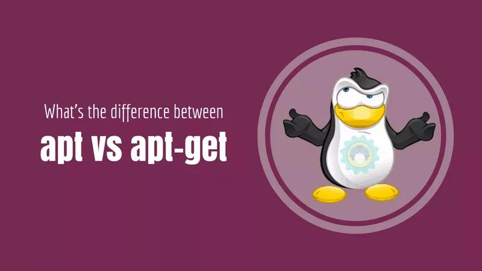

# apt 和 apt-get 的区别





## apt-get

Advanced Package Tool，又名 apt-get，是一款适用于 Unix 和 Linux 系统的应用程序管理器。

最初于1998年发布，用于检索应用程序并将其加载到 Debian Linux系统。主要用于自动从互联网的软件仓库中搜索、安装、升级、卸载软件或操作系统。

Apt-get 成名的原因之一在于其出色的解决软件依赖关系的能力。其通常使用 .deb-formatted 文件，但经过修改后可以使用 apt-rpm 处理红帽的 Package Manager（RPM）文件。

Apt-get 在 Linux 社区得到广泛使用，成为用来管理桌面、笔记本和网络的重要工具。随着 Linux 在企业中的普及，Windows 和 Mac 用户了解如何使用 apt-get 加载应用程序有一定的好处。

另外，随着单片机设备如 Raspberry Pi 的热度增加，apt-get 在这些平台上是比较便捷的应用加载方式。如果你想要加载的应用需要程序库或另一个应用程序才能正常工作，apt-get 会帮你找到并加载所需的程序库或应用代码。

使用 apt-get 的主流 Linux 系统包括 Debian 和 Ubuntu 变异版本。大多数情况下，从命令行运行该工具。桌面上有几个图形前端可以使用，包括 Synaptic Package Manager、Ubuntu Software Center、Aptitude 和 Kpackage。

Raspberry Pi 和 Beaglebone Black nanoLinux 版用户可以很容易地使用 apt-get 加载程序，因为这些系统通常来自 Ubuntu 或 Debian 代码。是 debian，ubuntu 发行版的包管理工具，与红帽中的**「yum」**工具非常类似。

apt-get 命令一般需要**「root 权限」**执行，所以一般跟着 sudo 命令。


## apt

apt 命令行实用程序于2014年推出第一个稳定版本，用于 Debian 发行版 .deb 软件包安装。它最初在不稳定的Debian版本中使用，然后在 Debian 8 中成为标准。

在 Ubuntu 16.04 发行后，apt 开始流行，并以某种方式取代了 apt-get 。

随着 apt install package 命令的使用频率和普遍性逐步超过 apt-get install package，越来越多的其它 Linux 发行版也开始遵循 Ubuntu 的脚步，开始鼓励用户使用 apt 而不是 apt-get。

大多数人不了解 apt 和 apt-get 之间的区别，并且经常在使用一个或另一个时感到困惑。

两者都是开源命令行工具，用于管理软件包，例如安装，更新，升级和删除。

但是，它们之间仍然存在一些差异。

让我们看一些替代 apt-get 的 apt 命令，要查看这些命令，可以键入 apt help 或通过在终端中键入 apt man 来访问apt 手册页。它将显示与 apt 相关的所有信息。


## 两者区别

apt 和 apt-get 之间的第一个区别是命令本身。例如，如果要使用 apt-get update 更新系统存储库索引，则可以运行：

```shell
apt-get update
```

使用 apt 则输入命令：

```shell
apt update
```

apt update 命令不仅更新存储库索引，还告知存储库中是否可用软件以及有多少新版本可用。


### 命令对比

| apt 命令         | 被替代的命令         | 功能描述                         |
| :--------------- | :------------------- | :------------------------------- |
| apt install      | apt-get install      | 安装软件包                       |
| apt remove       | apt-get remove       | 删除软件包                       |
| apt purge        | apt-get purge        | 删除软件包及其配置文件           |
| apt update       | apt-get update       | 更新存储库索引                   |
| apt upgrade      | apt-get upgrade      | 更新所有软件包（自动处理依赖项） |
| apt autoremove   | apt-get autoremove   | 自动删除不需要的包               |
| apt full-upgrade | apt-get dist-upgrade | 在升级软件包时自动处理依赖关系   |
| apt search       | apt-cache search     | 搜索软件包或应用程序             |
| apt show         | apt-cache show       | 显示软件包细节信息               |


### 两个新命令

除了替换命令外，apt 还引入了两个新命令

| 命令             | 描述                                 |
| ---------------- | ------------------------------------ |
| apt list         | 列出包含条件的包（已安装，可升级等） |
| apt edit-sources | 编辑源列表                           |

当 apt list 命令与 -installed 或 -upgradeable 一起使用时，它将列出已安装，可安装或需要升级的软件包。

使用 apt edit-sources 命令时，它将在编辑器中打开 sources.list 文件进行编辑。

apt-get 仍然不能完全被 apt 取代，而且我认为它永远不会被完全终止。你可能正在考虑应该选择什么：apt 或 apt-get。在我看来，选择 apt 是值得的，因为它提供了软件包管理的所有必需功能，并且更快，更友好且易于使用。


## 使用 apt 还是 apt-get

目前还没有任何 Linux 发行版官方放出 apt-get 将被停用的消息，至少它还有比 apt 更多、更细化的操作功能。对于低级操作，仍然需要 apt-get。

既然两个命令都有用，那么我该使用 apt 还是 apt-get 呢？

作为一个常规 Linux 用户，系统极客建议大家尽快适应并开始首先使用 apt。不仅因为广大 Linux 发行商都在推荐 apt，更主要的还是它提供了 Linux 包管理的必要选项。

最重要的是，apt 命令选项更少更易记，因此也更易用，所以没理由继续坚持 apt-get。

最后结大家提供两点使用上的建议：

- apt 可以看作 apt-get 和 apt-cache 命令的子集, 可以为包管理提供必要的命令选项。
- apt-get 虽然没被弃用，但作为普通用户，还是应该首先使用 apt。


