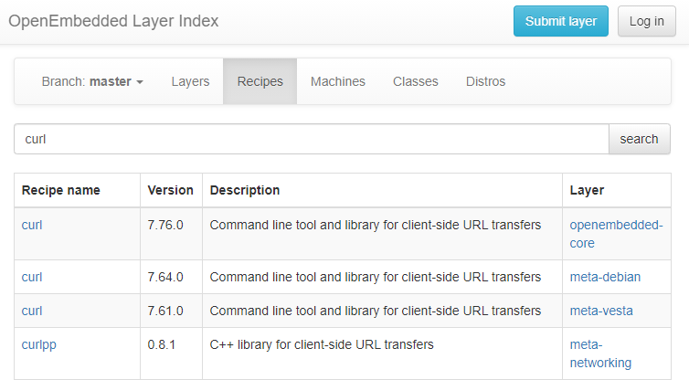

# Yocto 添加软件包


我们除了对 Yocto Project 中现有的软件系统进行修改定制外，还可以将更多的软件包添加到我们的 Yocto Project 环境中，这样可以直接将这些软件包打包进目标平台的系统镜像中，而不需要后续安装。


## 示例：添加 curl

下面我以添加 curl 为例进行操作：

1. 首先，我们先看看 MYiR 有没有提供 curl 软件包。查看 downloads 目录，发现其中已经包含 curl-7.47.1.tar.bz2。

2. 但是 core-image-base 的配方中并没有包含 curl，所以我们要添加进去。打开 sources/meta-myir-imx6ulx/recipes-core/images/core-image-base.bbappend，在末尾添加一行： IMAGE_INSTALL += "curl" 。

3. 重新构建系统镜像，执行 bitbake core-image-base。

4. 更新系统，检查是否包含 curl。

   ```shell
   # curl --version
   curl 7.47.1 (arm-poky-linux-gnueabi) libcurl/7.47.1 GnuTLS/3.4.9 zlib/1.2.8
   Protocols: file ftp ftps http https 
   Features: IPv6 Largefile NTLM NTLM_WB SSL libz TLS-SRP UnixSockets 
   ```


## 查找更多软件包

那么，问题来了！如果我们不是使用 MYS-6ULX-IOT 开发板，我们怎么知道 Yocto Project 包含哪些第三方软件包呢？修改配方文件时又应该使用什么名字呢？

其实，我们可以通过 [http://packages.yoctoproject.org](http://packages.yoctoproject.org) 来查询相应的软件包，比如我们在搜索栏输入“curl”。



如果觉得上述列表中的软件包还不够丰富，我们也可以采用由 Open Embedded 项目所提供的额外的软件包。为了使用这个系列的软件包，首先需要我们下载它对应的 Yocto Layer 到当前目录。

```shell
cd sources
git clone https://github.com/openembedded/meta-openembedded.git
cd meta-openembedded
git checkout daisy
```

上述操作会在 sources 目录创建出 meta-openembedded 目录，其中包含了对额外软件包的描述。不过此时 Yocto Project 系统并不能自动识别出这些软件包的存在，为此，我们需要修改 build/conf/bblayers.conf 配置文件，通知 Yocto Project 有新的软件包集合加入。

将 OpenEmbedded 提供的软件包加入到当前 Yocto Project 环境中：

```shell
BBLAYERS += "${BSPDIR}/sources/meta-openembedded/meta-oe"
```

其实 MYiR 已经帮我们添加好了 Open Embedded 项目，所以如果使用 MYS-6ULX-IOT 平台的话，我们并不需要再配置。

在 OpenEmbedded 中包含了大量的软件包，比如 OpenCV 库。如果我们希望编译产生的 MYS-6ULX-IOT 系统中就已经集成了 OpenCV，只需要按照前面加入 curl 软件包的做法那样，修改 core-image-base.bbappend 文件，对应地增加 OpenCV 即可。


## 可视化配置工具

上述直接修改配置文件的方式对于初学者来说可能难以接受，因此 Yocto Project 为我们提供了图形化配置工具。

原来的图形化配置工具是 Hob，但是现在 hob 已经不再支持了。取而代之的是 Toaster，toaster 是一个基于 web 架构的可视化配置工具，如果你对如何使用 toaster 来配置、构建 Linux 系统镜像，那么你应该还好看看《Toaster User Manual》。

