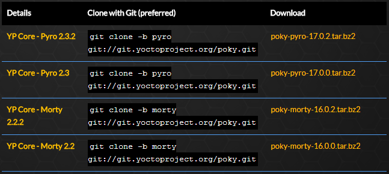
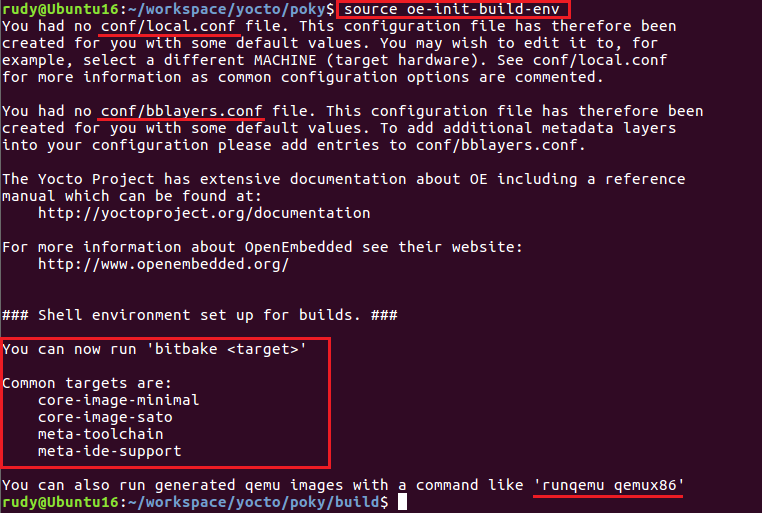
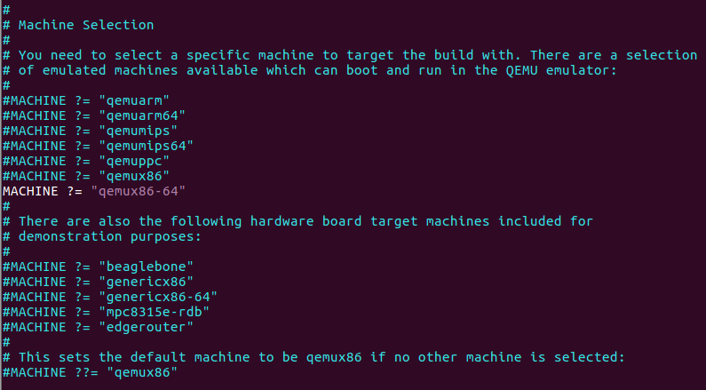
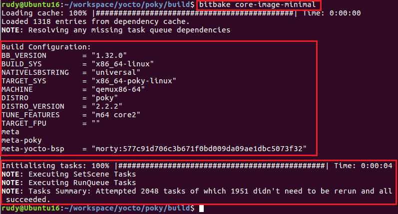
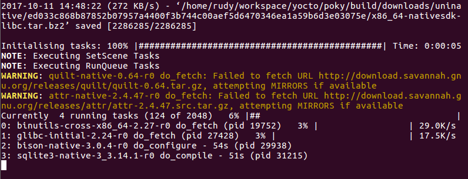
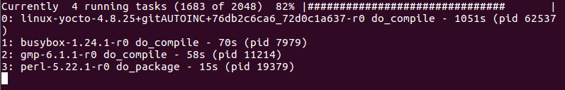
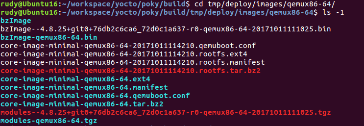
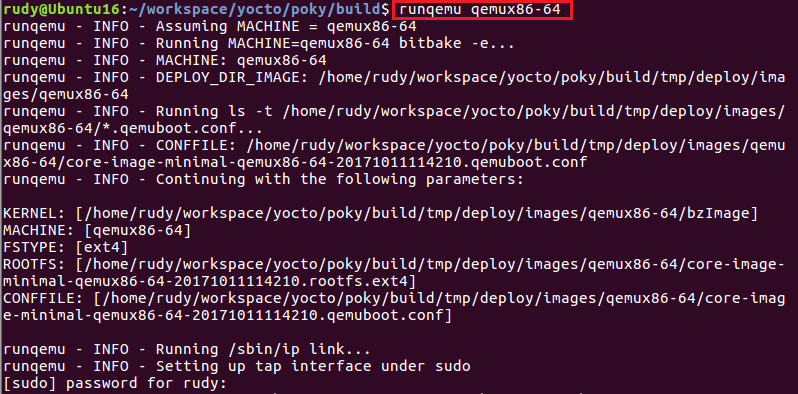
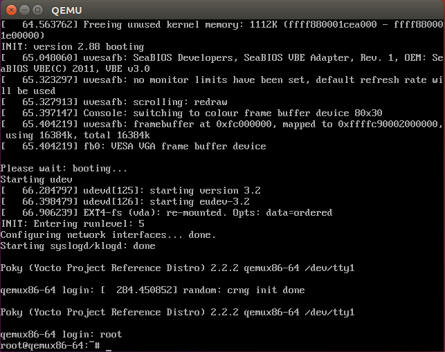
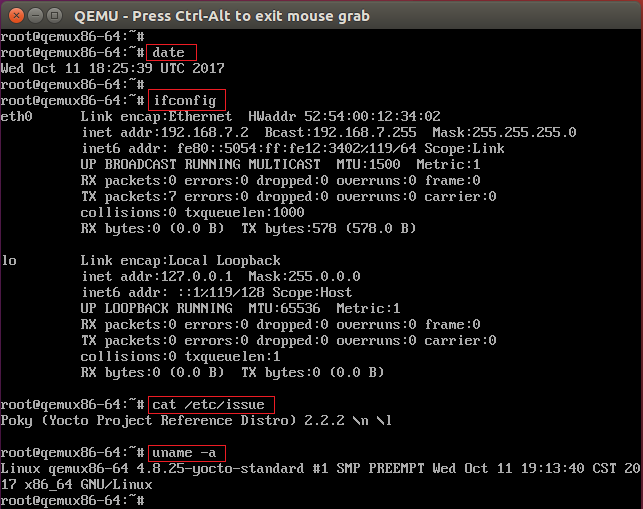

# 构建最小化 Linux 发行版

通过前面的介绍，我们已经对 Yocto 有了大致的认识。下面我们就来体验一下吧，通过在我的 Ubuntu 20.04 虚拟机上使用 bitbake 构建一个最小化的 Linux 发行版，并在 QEMU 模拟器中引导起来，让大家进一步加深对 Yocto 的了解。

由于采用了 OpenEmbedded 的几个关键组件，Yocto Project 兼容 OpenEmbedded 项目，你可以简单、可靠地进行编译和开发，完全支持通过 QEMU 模拟器的硬件和设备仿真。通过 Yocto 项目开发出来的 Image 可以在 QEMU模拟器中进行引导。

## 配置过程

注意，构建过程中会下载并编译大量文件，建议预留足够的资源（比如内存 4GB 以上，硬盘空间 60GB 以上）。

在开始之前，先执行 `sudo apt update` 更新软件包索引信息。然后安装各种依赖工具：

```shell
sudo apt install wget git-core unzip \
     make gcc g++ build-essential \
     subversion sed autoconf automake \
     texi2html texinfo coreutils diffstat \
     python-pysqlite2 docbook-utils libsdl1.2-dev \
     libxml-parser-perl libgl1-mesa-dev libglu1-mesa-dev \
     xsltproc desktop-file-utils chrpath \
     groff libtool xterm gawk fop
```

接着，我们到 [Yocto Project 官网](https://www.yoctoproject.org/)看看，发现如下信息：



接下来，我们以克隆 poky 的 morty 稳定分支为例进行讲解。

```shell
git clone -b morty git://git.yoctoproject.org/poky.git
```

下载完之后进入 poky 目录，然后执行下面的命令，为 Yocto 开发环境设置（设置/导出）一些环境变量。

```shell
source oe-init-build-env
```

在执行完 open embedded (oe) 的构建环境脚本之后，会发现终端里的路径被自动切换到 build 目录了，这样方便进行之后行发行版的的配置和构建。



从上图中的提示信息可以看到，第一次执行 `source oe-init-build-env` 的时候会在 conf 目录下创建 local.conf 和 bblayers.conf 文件。其中，文件 local.conf 是 Yocto 用来设置目标机器细节和 SDK 的目标架构的配置文件。

下面我们对 local.conf 进行配置。

如下所示，因为我的 Ubuntu 16.04 虚拟机是 64 bit 的，所以这里设置的目标机器是 qemux86-64。



在 local.conf 文件中取消下面参数的注释符号。

```shell
DL_DIR ?= "${TOPDIR}/downloads"

SSTATE_DIR ?= "${TOPDIR}/sstate-cache"

TMPDIR ?= "${TOPDIR}/tmp"

PACKAGE_CLASSES ?= "package_rpm"

SDKMACHINE ?= "i686"
```

在 local.conf 中为基于 Yocto 的 Linux 设置空密码和后续的一些参数，否则的话用户就不能登录进新的发行版。

```shell
EXTRA_IMAGE_FEATURES ?= "debug-tweaks"
```

我们并不准备使用任何图形化工具来创建 Linux OS，比如 toaster （hob 已经不再支持了）。

## 构建过程

当我们设置好 Yocto 开发环境，就可以执行下面的 bitbake 工具命令，开始为选定的目标机器下载和编译软件包。

```shell
bitbake core-image-minimal
```

注意：该命令需要在普通 Linux 用户下执行，如果是使用 root 用户，则可能会产生错误。



从上图中的提示信息可以看到，构建脚本组件的第一步工作是解析配置（recipe）；中间展示的是当前目标系统的配置信息；当看到下方的“succeeded”就表示下载、编译成功。

我这个图是编译完之后重新执行 `bitbake core-image-minimal` 命令得到的。实际上，虽然是最小化的 Linux 系统，但因为需要下载一些 SDK 和必要的库，并编译相应的软件包，所以耗时较长，大概需要 2-3 小时。

下面是下载、编译软件包的过程中的一些截图。






仔细观察，可以发现整个构建脚本的解析过程，以及构建你的新的基于 yocto 的发行版的构建系统的细节。

因为我们这里的目标机器类型是 qemux86-64，因此，编译好的新镜像将位于 build/tmp/deploy/images/qemux86-64 目录下。




## QEMU 引导

编译好镜像之后，我们就可以执行 `runqemu qemux86-64`，通过 QEMU 模拟器来引导系统了。



此时，运行新的基于 Yocto 的 Linux 发行版的 QEMU 会打开一个新屏幕。



输入 root 用户名即可登录进这个新的 Linux 发行版。登录系统之后，我们可以执行一些常用的命令查看系统的状态和信息。



可以看到 Yocto 的版本是 2.2.2，Linux 内核版本是 4.8.25，可以确定的确就是 Yocto 的 morty 分支啦。

## 小结

本文通过对 Yocto Project 的介绍，以及在 Ubuntu 上利用 Yocto 来构建了一个最小化的 Linux 发行版。相信通过这样的体验，各位读者朋友已经对 Yocto 有了一定的了解，后续我也会整理更多相关文章，敬请期待。
